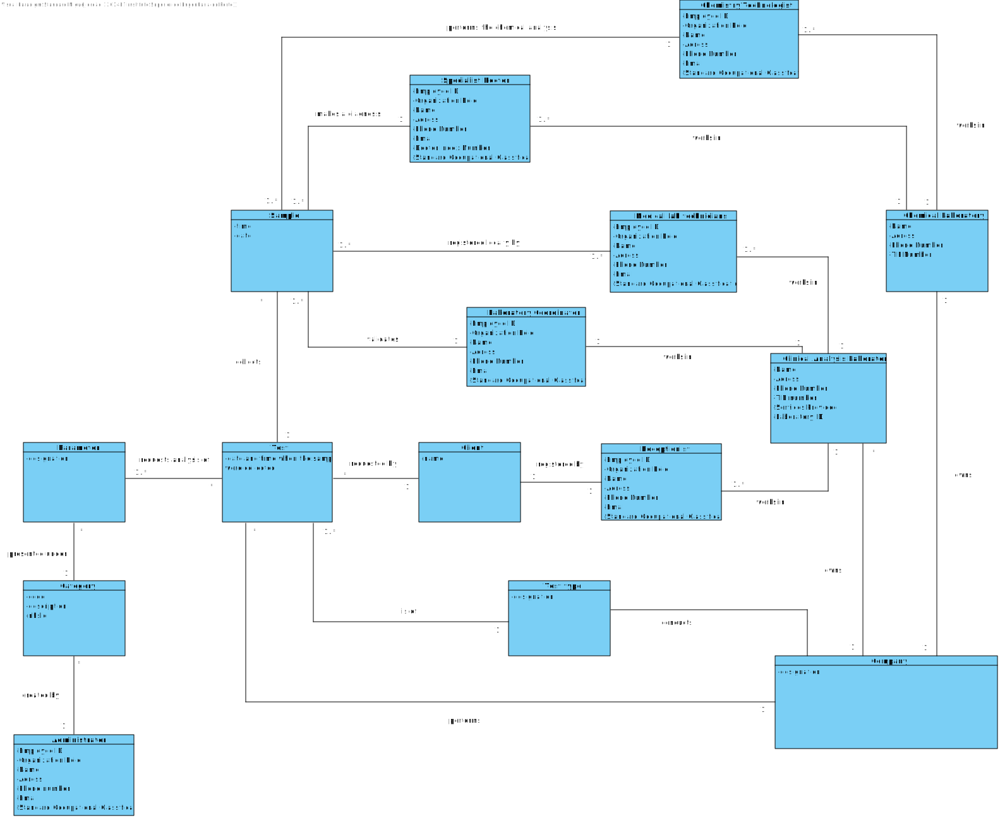

# OO Analysis #

The construction process of the domain model is based on the client specifications, especially the nouns (for _concepts_) and verbs (for _relations_) used. 

## Rationale to identify domain conceptual classes ##
To identify domain conceptual classes, start by making a list of candidate conceptual classes inspired by the list of categories suggested in the book "Applying UML and Patterns: An Introduction to Object-Oriented Analysis and Design and Iterative Development". 

### _Conceptual Class Category List_ ###

**Business Transactions**

* Test

---

**Transaction Line Items**

* Sample
* Lab Order

---

**Product/Service related to a Transaction or Transaction Line Item**

* Parameter
* Covid-19 tests
* Blood analysis

---

**Transaction Records**

* Test
* Report
* Test Results

---  

**Roles of People or Organizations**

* Specialist Doctor
* Chemistry Technologist
* Laboratory Coordinator
* Medical Lab Technicians
* Receptionist
* Client
* Administrator
* NHS
* Company

---

**Places**

* Chemical Laboratory
* Clinical Analysis Laboratory

---

**Noteworthy Events**

* Chemical Analysis
* Algorithm

---

**Physical Objects**

* Sample
* Lab Order

---

**Descriptions of Things**

* Type of test
* Category

---

**Catalogs**

*  

---

**Containers**

*  

---

**Elements of Containers**

*  

---

**Organizations**

* Company
* NHS

---

**Other External/Collaborating Systems**

* NHS API module
* External API module

---

**Records of finance, work, contracts, legal matters**

* Report to NHS
* Report to the Client

---

**Financial Instruments**

* Lab Order

---

**Documents mentioned/used to perform some work/**

* Diagnosis
* Test Validation
* Sample analyses
* Lab Order
* Test Result
* Test
* Report

---

###**Rationale to identify associations between conceptual classes**

|       Concept (A)       |          Association   	          |          Concept (B)          |
|:-----------------------:|:---------------------------------:|:-----------------------------:|
| Company  	              | owns                              | Chemical Laboratory           |
| Company  	              | owns                              | Clinical Analysis Laboratory  |
| Company  	              | performs   	                      | Test                          |
| Company  	              | conducts    		              | Test Type                     |
| Company             	  | uses                		      | NHS API                       |
| Client	              | registered by                     | Receptionist                  |
| Client 	              | has a            	              | Lab Order                     |
| Receptionist 	          | works in    		              | Clinical Analysis Laboratory  |
| Receptionist 	          | registers   		              | Lab Order                     |
| Test 	                  | is of    		                  | Test Type                     |
| Test 	                  | has a            	              | Test Result                   |
| Test 	                  | requests analysis of    	      | Parameter                     |
| Test 	                  | collects    		              | Sample                        |
| Test 	                  | requested by    	              | Client                        |
| Parameter               | presented under    		          | Category                      |
| Category 	              | created by    		              | Administrator                 |
| Medical lab technicians | works in    		              | Clinical Analysis Laboratory  |
| Sample 	              | registered locally by    	      | Medical lab technicians       |
| Chemistry Technologist  | works in    		              | Chemical Laboratory           |
| Chemistry Technologist  | performs the chemical analysis in | Sample                        |
| Specialist Doctor 	  | performs a                        | Diagnosis                     |
| Specialist Doctor 	  | works in    		              | Chemical Laboratory           |
| Laboratory Coordinator  | validates    		              | Sample                        |
| Laboratory Coordinator  | works in    		              | Clinical Analysis Laboratory  |
| NHS API            	  | generates              	 	      | Report                        |
| Report               	  | sent to              	 	      | NHS                           |
| External API	          | identifies         	              | Sample                        |
| Sample             	  | presented by         		      | Diagnosis                     |
| Algorithm	              | evaluates            	          | Company                       |

## Domain Model

