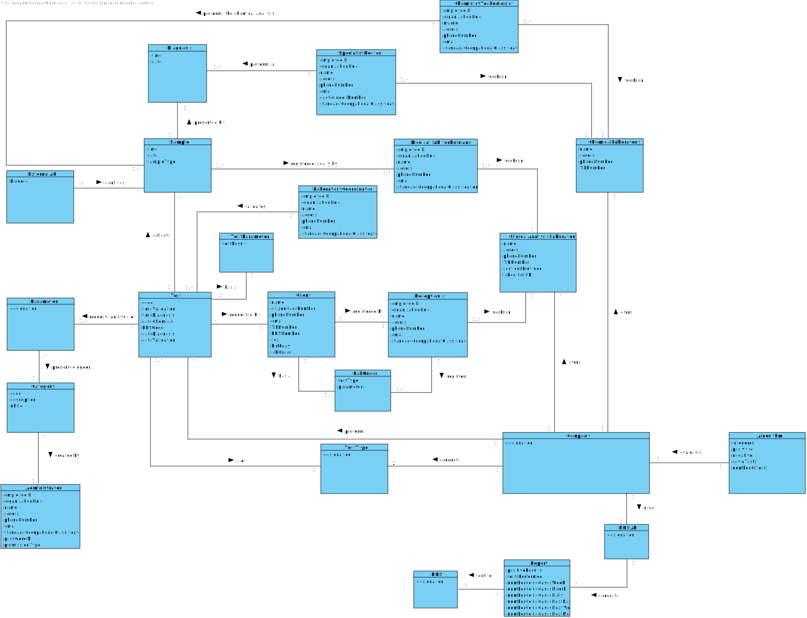

# OO Analysis #

The construction process of the domain model is based on the client specifications, especially the nouns (for _concepts_) and verbs (for _relations_) used. 

## Rationale to identify domain conceptual classes ##
To identify domain conceptual classes, start by making a list of candidate conceptual classes inspired by the list of categories suggested in the book "Applying UML and Patterns: An Introduction to Object-Oriented Analysis and Design and Iterative Development". 

### _Conceptual Class Category List_ ###

**Business Transactions**

*

---

**Transaction Line Items**

* Sample

---

**Product/Service related to a Transaction or Transaction Line Item**

*  Parameter

---

**Transaction Records**

* Test
* Record

---  

**Roles of People or Organizations**

* Specialist Doctor
* Chemistry Technologist
* Laboratory Coordinator
* Medical Lab Technicians
* Receptionist
* Client
* Administrator
* NHS

---

**Places**

*  Chemical Laboratory
*  Clinical Analysis Laboratory

---

**Noteworthy Events**

* Chemical Analysis

---

**Physical Objects**

* Sample

---

**Descriptions of Things**

* Type of test
* Category

---

**Catalogs**

*  

---

**Containers**

*  

---

**Elements of Containers**

*  

---

**Organizations**

* Company(ManyLabs?)
* NHS

---

**Other External/Collaborating Systems**

*  

---

**Records of finance, work, contracts, legal matters**

* 

---

**Financial Instruments**

*  

---

**Documents mentioned/used to perform some work/**

* 
---

###**Rationale to identify associations between conceptual classes**###

An association is a relationship between instances of objects that indicates a relevant connection and that is worth of remembering, or it is derivable from the List of Common Associations: 

+ **_A_** is physically or logically part of **_B_**
+ **_A_** is physically or logically contained in/on **_B_**
+ **_A_** is a description for **_B_**
+ **_A_** known/logged/recorded/reported/captured in **_B_**
+ **_A_** uses or manages or owns **_B_**
+ **_A_** is related with a transaction (item) of **_B_**
+ etc.

|       Concept (A)       |          Association   	      |          Concept (B)          |
|:-----------------------:|:-----------------------------:|------------------------------:|
| Company  	              | owns                          | Chemical Laboratory           |
| Company  	              | owns                          | Clinical Analysis Laboratory  |
| Company  	              | performs   	                  | Test                          |
| Company  	              | conducts    		          | Test Type                     |
| Test 	                  | is of    		              | Test Type                     |
| Test 	                  | requests analysis of    	  | Parameter                     |
| Test 	                  | collects    		          | Sample                        |
| Test 	                  | requested by    	          | Client                        |
| Parameter               | presented under    		      | Category                      |
| Category 	              | created by    		          | Administrator                 |
| Client	              | registered by                 | Receptionist                  |
| Receptionist 	          | works in    		          | Clinical Analysis Laboratory  |
| Medical lab technicians | works in    		          | Clinical Analysis Laboratory  |
| Sample 	              | registered locally by    	  | Medical lab technicians       |
| Specialist Doctor 	  | make a diagnosis    		  | Sample                        |
| Chemistry Technologist  | performs the chemical analysis| Sample                        |
| Specialist Doctor 	  | works in    		          | Chemical Laboratory           |
| Chemistry Technologist  | works in    		          | Chemical Laboratory           |
| Laboratory Coordinator  | validates    		          | Sample                        |
| Laboratory Coordinator  | works in    		          | Clinical Analysis Laboratory  |

## Domain Model

**Do NOT forget to identify concepts atributes too.**

**Insert below the Domain Model Diagram in a SVG format**

