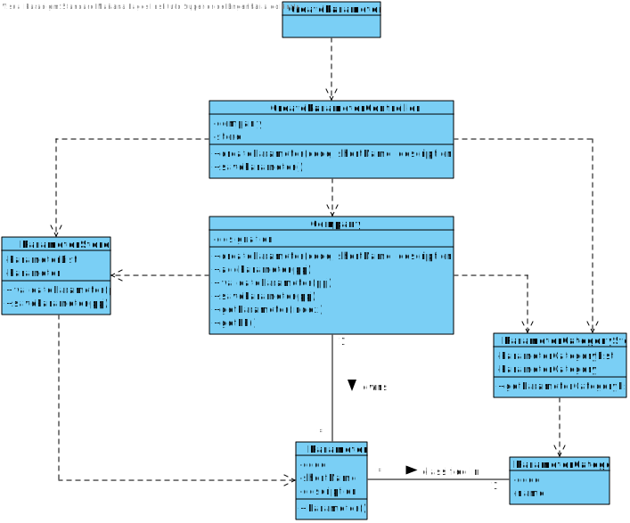

# US 10 - SpecifyNewParameter

## 1. Requirements Engineering

*In this section, it is suggested to capture the requirement description and specifications as provided by the client as well as any further clarification on it. It is also suggested to capture the requirements acceptance criteria and existing dependencies to other requirements. At last, identfy the involved input and output data and depicted an Actor-System interaction in order to fulfill the requirement.*

### 1.1. User Story Description

*As an administrator, I want to specify a new parameter and categorize it.*

### 1.2. Customer Specifications and Clarifications 

**From the specifications document:**

> “Typically, the client arrives at one of the clinical analysis laboratories with a lab order prescribed by a doctor. Once there, a receptionist asks the client’s citizen card number, the lab order (which contains the type of test and parameters to be measured), and registers in the application the test to be performed to that client.”

> "Blood tests are frequently characterized by measuring several parameters which for presentation/reporting purposes are organized by categories. For example, parameters such as the number of Red Blood Cells (RBC), White Blood Cells (WBC) and Platelets (PLT) are usually presented under the blood count (Hemogram) category."

> "Covid tests are characterized by measuring a single parameter stating whether it is a positive or a negative result."

> "Despite being out of scope, the system should be developed having in mind the need to easily support other kinds of tests (e.g., urine). Regardless, such tests rely on measuring one or more parameters that can be grouped/organized by categories."

**From the client clarifications:**

> **Question:** What is the data that characterize a parameter? Should we follow the same data as the parameter category, for example, would each parameter have its own code, description and NHS identifier?
> 
> **Answer:** Each parameter is associated with one category. Each parameter has a Code, a Short Name and a Description.

> **Question:** What is the information related to a Parameter Category?
> 
> **Answer:** Each category has a name and a unique code. There are no subcategories.

### 1.3. Acceptance Criteria

* **AC1:** Code is unique and has five alphanumeric characters.
* **AC2:** Short name is a string with no more than 8 characters.
* **AC3:** Description is a string with no more than 20 characters.

### 1.4. Found out Dependencies

* There is a dependency to “US11 Specify a new parameter category” since at least a parameter category must exist to classify the parameter being created.

### 1.5 Input and Output Data

**Input Data:**

* Typed data:
  * Code
  * Short name
  * Description

* Selected data:
  * Parameter category
  
**Output Data**

* (In)Success of the operation

### 1.6. System Sequence Diagram (SSD)

### 1.7 Other Relevant Remarks

*Use this section to capture other relevant information that is related with this US such as (i) special requirements ; (ii) data and/or technology variations; (iii) how often this US is held.* 

## 2. OO Analysis

### 2.1. Relevant Domain Model Excerpt 

### 2.2. Other Remarks

*Use this section to capture some additional notes/remarks that must be taken into consideration into the design activity. In some case, it might be usefull to add other analysis artifacts (e.g. activity or state diagrams).* 

## 3. Design - User Story Realization 

### 3.1. Rationale

**The rationale grounds on the SSD interactions and the identified input/output data.**

| Interaction ID | Question: Which class is responsible for... | Answer  | Justification (with patterns)  |
| Step/Msg 1: asks to create a new Parameter | ... interacting with the actor? | ParameterUI | Pure Fabrication: there is no reason to assign this responsibility to any existing class in the Domain Model |
|                                            | ... coordinating the US? | ParameterController | Controller |
|                                            | ... instantiating a new Parameter? | Company | Creator (Rule 1): in the DM Company has a Parameter |
|                                            | ... knowing the user using the system? | UserSession | IE: cf. A&A component documentation |
|                                            | ... knowing to which organization the user belongs to? | System | IE: has registered all |
| Step/Msg 2: request data (code, short name, description) | n/a | | |
| Step/Msg 3: types requested data | ... saving the inputted data? | Parameter | IE: object created in step/msg 1 has its own data |
| Step/Msg 4: shows the parameter categories it can operate and asks to select one | ... knowing the parameter categories to show? | System | IE: parameter category are defined by the system |
| Step/Msg 5: selects the parameter category | ... saving the selected data? | Parameter | IE: object created in step/msg 1 has its own data |
| Step/Msg 6: confirms the selected parameter category | ... saving the selected parameter category? | Parameter | IE: object created in step 1 operates one or more parameter categories |
| Step/Msg 7: shows all data and requests a confirmation | ... validating the data locally (e.g.: mandatory vs non-mandatory data)? | Company | IE: knows its own data |
|                                                        | ... validating the data globally (e.g.: duplicated)? | Company | IE: knows all the Parameter objects |
| Step/Msg 8: confirms the data | ... saving the created Parameter? | Company | IE: adopts/records all the Parameter objects |
| Step/Msg 9: informs operation success | ... informing operation success? | ParameterUI | IE: responsible for user interaction |            

### Systematization ##

According to the taken rationale, the conceptual classes promoted to software classes are: 

 * Company
 * Parameter

Other software classes (i.e. Pure Fabrication) identified: 
 * ParameterUI  
 * ParameterController
 * ParameterStore

## 3.2. Sequence Diagram (SD)

## 3.3. Class Diagram (CD)

# 4. Tests 

### AC1

**Test 1:** Check that it is not possible to create an instance of Parameter class with code blank.

	@Test(expected = IllegalArgumentException.class)
    public void checkCodeBlank() {

        ParameterCategoryStore  parameterCategoryStore = new ParameterCategoryStore();
        ParameterCategory pc = new ParameterCategory("aaaaa","aaa","aaa");
        parameterCategoryStore.listAdd();

        Parameter pp = new Parameter("","yes","aaa",parameterCategoryStore);
    }

**Test 2:** Check that it is not possible to create an instance of Parameter class with code not alphanumeric.

    @Test(expected = IllegalArgumentException.class)
    public void checkCodeNotAlphaNumeric1() {

        ParameterCategoryStore  parameterCategoryStore = new ParameterCategoryStore();
        ParameterCategory pc = new ParameterCategory("aaaaa","aaa","aaa");
        parameterCategoryStore.listAdd();

        Parameter pp = new Parameter("****","yes","aaa",parameterCategoryStore);
    }

**Test 3:** Check that it is not possible to create an instance of Parameter class with code with more characters than the maximum.

    @Test(expected = IllegalArgumentException.class)
    public void checkCodeTooManyChars() {

        ParameterCategoryStore  parameterCategoryStore = new ParameterCategoryStore();
        ParameterCategory pc = new ParameterCategory("aaaaa","aaa","aaa");
        parameterCategoryStore.listAdd();

        Parameter pp = new Parameter("112312312312312312312312","yes","aaa",parameterCategoryStore);
    }

### AC2

**Test 4:** Check that it is not possible to create an instance of Parameter class with short name blank.

    @Test(expected = IllegalArgumentException.class)
    public void checkNameBlank() {

        ParameterCategoryStore  parameterCategoryStore = new ParameterCategoryStore();
        ParameterCategory pc = new ParameterCategory("aaaaa","aaa","aaa");
        parameterCategoryStore.listAdd();

        Parameter pp = new Parameter("1abcE","yes","",parameterCategoryStore);
    }

**Test 5:** Check that it is not possible to create an instance of Parameter class with short name with more characters than the maximum.

    @Test(expected = IllegalArgumentException.class)
    public void checkNameTooManyChars1() {

        ParameterCategoryStore  parameterCategoryStore = new ParameterCategoryStore();
        ParameterCategory pc = new ParameterCategory("aaaaa","aaa","aaa");
        parameterCategoryStore.listAdd();

        Parameter pp = new Parameter("1abcE","yes","aasdasdasdasdaaaaaaaaaaaaaaaaaaaaaaaaaaaaaaaaaaaaaaaaaaaaaaaaaaaaaaaaaaaaaaaaaaaaaaaaaaaaaaaaaaaa",parameterCategoryStore);
    }

### AC3

**Test 6:** Check that it is not possible to create an instance of Parameter class with description blank.

    @Test(expected = IllegalArgumentException.class)
    public void checkDescriptionBlank() {

        ParameterCategoryStore  parameterCategoryStore = new ParameterCategoryStore();
        ParameterCategory pc = new ParameterCategory("aaaaa","aaa","aaa");
        parameterCategoryStore.listAdd();

        Parameter pp = new Parameter("1abcE","","aaa",parameterCategoryStore);
    }

**Test 7:** Check that it is not possible to create an instance of Parameter class with description with more characters than the maximum.

    @Test(expected = IllegalArgumentException.class)
    public void checkDescriptionTooManyChars1() {

        ParameterCategoryStore  parameterCategoryStore = new ParameterCategoryStore();
        ParameterCategory pc = new ParameterCategory("aaaaa","aaa","aaa");
        parameterCategoryStore.listAdd();

        Parameter pp = new Parameter("1abcE","yaaaaaaaaaaaaaaaaaaaaaaaaaaaaaaaaaaaaaaaaaaaaaaaaaaaaaaaaaaaaaaaaaaaaaaaaaaaaaaaaaaes","aaa",parameterCategoryStore);
    }

# 5. Construction (Implementation)

## Parameter

# 6. Integration and Demo 

*In this section, it is suggested to describe the efforts made to integrate this functionality with the other features of the system.*

# 7. Observations

*In this section, it is suggested to present a critical perspective on the developed work, pointing, for example, to other alternatives and or future related work.*

