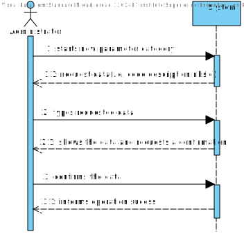
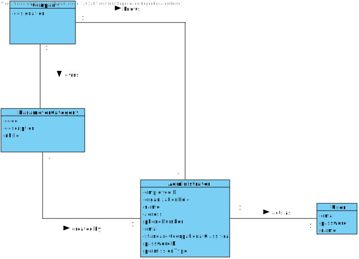
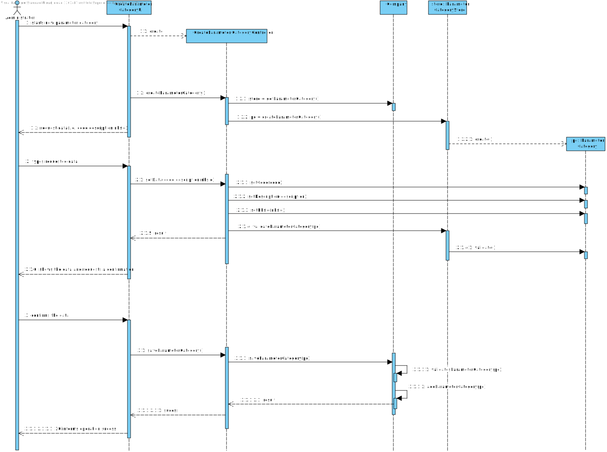
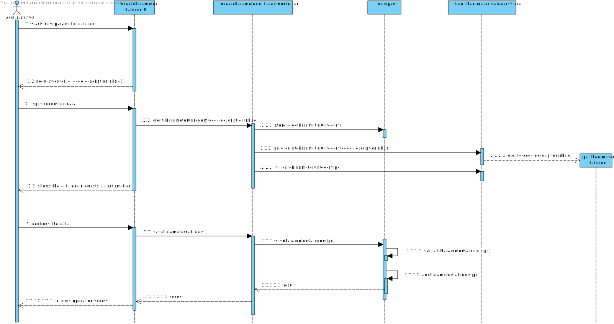
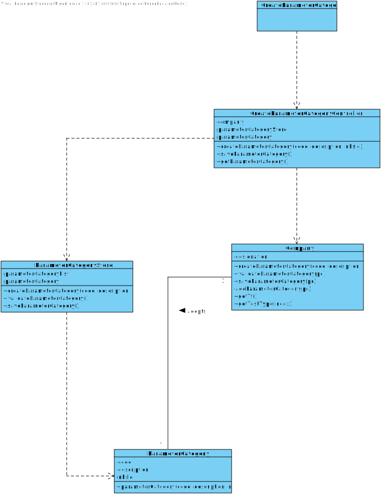

# US 11 - Specify new parameter category

## 1. Requirements Engineering

### 1.1. User Story Description

*As an administrator, I want to specify a new parameter category*

### 1.2. Customer Specifications and Clarifications 

**From the Specifications Document:**

>"Blood Tests are frequently characterized by measuring several parameters which for presentation/reporting purposes are organized by categories.For example, parameters such as the number of Red Blood Cells(RBC), White Blood Cells(RBC) and Platelets(PLT) are usually presented under the blood count (Hemogram) category."

>"Regardless, such tests rely on measuring one or more parameters that can be grouped/organized by categories."

**From the client clarifications:**

>**Question**: What are the information related to a Parameter Category?
>
>**Answer**: Each category has a name and a unique code. There are no subcategories.

>**Question**: Regarding the creation of a new category, what should be the format of the code in terms of length, should it be alphanumeric or numbers only? Also, can we assume that both attributes are mandatory?
>
>**Answer:** The format of the attributes of one category are:
> * Name: is a string with no more than 10 characters;
> * Code: are five alphanumeric characters. The code is unique and is not automatically generated.
> 
> Both attributes are mandatory.

### 1.3. Acceptance Criteria

* **AC1:** Name is a string with no more than 10 characters
* **AC2:** Code is unique and has five alphanumeric characters
* **AC3:** Code is not automatically generated

### 1.4. Found out Dependencies

*No dependencies were found*

### 1.5 Input and Output Data

**Input data**

* Typed data:
    * Name
    * Code
    
**Selected data**: 

*There is no selected data*

**Output Data**

* (In)Success of the operation

### 1.6. System Sequence Diagram (SSD)

### 1.7 Other Relevant Remarks

*Use this section to capture other relevant information that is related with this US such as (i) special requirements ; (ii) data and/or technology variations; (iii) how often this US is held.* 

## 2. OO Analysis

### 2.1. Relevant Domain Model Excerpt

### 2.2. Other Remarks

*Use this section to capture some aditional notes/remarks that must be taken into consideration into the design activity. In some case, it might be usefull to add other analysis artifacts (e.g. activity or state diagrams).* 

## 3. Design - User Story Realization 

### 3.1. Rationale

**The rationale grounds on the SSD interactions and the identified input/output data.**

| Interaction ID | Question: Which class is responsible for... | Answer | Justification (with patterns) |
|:-------------  |:--------------------- |:------------|:---------------------------- |
<<<<<<< HEAD
| Step/Msg 1: starts a new parameter category |	...instantiating a new Parameter Category | ParameterCategoryUI | Pure Fabrication: there is no reason to assign this responsibility to any existing class in the Domain Model |
| 		                                      |	...coordinating the US? | CreateParameterCategoryController | Controller |
| 	                                          |	...starts new parameter category? | Company | Creator: R1/2 |
| 		                                      |	...knowing the user using the system? | UserSession | IE: cf. A&A component documentation |
| 	                                          |	...knowing to which organization the user belongs to? | System | IE: has registered all |
| Step/Msg 2: request data (name, code) | n/a | | |
| Step/Msg 3: types requested data | ...saving the input data | ParameterCategory | IE: the object created in step 1 has its own data |
| Step/Msg 4: shows the data and requests a confirmation |	...validating the data locally (e.g..:mandatory vs. nom-mandatory data)? | ParameterCategory | IE: knows its own data |
|  	                                                     |	...validating the data globally (e.g..:duplicated)? | Company | IE : adopts/records all the ParameterCategory objects |
| Step/Msg 5:confirms the data | ...saving the created parameter category? | Company | IE: adopts/records all the ParameterCategory objects |
| Step/Msg 6:informing operation success | ...informing operation success? | ParameterCategoryUI | IE: responsible for user interaction |              
=======
| Step/Msg 1: 		 |	...instantiating a new Parameter Category		 |            |                            |
| 		 |	...coordinating the US?		 |  ParameterCategoryController           | Controller                             |
| 		 |	...starts new parameter category?		 |  Company            |       Creator: R1/2                        |
| 		 |		...knowing the user using the system?	 | UserSession             |  IE: cf. A&A component documentation                            |
| 		 |	...knowing to which organization the user belongs to	| Company           | IE: has registed all?                           |
| Step/Msg 2: request data (i.e.,code,description,nhsld) 		 | n/a							 |             |                              |
| Step/Msg 3: types requested data  		 |		...saving the input data					 | ParameterCategory            |      IE: The object created in step 1 has its own data                        |
| Step/Msg 4: shows the data and requests a confirmation  		 |	...validating the data locally (e.g..:mandatory vs. nom-mandatory data)?						 |   ParameterCategoryStore         |    IE: knows its own data                          |
|  	 |	...validanting the data globally (e.g..:duplicated)?		 |  ParameterCategoryStore          |      IE : adopts/records all the ParameterCategory objects                       |
| Step/Msg 5:confirms the data		 | ...saving the created parameter category							 |  ParameterCategoryStore           |  IE: adopts/records all the ParameterCategory objects                            |
| Step/Msg 6:informing operation sucess	 | 	...informing operation sucess			 |  ParameterCategoryUI	         |    IE: responible for user interaction                           |              
>>>>>>> b308047a688a2f8b78042b6198c7f28a1543ba4a

### Systematization ##

According to the taken rationale, the conceptual classes promoted to software classes are: 

 * Company
 * ParameterCategory

Other software classes (i.e. Pure Fabrication) identified: 

 * CreateParameterCategoryUI
 * CreateParameterCategoryController
 * CreateParameterCategoryStore

## 3.2. Sequence Diagram (SD)

**Alternativa 1**

##

**Alternativa 2**

##

**Other alternatives might exist.**

## 3.3. Class Diagram (CD)

# 4. Tests 
*In this section, it is suggested to systematize how the tests were designed to allow a correct measurement of requirements fulfilling.* 

**_DO NOT COPY ALL DEVELOPED TESTS HERE_**

**Test 1:** Check that it is not possible to create an instance of the Example class with null values. 

	@Test(expected = IllegalArgumentException.class)
		public void ensureNullIsNotAllowed() {
		Exemplo instance = new Exemplo(null, null);
	}

*It is also recommended to organize this content by subsections.* 

# 5. Construction (Implementation)

*In this section, it is suggested to provide, if necessary, some evidence that the construction/implementation is in accordance with the previously carried out design. Furthermore, it is recommeded to mention/describe the existence of other relevant (e.g. configuration) files and highlight relevant commits.*

*It is also recommended to organize this content by subsections.* 

# 6. Integration and Demo 

*In this section, it is suggested to describe the efforts made to integrate this functionality with the other features of the system.*

# 7. Observations

*In this section, it is suggested to present a critical perspective on the developed work, pointing, for example, to other alternatives and or future related work.*

