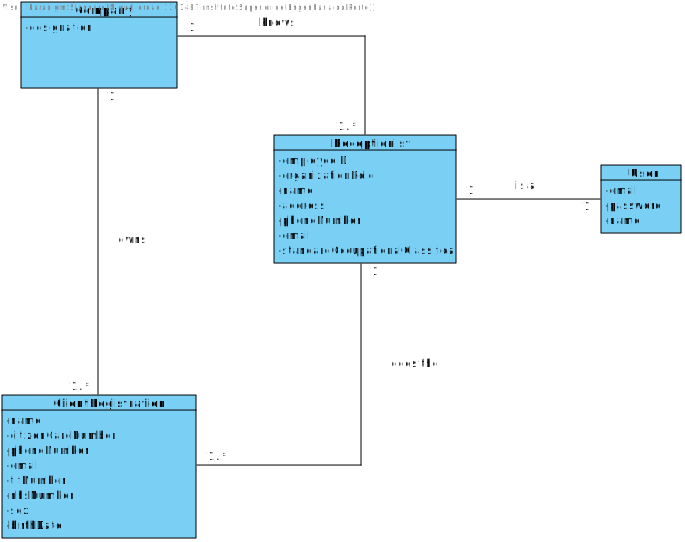

# US 3 - RegisterClient

## 1. Requirements Engineering

*In this section, it is suggested to capture the requirement description and specifications as provided by the client as well as any further clarification on it. It is also suggested to capture the requirements acceptance criteria and existing dependencies to other requirements. At last, identfy the involved input and output data and depicted an Actor-System interaction in order to fulfill the requirement.*

### 1.1. User Story Description

As a receptionist of the laboratory, I want to register a client.

### 1.2. Customer Specifications and Clarifications 

* **From the Specifications Document:** 

>"In case of a new client, the receptionist registers the client in the application." *(Pag. 2, ln. 1)*
>
>"To register a client the receptionist needs the client’s citizen card number, National Healthcare Service (NHS) number, birth date, sex, Tax Identification number (TIF), phone number, e-mail and name." *(Pag. 2, ln 1-3)*

* **From the client clarifications:**

>**Question:** Does the receptionist need to be logged in the app to perform the registration?
> 
>**Answer**: Yes.

>**Question:** What parameter (asked by the receptionist) should the system use to create the password of the new client?
> 
>**Answer:** The password should be randomly generated. It should have ten alphanumeric characters.

>**Question:** Relative to registering a new user, how should the system respond in the event of creating a new client with the same attributes of an already existing one?
>
>**Answer:** This should be treated as an error. A subset of the attributes of any client are unique.

>**Question:** When the receptionist is doing the client registration, does he need to pay?
>
>**Answer:** There are costs and payments but they are managed by a third party and are outside of the system. Therefore, in this project we will not consider the cost and payments associated with each test.

>**Question:** To register a Client which is the format of each attribute?
>
>**Answer:**
> * Citizen Card: 16 digit number
> * NHS: 10 digit number
> * TIN: 10 digit number
> * Birth day: in which format: DD/MM/YY
> * Sex: should only be Male/Female or include more options.
> * Phone number: 11 digit number
> * The sex is opcional. All other fields are required.

>**Question:** During the registration of a client, if he gives a phone number already used by another customer, should the registration continue normally or should it be canceled?
>
>**Answer:** The e-mail address and phone number should be unique for each user. The system should present a message informing about the error and asking for a different phone number.

>**Question:** how are the passwords delivered to the clients?
>
>**Answer:** Each client receives an e-mail informing that the registration was successful and that he can start to use the system. The e-mail includes the client password.

>**Question:** After being registered by the receptionist, should the client receive some kind of confirmation e-mail in order to finish his registration?
>
>**Answer:** The client only receives an e-mail informing that the registration was successful and that he can start to use the system. The e-mail includes the client password.

### 1.3. Acceptance Criteria

* **AC1:** The client must become a system user. The "auth" component available on the repository must be reused (without modifications).
* **AC2:** The password should be randomly generated.
* **AC3:** The password should have 10 alphanumeric characters.
* **AC4:** The creation of a new client with the same attributes of an aleardy existing one should be treated as an error.
* **AC5:** Each attribute has a specific format:
  * Citizen Card: 16 digit number
  * NHS: 10 digit number
  * TIN: 10 digit number
  * Birth day - in which format: DD/MM/YY
  * Sex - should only be Male/Female or include more options.
  * Phone number: 11 digit number
* **AC6:** The registration email includes the client password.
### 1.4. Found out Dependencies

No dependencies were found.

### 1.5 Input and Output Data

**Input Data:**

* Typed data:
    * Name
    * Citizen Card Number
    * Phone Number
    * Email
    * TIN Number
    * NHS Number
    * Sex
    * Birth Date
  

* Selected data:
   * No data found

**Output Data:**

* Confirmation Email (Including the password)
* (In)Success of the operation

### 1.6. System Sequence Diagram (SSD)

### 1.7 Other Relevant Remarks

*Use this section to capture other relevant information that is related with this US such as (i) special requirements ; (ii) data and/or technology variations; (iii) how often this US is held.* 

## 2. OO Analysis

### 2.1. Relevant Domain Model Excerpt 
*In this section, it is suggested to present an excerpt of the domain model that is seen as relevant to fulfill this requirement.* 

### 2.2. Other Remarks

*Use this section to capture some aditional notes/remarks that must be taken into consideration into the design activity. In some case, it might be usefull to add other analysis artifacts (e.g. activity or state diagrams).* 

## 3. Design - User Story Realization 

### 3.1. Rationale

**The rationale grounds on the SSD interactions and the identified input/output data.**

| Interaction ID | Question: Which class is responsible for... | Answer  | Justification (with patterns)  |
|:-------------  |:--------------------- |:------------|:---------------------------- |
| Step 1  		 |							 |             |                              |
| Step 2  		 |							 |             |                              |
| Step 3  		 |							 |             |                              |
| Step 4  		 |							 |             |                              |
| Step 5  		 |							 |             |                              |
| Step 6  		 |							 |             |                              |              

### Systematization ##

According to the taken rationale, the conceptual classes promoted to software classes are: 

 * Class1
 * Class2
 * Class3

Other software classes (i.e. Pure Fabrication) identified: 
 * xxxxUI  
 * xxxxController

## 3.2. Sequence Diagram (SD)

*In this section, it is suggested to present an UML dynamic view stating the sequence of domain related software objects' interactions that allows to fulfill the requirement.* 

## 3.3. Class Diagram (CD)

*In this section, it is suggested to present an UML static view representing the main domain related software classes that are involved in fulfilling the requirement as well as and their relations, attributes and methods.*

# 4. Tests 
*In this section, it is suggested to systematize how the tests were designed to allow a correct measurement of requirements fulfilling.* 

**_DO NOT COPY ALL DEVELOPED TESTS HERE_**

**Test 1:** Check that it is not possible to create an instance of the Example class with null values. 

	@Test(expected = IllegalArgumentException.class)
		public void ensureNullIsNotAllowed() {
		Exemplo instance = new Exemplo(null, null);
	}

*It is also recommended to organize this content by subsections.* 

# 5. Construction (Implementation)

*In this section, it is suggested to provide, if necessary, some evidence that the construction/implementation is in accordance with the previously carried out design. Furthermore, it is recommeded to mention/describe the existence of other relevant (e.g. configuration) files and highlight relevant commits.*

*It is also recommended to organize this content by subsections.* 

# 6. Integration and Demo 

*In this section, it is suggested to describe the efforts made to integrate this functionality with the other features of the system.*

# 7. Observations

*In this section, it is suggested to present a critical perspective on the developed work, pointing, for example, to other alternatives and or future related work.*

