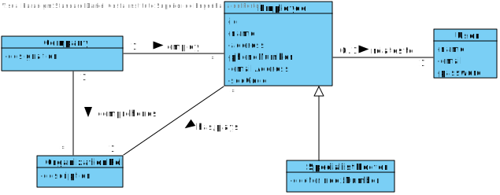
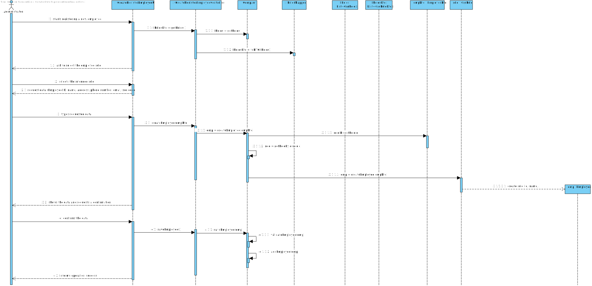

# US 7 - RegisterEmployee

## 1. Requirements Engineering

### 1.1. User Story Description

- As an administrator, I want to register a new employee.

### 1.2. Customer Specifications and Clarifications

**From the Specifications Document:**

**From the client clarifications:**

>**Question**: What kind of information does the company store about their employees?
> 
>**Answer**: All the roles that exist in the Many Labs company are characterized by the gollowing attributes: Employee ID, Organization Role, Name, Address, Phone Number, E-Mail and Standar Occupational Classification (SOC) code. The Specialist Doctor has an additional attribute: Doctor Index Number.

>**Question**: Are there any other employee roles than the ones specified in the documents?
> 
>**Answer**: No.

>**Question**: Do these roles have different contracts with ManyLabs (i.e. temporary contract, permanent contract, freelance, etc...)? If so, should this be registered in the system together with the employee role information?
> 
>**Answer**: Many Labs is known for making only permanent full-time contracts.Therefore, there is no need to register this type of information.

>**Question**: For the role id and respective description should we use any specific format or type?
> 
>**Answer**: From a previous answer: "All the roles that exist in the Many Labs company are characterized by the following attributes:
Employee ID; Organization Role; Name; Address; Phone Number; E-Mail; Standard Occupational Classification (SOC) code.

>**Question**:How should we generate the employee ID ? What type and length should it have ?
> 
>**Answer**:The employee ID should be generated from the initials of the employee name and should include a number. The number should have 5 digits and it increases automatically when a new employee is registered in the system. For instance, if the company has 20 employees and the administrator wants to register a specialist doctor with the name Ana Maria Santos Moura, then the the employee ID for this specialist doctor should be AMSM00021.

>**Question**: When the application is delivered , should it have default employees , ex:administrator,etc.. , or should be completly empty (without any user or employee)?
> 
>**Answer**:One Administrator must be registered before starting the application for the first time.

>**Question**: The aplication can add new employess but can it remove them , for example when one of them is fired ?
> 
>**Answer**: For now I do not want such feature.

>**Question**: The application should register the time when de employees log in and log out ?
> 
>**Answer**: No.
 

>**Question**: Should we validate if a new employee is the same as one that there is already inside the system ? Do we need to validate same atributes to check similarities ?
> 
>**Answer**: Yes. Yes.
 
>**Question**: When registering a new employee should the administrator write or select his role?
> 
> **Answer**: The administrator should write the role when he is registering a new employee.
 

### 1.3. Acceptance Criteria

* **AC1:** Each user must have a single role defined in the system. The "auth" component available on the repository must be reused (without modifications).
* **AC2:** Doctor Index Number: 6 digits.
* **AC3:** Name : 20 digits and letters only.
* **AC4:** Address: 30 digits.
* **AC5:** Phone number: 11 digits and numbers only.
* **AC6:** Employee ID : 9 digits.
* **AC7:** SOC Code : 7 digits.
* **AC8:** Organization Role: No numbers.

### 1.4. Found out Dependencies

*No dependencies found*

### 1.5 Input and Output Data

**Input Data:**

* Typed data:
    * Employee ID
    * Name
    * Address
    * Phone number
    * Email
    * SOC code
    * Organization role
    * Doctor Index Number
    

* Selected data:
  * None.

**Output Data:**

* Confirmation email (which has the password)
* (In)Success of the operation

### 1.6. System Sequence Diagram (SSD)

### 1.7 Other Relevant Remarks

*Use this section to capture other relevant information that is related with this US such as (i) special requirements ; (ii) data and/or technology variations; (iii) how often this US is held.* 

## 2. OO Analysis

### 2.1. Relevant Domain Model Excerpt 
*In this section, it is suggested to present an excerpt of the domain model that is seen as relevant to fulfill this requirement.* 

### 2.2. Other Remarks

*Use this section to capture some aditional notes/remarks that must be taken into consideration into the design activity. In some case, it might be usefull to add other analysis artifacts (e.g. activity or state diagrams).* 

## 3. Design - User Story Realization 

### 3.1. Rationale

**The rationale grounds on the SSD interactions and the identified input/output data.**

| Interaction ID | Question: Which class is responsible for... | Answer  | Justification (with patterns)  |
|:-------------  |:--------------------- |:------------|:---------------------------- |
| Step/Msg 1: Starts registering a new employee|...interacting with the actor|EmployeeUI| Pure Fabrication: there is no reason to assign this responsibility to any existing class in the Domain Model                             |
|  |...instantiating a new employee?|Company|               The company knows the employee               |
| |...coordinating the US?|RegisteringEmployeeController|It's a controller
| |...knowing which user is using the system?|UserSession|IE:cf. A&A component documentation
| Step/Msg 2: Request data (Employee ID, Organization Role, name, address, phone number, email, soc code, doctor index number)|n/a||         
| Step/Msg 3: Type and select requested data 		 |...saving the input data?    | Employee            |IE: object created in step1 has its own data.                           |
| Step/Msg 4: Show the data and requests confirmation 		 |...validating the data?  |  Company          |      IE: knows its own data.                        |              
| Step/Msg 5: Confirm the data		 |...saving the created new employee?    |   Company   |     IE: adopts/records all the Employee objects                         |              
| Step/Msg 6: Informs operation success|...informs operation success?|EmployeeUI|IE: resposible for user interaction

### Systematization ##

According to the taken rationale, the conceptual classes promoted to software classes are: 

 * Company
 * Employee
 * UserSession

Other software classes (i.e. Pure Fabrication) identified: 
 * EmployeeUI
 * EmployeeStore  
 * RegisterEmployeeController

## 3.2. Sequence Diagram (SD)

**Alternative 1**

**Alternative 2**
=======
*In this section, it is suggested to present an UML dynamic view stating the sequence of domain related software objects' interactions that allows to fulfill the requirement.*

## 3.3. Class Diagram (CD)

*In this section, it is suggested to present an UML static view representing the main domain related software classes that are involved in fulfilling the requirement as well as and their relations, attributes and methods.*

# 4. Tests 
*In this section, it is suggested to systematize how the tests were designed to allow a correct measurement of requirements fulfilling.* 

##AC2 

**Test 1:** Check that it's not possible to have a blank Doctor Index Number: 

	@Test(expected = IllegalArgumentException.class)
    public void checkDOCBlank(){

        Employee emp = new Employee("Daniel", "3425 Stone Street", "dasc@gmail.com","01492235687", "DASC00001","1234567", "specialistdoctor", "");
    }

**Test 2:** Check that it's not possible to have a Doctor Index Number with a number of digits different than 6:

    @Test(expected = IllegalArgumentException.class)
    public void checkDOCSize(){
    
            Employee emp = new Employee("Daniel", "3425 Stone Street", "dasc@gmail.com","01492235687", "DASC00001","1234567", "specialistdoctor", "12345678");
    }

##AC3

**Test 1:** Check that it's not possible to have blank Name:
        
        @Test(expected = IllegalArgumentException.class)
        public void checkNameBlank() {
        
                Employee emp = new Employee("", "3425 Stone Street", "dasc@gmail.com", "01492235687", "DASC00001","1234567", "specialistdoctor", "123456");
        }

**Test 2:** Check that it's not to have more than 20 digits:

       @Test(expected = IllegalArgumentException.class)
       public void checkNameTooManyChars() {

            Employee emp = new Employee("FirstClinicalAnalysisLaboratory", "3425 Stone Street", "dasc@gmail.com", "01492235687", "DASC00001","1234567", "specialistdoctor", "123456");
        }

**Test 3:** Check that the name only has characters:

        @Test(expected = IllegalArgumentException.class)
        public void checkNameNotOnlyLetters() {

          Employee emp = new Employee("651fvs6ef","3425 Stone Street", "dasc@gmail.com", "01492235687", "DASC00001","1234567", "specialistdoctor", "123456");
        }

##AC4

**Test 1:** Check that the test isn't blank:

          @Test (expected = IllegalArgumentException.class)
          public void checkAdBlank(){
          
                  Employee emp = new Employee("Daniel", "", "dasc@gmail.com","01492235687", "DASC00001","1234567", "specialistdoctor", "123456");
          }

**Test 2:** Check that the test isn't longer than 30 characters:

          @Test (expected = IllegalArgumentException.class)
          public void checkAdLength(){
      
              Employee emp = new Employee("Daniel", "3425 Stone Street 12345678901234567", "dasc@gmail.com","01492235687", "DASC00001","1234567", "specialistdoctor", "123456");
          }

##AC5

**Test 1:** Check that the phone number isn't blank:
    
          @Test (expected = IllegalArgumentException.class)
          public void checkPhoneNumberBlank() {

              Employee emp = new Employee("Daniel", "3425 Stone Street", "dasc@gmail.com","", "DASC00001","1234567", "specialistdoctor", "123456");
          }

**Test 2:** Check that the phone number has the correct number of digits:

          @Test(expected = IllegalArgumentException.class)
          public void checkPhoneNumberTooManyChars() {

                Employee emp = new Employee("Daniel", "3425 Stone Street", "dasc@gmail.com","014922356871234123", "DASC00001","1234567", "specialistdoctor", "123456");
          }

**Test 3:** Check that the phone number only has numbers in it:

        @Test(expected = IllegalArgumentException.class)
        public void checkPhoneNumberNotOnlyNumbers() {
    
            Employee emp = new Employee("Daniel", "3425 Stone Street", "dasc@gmail.com","0d149a5b687", "DASC00001","1234567", "specialistdoctor", "123456");
        }

##AC6

**Test 1:** Check that the employee ID isn't blank:

      @Test (expected = IllegalArgumentException.class)
      public void checkEmpIDBlank() {
  
          Employee emp = new Employee("Daniel", "3425 Stone Street", "dasc@gmail.com","01492235687", "","1234567", "specialistdoctor", "123456");
  
      }

**Test 2:** Check that the employee ID has the correct:

      @Test (expected = IllegalArgumentException.class)
      public void checkEmpIDLength(){
  
          Employee emp = new Employee("Daniel", "3425 Stone Street", "dasc@gmail.com","01492235687", "DASC000011234","1234567", "specialistdoctor", "123456");
  
      }

##AC7

**Test 1:** Check that the SOC code isn't blank:

    @Test (expected = IllegalArgumentException.class)
    public void checkSOCBlank(){
    
            Employee emp = new Employee("Daniel", "3425 Stone Street", "dasc@gmail.com","01492235687", "DASC00001","", "specialistdoctor", "123456");
    
    }

**Test 2:** Check that the SOC code has the appopriate length:

    @Test (expected = IllegalArgumentException.class)
    public void checkSOCLength(){

        Employee emp = new Employee("Daniel", "3425 Stone Street", "dasc@gmail.com","01492235687", "DASC00001","1234567123", "specialistdoctor", "123456");

    }

**Test 3:** Check that the SOC code only has numbers:

    @Test (expected = IllegalArgumentException.class)
    public void checkSOCIsInvalid(){

        Employee emp = new Employee("Daniel", "3425 Stone Street", "dasc@gmail.com","01492235687", "DASC00001","a234567", "specialistdoctor", "123456");

    }

##AC8

**Test 1:** Check that the organization role isn't blank:

    @Test(expected = IllegalArgumentException.class)
    public void checkORBlank(){

        Employee emp = new Employee("Daniel", "3425 Stone Street", "dasc@gmail.com","01492235687", "DASC00001","1234567", "", "123456");

    }

**Test 2/3:** Check that the organization role is within the types wanted:

     @Test
    public void checkORTypes(){

        Employee emp = new Employee("Daniel", "3425 Stone Street", "dasc@gmail.com","01492235687", "DASC00001","1234567", "specialistdoctor", "123456");
    }

    @Test
    public void checkORTypes2(){
        Employee emp = new Employee("Daniel", "3425 Stone Street", "dasc@gmail.com","01492235687", "DASC00001","1234567", "employee", "123456");

    }

**Test 4:** Check that the organization role doesn't have any numbers:

    @Test (expected = IllegalArgumentException.class)
    public void checkORChar(){

        Employee emp = new Employee("Daniel", "3425 Stone Street", "dasc@gmail.com","01492235687", "DASC00001","1234567", "1", "123456");
    }

# 5. Construction (Implementation)

*In this section, it is suggested to provide, if necessary, some evidence that the construction/implementation is in accordance with the previously carried out design. Furthermore, it is recommeded to mention/describe the existence of other relevant (e.g. configuration) files and highlight relevant commits.*

###Employee
    package app.domain;
    
    import org.apache.commons.lang3.StringUtils;
    import java.util.regex.Pattern;
    
    public class Employee {
    
        String name, address, phoneNumber, email, orgRole;
        String employeeId;
        String socCode, doctorIndexNumber;
    
    
        /**
         * Creates an instance of an Employee.
         *
         * @param name                   - the Employee's name
         * @param address                - the Employee's address
         * @param email                  - the Employee's email
         * @param phoneNumber            - the Employee's phone number
         * @param employeeId             - the Employee's ID
         * @param socCode                - the Employee's SOC Code
         * @param orgRole                - the Employee's organization role
         * @param doctorIndexNumber      - the Specialist Doctor Doctor Index Number
         */
    
        public Employee (String name, String address, String email, String phoneNumber, String employeeId, String socCode, String orgRole, String doctorIndexNumber){
    
            checkNameRules(name);
            checkAddressRules(address);
            checkEmailRules(email);
            checkPhoneNumberRules(phoneNumber);
            checkEmployeeId(employeeId);
            checkSocCode(socCode);
            checkOrgRole(orgRole);
            checkDoctorIndexNumber(doctorIndexNumber);
    
            this.name = name;
            this.address = address;
            this.email = email;
            this.phoneNumber = phoneNumber;
            this.employeeId = employeeId;
            this.socCode = socCode;
            this.orgRole = orgRole;
            this.doctorIndexNumber = doctorIndexNumber;
        }
    
        //Checks
    
        /**
         * Checks the Doctor Index Number rules
         *
         * @param doctorIndexNumber  - the Specialist Doctor Doctor Index Number
         *
         */
        public void checkDoctorIndexNumber (String doctorIndexNumber){
    
            if (StringUtils.isBlank(doctorIndexNumber)){
                throw new IllegalArgumentException("Doctor Index Number can't be empty.");
            }
            if (doctorIndexNumber.length()!=6){
                throw new IllegalArgumentException("Doctor Index Number needs to have exactly 6 digits.");
            }
    
        }
    
        /**
         * Checks the Organization Role rules
         *
         * @param orgRole  - the Employee's organization role
         *
         */
    
        public void checkOrgRole (String orgRole){
    
            String aux = orgRole.trim() ;
            aux = aux.toLowerCase();
    
            if (StringUtils.isBlank(orgRole)) {
                throw new IllegalArgumentException("Organization role cannot be empty.");
            }
            if (!((aux.equalsIgnoreCase("specialistdoctor")) || (aux.equalsIgnoreCase("employee")))) {
                throw new IllegalArgumentException("Please select between \"employee\" and \"specialist doctor\".");
            }
    
        }
    
        /**
         * Checks the Employee's name rules
         *
         * @param name  - the Employee's name rules
         *
         */
    
        public void checkNameRules(String name){
    
            String aux = name.trim();
            aux = aux.toLowerCase();
            char[] auxchar = aux.toCharArray();
    
            if (StringUtils.isBlank(name)) {
                throw new IllegalArgumentException("Name cannot be empty.");
            }
            if (!(name.length() < 30)) {
                throw new IllegalArgumentException("Name cannot have more than 30 characters.");
            }
            for (int i = 0; i < auxchar.length; i++) {
                char ch = auxchar[i];
                if (!(ch >= 'a' && ch <= 'z')) {
                    throw new IllegalArgumentException("Invalid name.");
                }
            }
    
        }
    
        /**
         * Checks the Employee's address rules
         *
         * @param address  - the Employee's address rules
         *
         */
    
        public void checkAddressRules (String address){
            String aux = address.trim();
            aux = aux.toLowerCase();
    
            if(StringUtils.isBlank(address)){
                throw new IllegalArgumentException("Address cannot be empty.");
            }
    
            if (!(aux.length() <= 30)){
                throw new IllegalArgumentException("Address cannot have more than 30 characters.");
            }
    
        }
    
        /**
         * Checks the Employee's email rules
         *
         * @param email  - the Employee's email rules
         *
         */
    
        public void checkEmailRules(String email){
    
            if (StringUtils.isBlank(email)) {
                throw new IllegalArgumentException("Email cannot be empty.");
            }
    
            String emailRegex = "^[a-zA-Z0-9_+&*-]+(?:\\." + "[a-zA-Z0-9_+&*-]+)*@" + "(?:[a-zA-Z0-9-]+\\.)+[a-z" + "A-Z]{2,7}$";
    
            Pattern pat = Pattern.compile(emailRegex);
    
            if (!pat.matcher(email).matches()){
                throw new IllegalArgumentException("Invalid Email format.");
            }
    
        }
    
        /**
         * Checks the Employee's Phone Number rules
         *
         * @param phoneNumber  - the Employee's phone number rules
         *
         */
    
        public void checkPhoneNumberRules(String phoneNumber) {
            String auxTrimPhoneNumber = phoneNumber.replaceAll("\s", "");
            char[] auxChar = auxTrimPhoneNumber.toCharArray();
    
            if (StringUtils.isBlank(phoneNumber)) {
                throw new IllegalArgumentException("Phone number cannot be blank.");
            }
            if (!(phoneNumber.length() == 11)) {
                throw new IllegalArgumentException("Phone number must be 11 digit numbers.");
            }
            for (int i = 0; i < auxChar.length; i++) {
                char ch = auxChar[i];
                if (ch >= 'a' && ch <= 'z') {
                    throw new IllegalArgumentException("Invalid phone number! Try using only numbers.");
                }
            }
        }
    
        /**
         * Checks the Employee's ID rules
         *
         * @param employeeId  - the Employee's ID rules
         *
         */
    
        public void checkEmployeeId (String employeeId){
    
    
            String auxEmployeeId = employeeId.replaceAll("\s","");
    
            if (StringUtils.isBlank(auxEmployeeId)){
                throw new IllegalArgumentException("Employee ID cannot be empty.");
            }
            if (!(auxEmployeeId.length()==9)){
                throw new IllegalArgumentException("Employee ID has an invalid format.");
            }
    
        }
    
        /**
         * Checks the Employee's SOC Code rules
         *
         * @param socCode  - the Employee's SOC Code rules
         *
         */
    
        public void checkSocCode (String socCode){
    
            String auxSocCode = socCode.replaceAll("\s","");
            char[] auxchar = auxSocCode.toCharArray();
    
            if (StringUtils.isBlank(auxSocCode)){
                throw new IllegalArgumentException("SOC code cannot be empty.");
            }
            if (!(auxSocCode.length() == 7)) {
                throw new IllegalArgumentException("SOC code must have 7 digits.");
            }
    
    
            for (int i = 0; i < auxchar.length; i++) {
                char ch = auxchar[i];
                if (ch >= 'a' && ch <= 'z') {
                    throw new IllegalArgumentException("Invalid Soc Code.");
                }
            }
    
        }
    
    
    
        //Gets
    
    
        /**
         * Returns the Doctor Index Number of the Employee.
         *
         * @return the Doctor Index Number of the Employee
         */
    
        public String getDoctorIndexNumber(){return doctorIndexNumber;}
    
        /**
         * Returns the Organization Role of the Employee.
         *
         * @return the Organization Role of the Employee
         */
    
        public String getOrgRole(){return orgRole;}
    
        /**
         * Returns the Name of the Employee.
         *
         * @return the Name of the Employee
         */
    
        public String getName(){return name;}
    
        /**
         * Returns the Address of the Employee.
         *
         * @return the Address of the Employee
         */
    
        public String getAddress(){return address;}
    
    
        /**
         * Returns the Email of the Employee.
         *
         * @return the Email of the Employee
         */
    
        public String getEmail(){return email;}
    
    
        /**
         * Returns the Phone Number of the Employee.
         *
         * @return the Phone Number of the Employee
         */
    
        public String getPhoneNumber(){return phoneNumber;}
    
    
        /**
         * Returns the Employee ID of the Employee.
         *
         * @return the Employee ID of the Employee
         */
    
        public String getEmployeeId(){return employeeId;}
    
    
        /**
         * Returns the SOC Code of the Employee.
         *
         * @return the SOC Code of the Employee
         */
    
        public String getSocCode(){return socCode;}
    
        //Sets
    
        /**
         * Modifies the Specialist Doctor's Doctor Index Number
         *
         * @param doctorIndexNumber      - the Specialist Doctor Doctor Index Number
         */
    
        public void setDoctorIndexNumber(String doctorIndexNumber){this.doctorIndexNumber = doctorIndexNumber;}
    
        /**
         * Modifies the employee's organization role
         *
         * @param orgRole      - the employee's organization role
         */
    
        public void setOrgRole(String orgRole){this.orgRole = orgRole;}
    
    
        /**
         * Modifies the employee's name
         *
         * @param name      - the employee's name
         */
    
        public void setName(String name){this.name = name;}
    
    
        /**
         * Modifies the employee's address
         *
         * @param address      - the employee's address
         */
    
        public void setAddress(String address){this.address = address;}
    
    
        /**
         * Modifies the employee's email
         *
         * @param email      - the employee's email
         */
    
        public void setEmail(String email){this.email = email;}
    
    
        /**
         * Modifies the employee's phone number
         *
         * @param phoneNumber      - the employee's phone number
         */
    
        public void setPhoneNumber(String phoneNumber){this.phoneNumber = phoneNumber;}
    
    
        /**
         * Modifies the employee's ID
         *
         * @param employeeId      - the employee's ID
         */
    
        public void setEmployeeId(String employeeId){this.employeeId = employeeId;}
    
    
        /**
         * Modifies the employee's SOC Code
         *
         * @param socCode      - the employee's SOC Code
         */
    
        public void setSocCode(String socCode){this.socCode = socCode;}
    
    
    }

    
###EmployeeStore
    
    package app.domain;
    
    import java.util.ArrayList;
    import java.util.List;
    
    
    public class EmployeeStore {
    
        List <Employee> employeeList;
        Employee emp;
    
        /**
         * Constructor
         */
        public EmployeeStore(){this.employeeList = new ArrayList<Employee>();}
    
        /**
         * Creates an instance of an Employee.
         *
         * @param name                   - the Employee's name
         * @param address                - the Employee's address
         * @param email                  - the Employee's email
         * @param phoneNumber            - the Employee's phone number
         * @param employeeId             - the Employee's ID
         * @param socCode                - the Employee's SOC Code
         * @param orgRole                - the Employee's organization role
         * @param doctorIndexNumber      - the Specialist Doctor Doctor Index Number
         */
    
        public Employee NewEmployee (String name, String address, String email, String phoneNumber, String employeeId, String socCode, String orgRole, String doctorIndexNumber){
            return this.emp = new Employee(name, address, email, phoneNumber, employeeId, socCode, orgRole, doctorIndexNumber);
        }
    
        /**
         * Validates an instance of an Employee.
         *
         * @param emp - the object Employee
         * @return the validation of the Employee being created
         */
    
        public boolean validateEmployee (Employee emp){
    
            if (emp == null || listContain(emp)){
                return false;
            }
            return true;
    
        }
    
        /**
         *
         * Checks if the new object Employee is already in the list.
         *
         *
         *
         * @param emp - the object Employee
         * @return true if the list contains the Employee and false if it doesn't
         */
    
        public boolean listContain(Employee emp){
            if(this.employeeList.contains(emp)){
                return true;
            } else {
                return false;
            }
        }
    
        /**
         * Saves an instance of Employee
         *
         * @return the saving of an instance of a Employee
         */
    
        public boolean saveEmployee(){
            if(validateEmployee(this.emp)){
                listAdd(emp);
                return true;
            } else {
                return false;
            }
    
        }
    
        /**
         * Adds an instance of Employee to the list
         *
         *
         * @param emp - the object Employee
         * @return the addition of Employee to the list
         */
    
        public boolean listAdd(Employee emp){
            employeeList.add(emp);
            return true;
        }
    
    
        /**
         * Replaces the element at the specified position in the list with the specified element.
         *
         * @param i - the index of the element to replace
         * @return the element previously at the specified position
         */
    
        public Employee getEmployee (int i){
            return employeeList.get(i);
        }
    
    
        /**
         * Gets Employee from the list.
         *
         *
         * @return the Employee requested
         */
    
        public Employee getEmp (){
            return emp;
        }
    
    
    }

###RegisterEmployeeController

    package app.controller;
    
    import app.domain.EmployeeStore;
    import app.domain.Company;
    import auth.AuthFacade;
    
    
    public class RegisterEmployeeController {
    
        private Company company;
        private EmployeeStore store;
    
        /**
         * Creates an empty Register Employee controller.
         */
    
        public RegisterEmployeeController() {
            this(App.getInstance().getCompany());
        }
    
        /**
         * Instance of a New Employee.
         *
         * @param company - the company that administrates the system
         */
    
        public RegisterEmployeeController(Company company) {this.company = company;}
    
    
        /**
         * Creates an instance of an Employee.
         *
         * @param name                   - the Employee's name
         * @param address                - the Employee's address
         * @param email                  - the Employee's email
         * @param phoneNumber            - the Employee's phone number
         * @param employeeId             - the Employee's ID
         * @param socCode                - the Employee's SOC Code
         * @param orgRole                - the Employee's organization role
         * @param doctorIndexNumber      - the Specialist Doctor Doctor Index Number
         */
    
    
        public void Employee(String name, String address, String email, String phoneNumber, String employeeId, String socCode, String orgRole, String doctorIndexNumber){
            store = company.getEmployeeStore();
            store.NewEmployee(name, address, email, phoneNumber, employeeId, socCode, orgRole, doctorIndexNumber);
        }
    
    
        /**
         * Transforms into string.
         *
         * @return the Employee's info in string format
         */
    
        public String getEmp() { return store.getEmp().toString();}
    
    
        /**
         * Saves an instance of an Employee.
         *
         * @return the saving of an Employee
         */
    
        public boolean SaveEmployee() { return this.store.saveEmployee();}
    
    
    }

###EmployeeUI

    package app.ui.console;
    
    import app.controller.RegisterEmployeeController;
    import app.ui.console.utils.Utils;
    
    public class EmployeeUI implements Runnable {
    
    
        private RegisterEmployeeController ctrl;
    
        public EmployeeUI() {this.ctrl = new RegisterEmployeeController();}
    
    
        @Override
        public void run() {
            boolean count = true;
            boolean exception = false;
            do {
                try {
                    String name = Utils.readLineFromConsole("Please enter the name of the employee");
                    String address = Utils.readLineFromConsole("Please enter the address of the employee");
                    String email = Utils.readLineFromConsole("Please enter the name of the employee");
                    String phoneNumber = Utils.readLineFromConsole("Please enter the phone number of the employee");
                    String employeeId = Utils.readLineFromConsole("Please enter the Employee ID of the employee");
                    String socCode = Utils.readLineFromConsole("Please enter the SOC Code of the employee");
                    String orgRole = Utils.readLineFromConsole("Please enter the employee's organization role, choose between \"employee\" and \"specialistdoctor\"");
                    if (orgRole.equals("specialistdoctor")){
                        String doctorIndexNumber = Utils.readLineFromConsole("Please enter the Doctor Index Number");
                        ctrl.Employee(name, address, email, phoneNumber, employeeId, socCode, orgRole, doctorIndexNumber);
                    }else{
                    ctrl.Employee(name, address, email, phoneNumber, employeeId, socCode, orgRole, "None");
                    }
                    exception = false;
    
                } catch (Exception e) {
                    e.printStackTrace();
                    System.out.println("Incorrect input of data (an error has occured)! Please, try again.");
                    exception = true;
                }
            } while (exception);
    
            count = Utils.confirm("Client created! Do you want to save it?" + ctrl.getEmp());
            if (count) {
                if (ctrl.SaveEmployee()) {
                    System.out.println("Client was saved with success!");
                }
            }
        }
    }

# 6. Integration and Demo 

# 7. Observations

