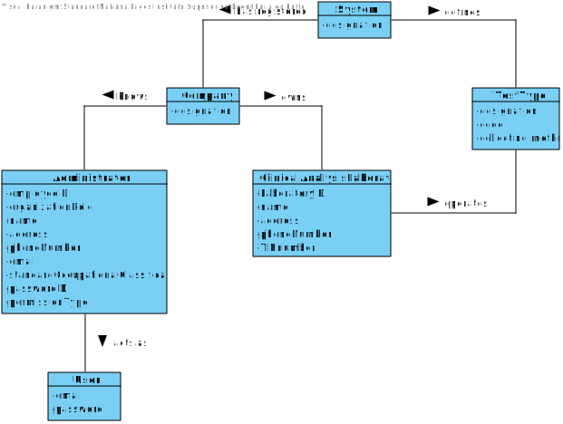
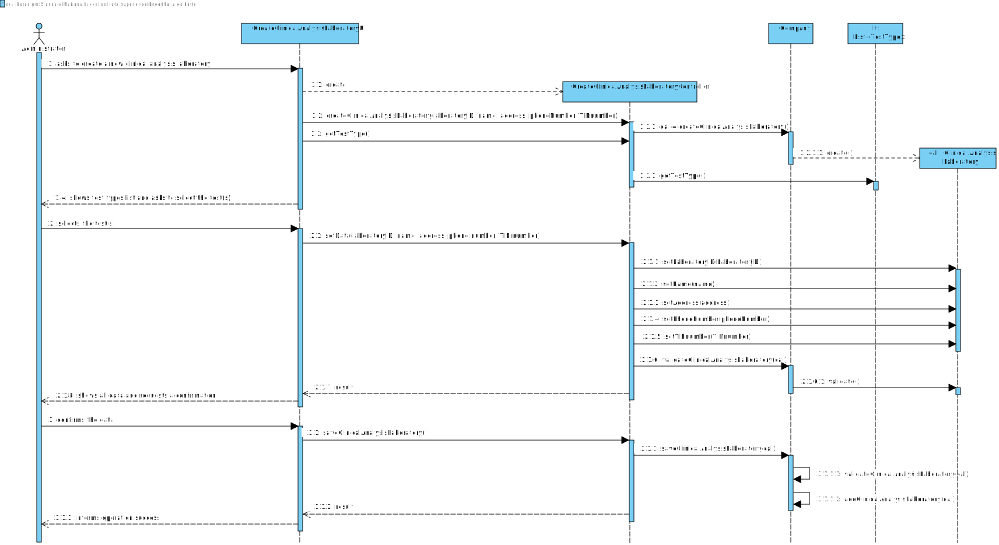
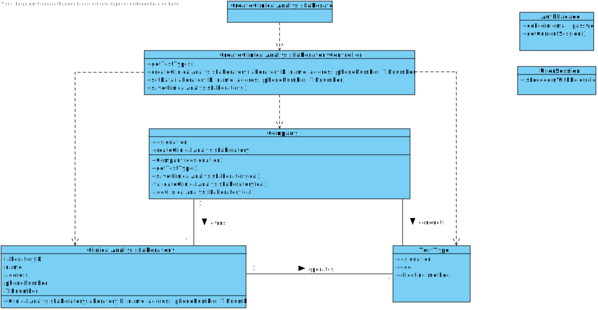

# US 8 - RegisterNewClinicalAnalysisLaboratory

## 1. Requirements Engineering

*In this section, it is suggested to capture the requirement description and specifications as provided by the client as well as any further clarification on it. It is also suggested to capture the requirements acceptance criteria and existing dependencies to other requirements. At last, identfy the involved input and output data and depicted an Actor-System interaction in order to fulfill the requirement.*

### 1.1. User Story Description

*As an administrator, I want to register a new clinical analysis laboratory stating which kind of test(s) it operates.*

### 1.2. Customer Specifications and Clarifications 

**From the specifications document:**

> All Many Labs clinical analysis laboratories perform clinical blood tests, and a subset of these laboratories also performs Covid-19 tests.

**From the client clarifications:**

> **Question:** What are that data that characterize a Clinical Analysis Laboratory?
> 
> **Answer:** Each Clinical Analysis Laboratory is characterized by the following attributes: Laboratory ID, name, address, phone number and TIN number.

> **Question:** Is there a maximum limit of types of tests a Clinical Analysis Laboratory can operate?
>
> **Answer:** No.

> **Question:** Are the test types in US8 typed in or selected from those that the program has?
> 
> **Answer:** The test types are selected from a list.

> **Question:** Should the employees be allocated to the clinical lab in which they work? Or, for example, can one medical lab technician work in more than one clinical analysis laboratory?
> 
> **Answer:** Each Receptionist and each Medical Lab Technician can work in any CLinical Analysis Laboratory of the Many Labs network.

> **Question:** Are two Clinical Analysis Laboratories with the same attributes allowed to exist?
> 
> **Answer:** Only the name of two Clinical Analysis Laboratories can be the same.

### 1.3. Acceptance Criteria

* **AC1:** A Clinical Analysis Laboratory must always perform clinical blood tests.
* **AC2:** Laboratory ID has 5 alphanumeric characters
* **AC3:** Name is a string with no more than 30 characters
* **AC4:** Address is a string with no more than 30 characters
* **AC5:** Phone number has 11 digit numbers
* **AC6:** TIN number has 10 digit numbers
* **AC7:** A Clinical Analysis Laboratory cannot be registered without all its attributes
* **AC8:** All types of test are performed by the lab
* **AC9:** Only the name of two Clinical Analysis Laboratories can be the same

### 1.4. Found out Dependencies

There is a dependency to "US009 Specify a new type of test and its collecting methods" since at least a test type must exist to be performed in a clinical analysis laboratory.

### 1.5 Input and Output Data

**Input Data:**

* Typed data:
    * Laboratory ID
    * Name
    * Address
    * Phone number
    * TIN number

* Selected data:
    * Test type(s)

**Output Data:**

* List of existing test types
* (In)Success of the operation

### 1.6. System Sequence Diagram (SSD)

### 1.7 Other Relevant Remarks

*Use this section to capture other relevant information that is related with this US such as (i) special requirements ; (ii) data and/or technology variations; (iii) how often this US is held.* 

## 2. OO Analysis

### 2.1. Relevant Domain Model Excerpt 
*In this section, it is suggested to present an excerpt of the domain model that is seen as relevant to fulfill this requirement.* 

### 2.2. Other Remarks

*Use this section to capture some aditional notes/remarks that must be taken into consideration into the design activity. In some case, it might be usefull to add other analysis artifacts (e.g. activity or state diagrams).* 

## 3. Design - User Story Realization 

### 3.1. Rationale

**The rationale grounds on the SSD interactions and the identified input/output data.**

| Interaction ID | Question: Which class is responsible for... | Answer | Justification (with patterns) |
|:-------------  |:--------------------- |:------------|:---------------------------- |
| Step/Msg 1: asks to create a new clinical analysis laboratory | ... interacting with the actor? | CreateClinicalAnalysisLaboratoryUI | Pure Fabrication: there is no reason to assign this responsibility to any existing class in the Domain Model |
|                                                               | ... coordinating the US? | CreateClinicalAnalysisLaboratoryController | Controller |
|                                                               | ... instantiating a new Clinical Analysis Laboratory? | Company | Creator (Rule 1): in the DM Company has a Clinical Analysis Laboratory |
|                                                               | ... knowing the user using the system? | UserSession | IE: cf. A&A component documentation |
|                                                               | ... knowing to which organization the user belongs to? | System | IE: has registed all? |
| Step/Msg 2: request data (laboratoryID, name, address, phoneNumber, TINnumber) | n/a | | |
| Step/Msg 3: types requested data | ... saving the inputted data? | ClinicalAnalysisLaboratory | IE: object created in step 1 has its own data |
| Step/Msg 4: shows the test types it can operate |	... knowing the test types to show? | System | IE: test types are defined by the system? |
| Step/Msg 5: confirms the selected test types | ... saving the selected test types? | ClinicalAnalysisLaboratory | IE: object created in step 1 operates one or more test types |
| Step/Msg 6: shows the data and requests a confirmation | ... validating the data locally (e.g.: mandatory vs non-mandatory data)? | Company | IE: knows its own data |
|                                                        | ... validating the data globally (e.g.: duplicated)? | Company | IE: knows all the ClinicalAnalysisLaboratory objects |
| Step/Msg 7: confirms the data | ... saving the created clinical analysis laboratory? | Company | IE: adopts/records all the ClinicalAnalysisLaboratory objects |
| Step/Msg 8: informs operation success | ... informing operation success? | UI | IE: responsible for user interaction |

### Systematization ##

According to the taken rationale, the conceptual classes promoted to software classes are: 

 * Company
 * UserSession
 * System
 * ClinicalAnalysisLaboratory
 * UI?

Other software classes (i.e. Pure Fabrication) identified: 
 * CreateClinicalAnalysisLaboratoryUI  
 * CreateClinicalAnalysisLaboratoryController

## 3.2. Sequence Diagram (SD)

*In this section, it is suggested to present an UML dynamic view stating the sequence of domain related software objects' interactions that allows to fulfill the requirement.*

## 3.3. Class Diagram (CD)

*In this section, it is suggested to present an UML static view representing the main domain related software classes that are involved in fulfilling the requirement as well as and their relations, attributes and methods.*

# 4. Tests

*In this section, it is suggested to systematize how the tests were designed to allow a correct measurement of requirements fulfilling.* 

**_DO NOT COPY ALL DEVELOPED TESTS HERE_**

**Test 1:** Check that it is not possible to create an instance of the Example class with null values. 

	@Test(expected = IllegalArgumentException.class)
		public void ensureNullIsNotAllowed() {
		Exemplo instance = new Exemplo(null, null);
	}

*It is also recommended to organize this content by subsections.* 

# 5. Construction (Implementation)

*In this section, it is suggested to provide, if necessary, some evidence that the construction/implementation is in accordance with the previously carried out design. Furthermore, it is recommeded to mention/describe the existence of other relevant (e.g. configuration) files and highlight relevant commits.*

*It is also recommended to organize this content by subsections.* 

# 6. Integration and Demo 

*In this section, it is suggested to describe the efforts made to integrate this functionality with the other features of the system.*

# 7. Observations

*In this section, it is suggested to present a critical perspective on the developed work, pointing, for example, to other alternatives and or future related work.*

