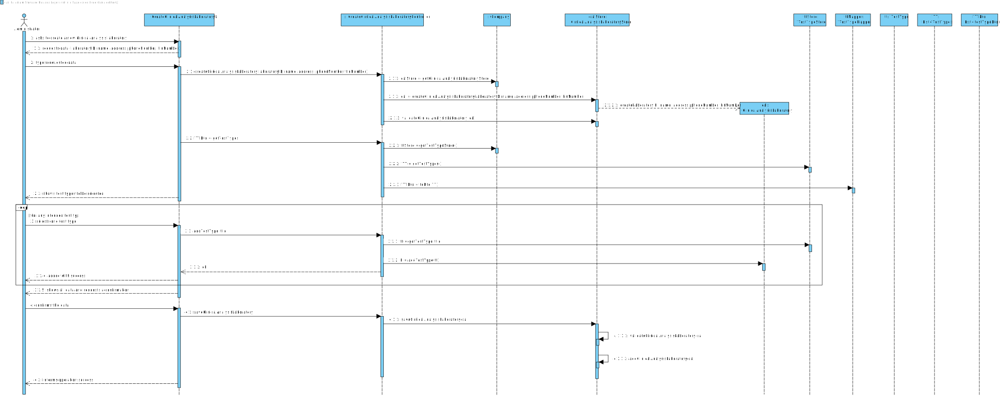

# US 8 - RegisterNewClinicalAnalysisLaboratory

## 1. Requirements Engineering

*In this section, it is suggested to capture the requirement description and specifications as provided by the client as well as any further clarification on it. It is also suggested to capture the requirements acceptance criteria and existing dependencies to other requirements. At last, identfy the involved input and output data and depicted an Actor-System interaction in order to fulfill the requirement.*

### 1.1. User Story Description

*As an administrator, I want to register a new clinical analysis laboratory stating which kind of test(s) it operates.*

### 1.2. Customer Specifications and Clarifications 

**From the specifications document:**

> All Many Labs clinical analysis laboratories perform clinical blood tests, and a subset of these laboratories also performs Covid-19 tests.

**From the client clarifications:**

> **Question:** What are that data that characterize a Clinical Analysis Laboratory?
> 
> **Answer:** Each Clinical Analysis Laboratory is characterized by the following attributes: Laboratory ID, name, address, phone number and TIN number.

> **Question:** Which type/format has LaboratoryID, address, name, phone number, and TIN number on Clinical Analysis Laboratory?
> 
> **Answer:** Each Clinical Analysis Laboratory is characterized by the following attributes:
>
> * Laboratory ID: 5 alphanumeric characters;
> * Name: A string with no more than 20 characters;
> * Address: A string with no more than 30 characters;
> * Phone Number: 11 digit numbers;
> * TIN number: 10 digit numbers;
> * Type of tests performed by the lab.
>
> All information is required.

> **Question:** Is there a maximum limit of types of tests a Clinical Analysis Laboratory can operate?
>
> **Answer:** No.

> **Question:** Are the test types in US8 typed in or selected from those that the program has?
> 
> **Answer:** The test types are selected from a list.

> **Question:** Should the employees be allocated to the clinical lab in which they work? Or, for example, can one medical lab technician work in more than one clinical analysis laboratory?
> 
> **Answer:** Each Receptionist and each Medical Lab Technician can work in any CLinical Analysis Laboratory of the Many Labs network.

> **Question:** Are two Clinical Analysis Laboratories with the same attributes allowed to exist?
> 
> **Answer:** Only the name of two Clinical Analysis Laboratories can be the same.

### 1.3. Acceptance Criteria

* **AC1:** Laboratory ID has 5 alphanumeric characters
* **AC2:** Name is a string with no more than 20 characters
* **AC3:** Address is a string with no more than 30 characters
* **AC4:** Phone number has 11 digit numbers
* **AC5:** TIN number has 10 digit numbers
* **AC6:** A Clinical Analysis Laboratory cannot be registered without all its attributes
* **AC7:** All types of test are performed by the lab
* **AC8:** A Clinical Analysis Laboratory must always perform clinical blood tests.
* **AC9:** Only the name of two Clinical Analysis Laboratories can be the same

### 1.4. Found out Dependencies

There is a dependency to "US009 Specify a new type of test and its collecting methods" since at least a test type must exist to be performed in a clinical analysis laboratory.

### 1.5 Input and Output Data

**Input Data:**

* Typed data:
    * Laboratory ID
    * Name
    * Address
    * Phone number
    * TIN number

* Selected data:
    * Test type(s)

**Output Data:**

* List of existing test types
* (In)Success of the operation

### 1.6. System Sequence Diagram (SSD)

### 1.7 Other Relevant Remarks

*Use this section to capture other relevant information that is related with this US such as (i) special requirements ; (ii) data and/or technology variations; (iii) how often this US is held.* 

## 2. OO Analysis

### 2.1. Relevant Domain Model Excerpt

### 2.2. Other Remarks

*Use this section to capture some additional notes/remarks that must be taken into consideration into the design activity. In some case, it might be usefull to add other analysis artifacts (e.g. activity or state diagrams).*

## 3. Design - User Story Realization 

### 3.1. Rationale

**The rationale grounds on the SSD interactions and the identified input/output data.**

| Interaction ID | Question: Which class is responsible for... | Answer | Justification (with patterns) |
|:-------------  |:--------------------- |:------------|:---------------------------- |
| Step/Msg 1: asks to create a new Clinical Analysis Laboratory | ... interacting with the actor? | ClinicalAnalysisLaboratoryUI | Pure Fabrication: there is no reason to assign this responsibility to any existing class in the Domain Model |
|                                                               | ... coordinating the US? | ClinicalAnalysisLaboratoryController | Controller |
|                                                               | ... instantiating a new Clinical Analysis Laboratory? | Company | Creator (Rule 1): in the DM Company has a Clinical Analysis Laboratory |
|                                                               | ... knowing the user using the system? | UserSession | IE: cf. A&A component documentation |
|                                                               | ... knowing to which organization the user belongs to? | System | IE: has registered all |
| Step/Msg 2: request data (laboratoryID, name, address, phoneNumber, tinNumber) | n/a | | |
| Step/Msg 3: types requested data | ... saving the inputted data? | ClinicalAnalysisLaboratory | IE: object created in step/msg 1 has its own data |
| Step/Msg 4: shows the test types it can operate and asks to select the test(s) | ... knowing the test types to show? | System | IE: test types are defined by the system |
| Step/Msg 5: selects the test(s) | ... saving the selected data? | ClinicalAnalysisLaboratory | IE: object created in step/msg 1 has its own data |
| Step/Msg 6: confirms the selected test types | ... saving the selected test types? | ClinicalAnalysisLaboratory | IE: object created in step 1 operates one or more test types |
| Step/Msg 7: shows all data and requests a confirmation | ... validating the data locally (e.g.: mandatory vs non-mandatory data)? | Company | IE: knows its own data |
|                                                        | ... validating the data globally (e.g.: duplicated)? | Company | IE: knows all the ClinicalAnalysisLaboratory objects |
| Step/Msg 8: confirms the data | ... saving the created Clinical Analysis Laboratory? | Company | IE: adopts/records all the ClinicalAnalysisLaboratory objects |
| Step/Msg 9: informs operation success | ... informing operation success? | ClinicalAnalysisLaboratoryUI | IE: responsible for user interaction |

### Systematization ##

According to the taken rationale, the conceptual classes promoted to software classes are: 

 * Company
 * ClinicalAnalysisLaboratory

Other software classes (i.e. Pure Fabrication) identified: 
 * ClinicalAnalysisLaboratoryUI  
 * ClinicalAnalysisLaboratoryController
 * ClinicalAnalysisLaboratoryStore

## 3.2. Sequence Diagram (SD)

## 3.3. Class Diagram (CD)

# 4. Tests

**Test 1:** Check that it is not possible to create an instance of ClinicalAnalysisLaboratory class with null values. 

	@Test(expected = IllegalArgumentException.class)
    public void ClinicalAnalysisLaboratoryNull() {
        ClinicalAnalysisLaboratory cal = new ClinicalAnalysisLaboratory(null, null,null,null,null);
    }

### AC1

**Test 2:** Check that it is not possible to create an instance of ClinicalAnalysisLaboratory class with laboratoryID blank.

    @Test(expected = IllegalArgumentException.class)
    public void checkLaboratoryIDBlank() {
        ClinicalAnalysisLaboratory cal = new ClinicalAnalysisLaboratory(" ", "FirstCal", "3425 Stone Street", "01492235687", "3245681253");
    }

**Test 3:** Check that it is not possible to create an instance of ClinicalAnalysisLaboratory class with laboratoryID not alphanumeric.

    @Test(expected = IllegalArgumentException.class)
    public void checkLaboratoryIDNotAlphanumeric() {
        ClinicalAnalysisLaboratory cal = new ClinicalAnalysisLaboratory("1a?.", "FirstCal", "3425 Stone Street", "01492235687", "3245681253");
    }

**Test 4:** Check that it is not possible to create an instance of ClinicalAnalysisLaboratory class with laboratoryID with more characters than the maximum.

    @Test(expected = IllegalArgumentException.class)
    public void checkLaboratoryIDTooManyChars() {
        ClinicalAnalysisLaboratory cal = new ClinicalAnalysisLaboratory("12aB8c", "FirstCal", "3425 Stone Street", "01492235687", "3245681253");
    }

### AC2

**Test 5:** Check that it is not possible to create an instance of ClinicalAnalysisLaboratory class with name blank.

    @Test(expected = IllegalArgumentException.class)
    public void checkNameBlank() {
        ClinicalAnalysisLaboratory cal = new ClinicalAnalysisLaboratory("LAB01", " ", "3425 Stone Street", "01492235687", "3245681253");
    }

**Test 6:** Check that it is not possible to create an instance of ClinicalAnalysisLaboratory class with name with more characters than the maximum.

    @Test(expected = IllegalArgumentException.class)
    public void checkNameTooManyChars() {
        ClinicalAnalysisLaboratory cal = new ClinicalAnalysisLaboratory("LAB01", "FirstClinicalAnalysisLaboratory", "3425 Stone Street", "01492235687", "3245681253");
    }

**Test 7:** Check that it is not possible to create an instance of ClinicalAnalysisLaboratory class with name not being only letters. (example)

    @Test(expected = IllegalArgumentException.class)
    public void checkNameNotOnlyLetters1() {
        ClinicalAnalysisLaboratory cal = new ClinicalAnalysisLaboratory("LAB01", "651fvs6DN", "3425 Stone Street", "01492235687", "3245681253");
    }

### AC3

**Test 8:** Check that it is not possible to create an instance of ClinicalAnalysisLaboratory class with address blank.

    @Test(expected = IllegalArgumentException.class)
    public void checkAddressBlank() {
        ClinicalAnalysisLaboratory cal = new ClinicalAnalysisLaboratory("LAB01", "FirstCal", " ", "01492235687", "3245681253");
    }

**Test 9:** Check that it is not possible to create an instance of ClinicalAnalysisLaboratory class with address with more characters than the maximum.

    @Test(expected = IllegalArgumentException.class)
    public void checkAddressTooManyChars() {
        ClinicalAnalysisLaboratory cal = new ClinicalAnalysisLaboratory("LAB01", "FirstCal", "342892491625416825 Stone Street", "01492235687", "3245681253");
    }

### AC4

**Test 10:** Check that it is not possible to create an instance of ClinicalAnalysisLaboratory class with phone number blank.

    @Test(expected = IllegalArgumentException.class)
    public void checkPhoneNumberBlank() {
        ClinicalAnalysisLaboratory cal = new ClinicalAnalysisLaboratory("LAB01", "FirstCal", "3425 Stone Street", " ", "3245681253");
    }

**Test 11:** Check that it is not possible to create an instance of ClinicalAnalysisLaboratory class with phone number with more characters than the maximum.

    @Test(expected = IllegalArgumentException.class)
    public void checkPhoneNumberTooManyChars() {
        ClinicalAnalysisLaboratory cal = new ClinicalAnalysisLaboratory("LAB01", "FirstCal", "3425 Stone Street", "014922356870", "3245681253");
    }

**Test 12:** Check that it is not possible to create an instance of ClinicalAnalysisLaboratory class with phone number not being only numbers. (example)

    @Test(expected = IllegalArgumentException.class)
    public void checkPhoneNumberNotOnlyNumbers1() {
        ClinicalAnalysisLaboratory cal = new ClinicalAnalysisLaboratory("LAB01", "FirstCal", "3425 Stone Street", "01422dqas35", "3245681253");
    }

### AC5

**Test 13:** Check that it is not possible to create an instance of ClinicalAnalysisLaboratory class with TIN number blank.

    @Test(expected = IllegalArgumentException.class)
    public void checkTinNumberBlank() {
        ClinicalAnalysisLaboratory cal = new ClinicalAnalysisLaboratory("LAB01", "FirstCal", "3425 Stone Street", "014922356870", " ");
    }

**Test 14:** Check that it is not possible to create an instance of ClinicalAnalysisLaboratory class with TIN number with more characters than the maximum.

    @Test(expected = IllegalArgumentException.class)
    public void checkTinNumberTooManyChars() {
        ClinicalAnalysisLaboratory cal = new ClinicalAnalysisLaboratory("LAB01", "FirstCal", "3425 Stone Street", "01492235687", "32456812530");
    }

**Test 15:** Check that it is not possible to create an instance of ClinicalAnalysisLaboratory class with TIN number not being only numbers. (example)

    @Test(expected = IllegalArgumentException.class)
    public void checkTinNumberNotOnlyNumbers1() {
        ClinicalAnalysisLaboratory cal = new ClinicalAnalysisLaboratory("LAB01", "FirstCal", "3425 Stone Street", "01492235687", "326erFC813");
    }

# 5. Construction (Implementation)

### ClinicalAnalysisLaboratory

    public class ClinicalAnalysisLaboratory {

        private String laboratoryID;
        private String name;
        private String address;
        private String phoneNumber;
        private String tinNumber;

        /**
        * Constructs an instance of Clinical Analysis Laboratory.
        *
        * @param laboratoryID the Clinical Analysis Laboratory's laboratory ID
        * @param name the Clinical Analysis Laboratory's name
        * @param address the Clinical Analysis Laboratory's address
        * @param phoneNumber the Clinical Analysis Laboratory's phone number
        * @param tinNumber the Clinical Analysis Laboratory's TIN number
        */
        public ClinicalAnalysisLaboratory(String laboratoryID, String name, String address, String phoneNumber, String tinNumber) {
            this.laboratoryID = laboratoryID;
            this.name = name;
            this.address = address;
            this.phoneNumber = phoneNumber;
            this.tinNumber = tinNumber;

            checkLaboratoryIDRules(laboratoryID);
            checkNameRules(name);
            checkAddressRules(address);
            checkPhoneNumberRules(phoneNumber);
            checkTinNumberRules(tinNumber);
        }

        //  Gets --------------------------------------------------------------------

        /**
        * Returns the laboratory ID of the Clinical Analysis Laboratory.
        *
        * @return the laboratory ID of the Clinical Analysis Laboratory
        */
        public String getLaboratoryID() {
            return laboratoryID;
        }

        /**
        * Returns the name of the Clinical Analysis Laboratory.
        *
        * @return the name of the Clinical Analysis Laboratory
        */
        public String getName() {
            return name;
        }

        /**
        * Returns the address of the Clinical Analysis Laboratory.
        *
        * @return the address of the Clinical Analysis Laboratory
        */
        public String getAddress() {
            return address;
        }

        /**
        * Returns the phone number of the Clinical Analysis Laboratory.
        *
        * @return the phone number of the Clinical Analysis Laboratory
        */
        public String getPhoneNumber() {
            return phoneNumber;
        }

        /**
        * Returns the TIN number of the Clinical Analysis Laboratory.
        *
        * @return the TIN number of the Clinical Analysis Laboratory
        */
        public String getTINnumber() {
            return tinNumber;
        }

        //  Sets --------------------------------------------------------------------

        /**
        * Modifies the laboratory ID of the Clinical Analysis Laboratory.
        *
        * @param laboratoryID the Clinical Analysis Laboratory's laboratory ID
        */
        public void setLaboratoryID(String laboratoryID) {
            this.laboratoryID = laboratoryID;
        }

        /**
        * Modifies the name of the Clinical Analysis Laboratory.
        *
        * @param name the Clinical Analysis Laboratory's name
        */
        public void setName(String name) {
            checkNameRules(name);
            this.name = name;
        }

        /**
        * Modifies the address of the Clinical Analysis Laboratory.
        *
        * @param address the Clinical Analysis Laboratory's address
        */
        public void setAddress(String address) {
            checkAddressRules(address);
            this.address = address;
        }

        /**
        * Modifies the phone number of the Clinical Analysis Laboratory.
        *
        * @param phoneNumber the Clinical Analysis Laboratory's phone number
        */
        public void setPhoneNumber(String phoneNumber) {
            checkPhoneNumberRules(phoneNumber);
            this.phoneNumber = phoneNumber;
        }

        /**
        * Modifies the TIN number of the Clinical Analysis Laboratory.
        *
        * @param tinNumber the Clinical Analysis Laboratory's TIN number
        */
        public void setTINnumber(String tinNumber) {
            checkTinNumberRules(tinNumber);
            this.tinNumber = tinNumber;
        }

        //  Checks --------------------------------------------------------------------

        /**
        * Checks the laboratory ID rules.
        *
        * @param laboratoryID the Clinical Analysis Laboratory's laboratory ID
        */
        private void checkLaboratoryIDRules(String laboratoryID) {
            if (StringUtils.isBlank(laboratoryID)) {
                throw new IllegalArgumentException("LaboratoryID cannot be blank.");
            }
            if (!(laboratoryID.matches("^[a-zA-Z0-9]*$") && laboratoryID.length() == 5)) {
                throw new IllegalArgumentException("LaboratoryID must be 5 alphanumeric characters.");
            }
        }

        /**
        * Checks the name rules.
        *
        * @param name the Clinical Analysis Laboratory's name
        */
        private void checkNameRules(String name) {
            String aux = name.trim();
            aux = aux.toLowerCase();
            char[] auxchar = aux.toCharArray();

            if (StringUtils.isBlank(name)) {
                throw new IllegalArgumentException("Name cannot be blank.");
            }
            if (name.length() >= 20) {
                throw new IllegalArgumentException("Name cannot have more than 30 characters.");
            }
            for (int i = 0; i < auxchar.length; i++) {
                char ch = auxchar[i];
                if (!(ch >= 'a' && ch <= 'z')) {
                    throw new IllegalArgumentException("Invalid name! Try using only letters.");
                }
            }
        }

        /**
        * Checks the address rules.
        *
        * @param address the Clinical Analysis Laboratory's address
        */
        private void checkAddressRules(String address) {
            if (StringUtils.isBlank(address)) {
                throw new IllegalArgumentException("Address cannot be blank.");
            }
            if (address.length() >= 30) {
                throw new IllegalArgumentException("Address cannot have more than 30 characters.");
            }
        }

        /**
        * Checks the phone number rules.
        *
        * @param phoneNumber the Clinical Analysis Laboratory's phone number
        */
        private void checkPhoneNumberRules(String phoneNumber) {
            String auxTrimPhoneNumber = phoneNumber.replaceAll("\\s", "");
            char[] auxChar = auxTrimPhoneNumber.toCharArray();

            if (StringUtils.isBlank(phoneNumber)) {
                throw new IllegalArgumentException("Phone number cannot be blank.");
            }
            if (phoneNumber.length() != 11) {
                throw new IllegalArgumentException("Phone number must be 11 digit numbers.");
            }
            for (int i = 0; i < auxChar.length; i++) {
                char ch = auxChar[i];
                if (ch >= 'a' && ch <= 'z' || ch >= 'A' && ch <= 'Z') {
                    throw new IllegalArgumentException("Invalid phone number! Try using only numbers.");
                }
            }
        }

        /**
        * Checks the TIN number rules.
        *
        * @param tinNumber the Clinical Analysis Laboratory's TIN number
        */
        private void checkTinNumberRules(String tinNumber) {
            String auxTrimTINnumber = tinNumber.replaceAll("\\s", "");
            char[] auxChar = auxTrimTINnumber.toCharArray();

            if (StringUtils.isBlank(tinNumber)) {
                throw new IllegalArgumentException("TIN number cannot be blank.");
            }
            if (tinNumber.length() != 10) {
                throw new IllegalArgumentException("TIN number must be 10 digit numbers.");
            }
            for (int i = 0; i < auxChar.length; i++) {
                char ch = auxChar[i];
                if (ch >= 'a' && ch <= 'z' || ch >= 'A' && ch <= 'Z') {
                    throw new IllegalArgumentException("Invalid TIN number! Try using only numbers.");
                }
            }
        }

        /**
        * Returns the textual description of the Clinical Analysis Laboratory in the format: laboratory ID, name,
        * address, phone number, TIN number.
        *
        * @return the Clinical Analysis Laboratory's characteristics
        */
        @Override
        public String toString() {
            return "LaboratoryID: " + laboratoryID + ", Name: " + name + ", Address: " + address + ", Phone number: " + phoneNumber + ", TIN number: " + tinNumber;
        }
    }

## ClinicalAnalysisLaboratoryController

    public class ClinicalAnalysisLaboratoryController {

        private Company company;
        private ClinicalAnalysisLaboratoryStore store;

        /**
        * Creates an empty Clinical Analysis Laboratory controller.
        */
        public ClinicalAnalysisLaboratoryController() {
            this(App.getInstance().getCompany());
        }

        /**
        * Instance of a Clinical Analysis Laboratory.
        *
        * @param company the company that administrates the system
        */
        public ClinicalAnalysisLaboratoryController(Company company) {
            this.company = company;
        }

        /**
        * Creates a Clinical Analysis Laboratory.
        *
        * @param laboratoryID the Clinical Analysis Laboratory's laboratory ID
        * @param name the Clinical Analysis Laboratory's name
        * @param address the Clinical Analysis Laboratory's address
        * @param phoneNumber the Clinical Analysis Laboratory's phone number
        * @param tinNumber the Clinical Analysis Laboratory's TIN number
        */
        public void CreateClinicalAnalysisLaboratory(String laboratoryID, String name, String address, String phoneNumber, String tinNumber) {
            store = company.getClinicalAnalysisLaboratoryStore();
            store.CreateClinicalAnalysisLaboratory(laboratoryID, name, address, phoneNumber, tinNumber);
        }

        /**
        * Transforms into string.
        *
        * @return the Clinical Analysis Laboratory's info in string format
        */
        public String getCAL() {
            return store.getCal().toString();
        }

        /**
        * Saves an instance of Clinical Analysis Laboratory.
        *
        * @return the saving of an instance of a Clinical Analysis Laboratory
        */
        public boolean saveClinicalAnalysisLaboratory() {
            return this.store.saveClinicalAnalysisLaboratory();
        }
    }

## ClinicalAnalysisLaboratoryStore

    public class ClinicalAnalysisLaboratoryStore {

        List<ClinicalAnalysisLaboratory> clinicalAnalysisLaboratoryList;
        ClinicalAnalysisLaboratory cal;

        /**
        * Constructor.
        */
        public ClinicalAnalysisLaboratoryStore() {
            this.clinicalAnalysisLaboratoryList = new ArrayList<>();
        }

        /**
        * Creates a Clinical Analysis Laboratory.
        *
        * @param laboratoryID the Clinical Analysis Laboratory's laboratory ID
        * @param name the Clinical Analysis Laboratory's name
        * @param address the Clinical Analysis Laboratory's address
        * @param phoneNumber the Clinical Analysis Laboratory's phone number
        * @param tinNumber the Clinical Analysis Laboratory's TIN number
        */
        public ClinicalAnalysisLaboratory CreateClinicalAnalysisLaboratory(String laboratoryID, String name, String address, String phoneNumber, String tinNumber) {
            return this.cal = new ClinicalAnalysisLaboratory(laboratoryID, name, address, phoneNumber, tinNumber);
        }

        /**
        * Validates a Clinical Analysis Laboratory.
        *
        * @param cal the object Clinical Analysis Laboratory
        * @return the validation of the Clinical Analysis Laboratory being created
        */
        public boolean validateClinicalAnalysisLaboratory(ClinicalAnalysisLaboratory cal) {
            if (cal == null || listContain(cal)) {
                return false;
            }
            return true;
        }

        /**
        * Checks if the new object created is already in the list.
        *
        * @param cal the object Clinical Analysis Laboratory
        * @return true if the list contains the Clinical Analysis Laboratory and false if it doesn't
        */
        public boolean listContain(ClinicalAnalysisLaboratory cal) {
            if (this.clinicalAnalysisLaboratoryList.contains(cal)) {
                return true;
            } else {
                return false;
            }
        }

        /**
        * Saves an instance of Clinical Analysis Laboratory.
        *
        * @return the saving of an instance of a Clinical Analysis Laboratory
        */
        public boolean saveClinicalAnalysisLaboratory() {
            if (validateClinicalAnalysisLaboratory(this.cal)) {
                listAdd(cal);
                return true;
            } else {
                return false;
            }
        }

        /**
        * Adds an instance of Clinical Analysis Laboratory to the list.
        *
        * @param cal the object Clinical Analysis Laboratory
        * @return the addition of the Clinical Analysis Laboratory to the list
        */
        public boolean listAdd(ClinicalAnalysisLaboratory cal) {
            clinicalAnalysisLaboratoryList.add(cal);
            return true;
        }

        /**
        * Replaces the element at the specified position in the list with the specified element.
        *
        * @param i the index of the element to replace
        * @return the element previously at the specified position
        */
        public ClinicalAnalysisLaboratory getClinicalAnalysisLaboratory(int i) {
            return clinicalAnalysisLaboratoryList.get(i);
        }

        /**
        * Gets Clinical Analysis Laboratory from the list.
        *
        * @return the Clinical Analysis Laboratory requested
        */
        public ClinicalAnalysisLaboratory getCal() {
            return cal;
        }
    }

##ClinicalAnalysisLaboratoryUI

    public class ClinicalAnalysisLaboratoryUI implements Runnable {

        private ClinicalAnalysisLaboratoryController ctrl;
        private TestTypeStore ttStore;

        public ClinicalAnalysisLaboratoryUI() {
            this.ctrl = new ClinicalAnalysisLaboratoryController();
            this.ttStore = new TestTypeStore();
        }

        @Override
        public void run() {
            boolean count = true;
            boolean leave = false;
            if (this.ttStore.getTestTypeList() == null || this.ttStore.getTestTypeList().isEmpty()) {
                System.out.println("The list is empty! Please, try adding at least one test type in order to create the laboratory.");
            } else {
                do {
                    boolean exception = false;
                    do {
                        TestType tt = (TestType) Utils.showAndSelectOne(this.ttStore.getTestTypeList(), "Select the test types");
                        this.ttStore.listAdd(tt);
                        leave = Utils.confirm("Do you wish to select more test types?");
                    } while (!leave);

                    do {
                        try {
                            String laboratoryID = Utils.readLineFromConsole("Please enter the laboratoryID of the Clinical Analysis Laboratory");
                            String name = Utils.readLineFromConsole("Please enter the name of the Clinical Analysis Laboratory");
                            String address = Utils.readLineFromConsole("Please enter the address of the Clinical Analysis Laboratory");
                            String phoneNumber = Utils.readLineFromConsole("Please enter the phone number of the Clinical Analysis Laboratory");
                            String TINnumber = Utils.readLineFromConsole("Please enter the TIN number of the Clinical Analysis Laboratory");

                            this.ctrl.CreateClinicalAnalysisLaboratory(laboratoryID, name, address, phoneNumber, TINnumber);
                        } catch (Exception e){
                            e.printStackTrace();
                            System.out.println("Incorrect input of data (an error has occured)! Please, try again.");
                            exception = true;
                        }
                    } while (exception);

                    count = Utils.confirm("Clinical Analysis Laboratory created! Do you want to save it?" + ctrl.getCAL());
                    if (count) {
                        if (this.ctrl.saveClinicalAnalysisLaboratory()) {
                            System.out.println("Clinical Analysis Laboratory was saved with success!");
                        }
                    }
                } while (!count);
            }
        }
    }

# 6. Integration and Demo 

- Options list in AdminUI
- Team members in DevTeamUI

# 7. Observations

