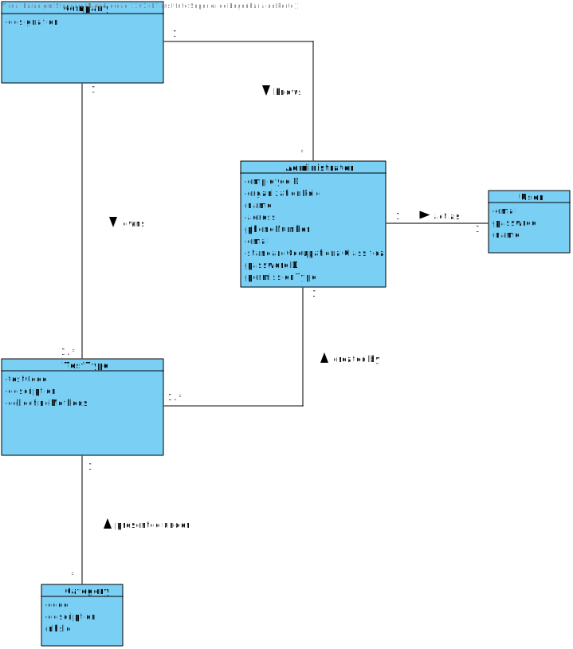
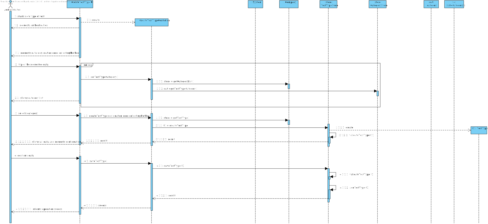

# US 9 - Specify test and its collecting methods

## 1. Requirements Engineering

### 1.1. User Story Description

*- As an administrator, I want to specify a new type of test and its collecting methods.*

### 1.2. Customer Specifications and Clarifications

**From the Specifications Document:**

> "Typically, the client arrives at one of the clinical analysis laboratories with a lab order prescribed by a doctor. Once there, a receptionist asks the client´s citizen card number, the lab order (which contains the type of test and parameters to be measured), and registers in the application the test to be performed to that client".

> "Many Labs performs two types of tests. Each test is characterized by an internal code, an NHS code, a description that indetifies the sample collection method, the date and time when the samples were collected, the date and time of the chemical analysis, the data and time of the diagnosis made by the specialist doctor, the date and time when the laboratory coordiantor validated the test, and the test type(whether it is blood test or Covid test)"

**From the client clarifications:**

> **Question**: Does a type of test holds any attribute besides its name and collecting methods?
>
> **Answer**: The attributes for a new test type are: description, collecting method and each test type should have a set of categories. Each category should be chosen from a list of categories. Each category has a name and a unique code. There are no subcategories. There exists only one collection method per test type.

> **Question**: Are the collecting methods stored simpled as a word or a sentence, or does it also must contain its description, and/or another attributes?
>
> **Answer**: To make a Covid test you need a swab to collect a sample. To make a blood test you need sample tubes and a syringe.
When the administrator (US9) specifies a new type of test, the administrator also specifies the method to collect a sample. The administrator introduces a brief description for specifying the collecting method. There exists only one collection method per test type.

> **Question**: Are there any different collecting methods other than the ones currently known? Which ones?
>
> **Answer**: Each collecting method is associated with a test type. Whenever a test type is created a collecting method should be defined.

### 1.3. Acceptance Criteria

* **AC1:** Code has five alphanumeric characters.
* **AC2:** The code is not automatically generated.
* **AC3:** The administrator introduces a brief description for specifying the collecting method.
* **AC4:** Description is a string with no more than 15 characters.
* **AC5:** Collecting method is a string with no more than 20 characters.
* **AC6:** Each category has a name and a unique code. There are no subcategories.
* **AC7:** There exists only one collection method per test type.
* **AC8:** Each collecting method is associated with a test type.
* **AC9:** Whenever a test type is created a collecting method should be defined.

### 1.4. Found out Dependencies

*There is a dependency to "US011 Specify a new parameter category" since at least a category must exist to be performed a test type.*

### 1.5 Input and Output Data

**Input data**

* Typed data:
    * a code,
    * a description,
    * a collecting method.

**Selected data**: Categories

**Output Data**

* List of existing categories
* (In)Success of the operation

### 1.6. System Sequence Diagram (SSD)

##

**Alternativa 1**

##

##

**Alternativa 2**

##

### 1.7 Other Relevant Remarks

*Use this section to capture other relevant information that is related with this US such as (i) special requirements ; (ii) data and/or technology variations; (iii) how often this US is held.* 

## 2. OO Analysis

### 2.1. Relevant Domain Model Excerpt 

### 2.2. Other Remarks

*Use this section to capture some aditional notes/remarks that must be taken into consideration into the design activity. In some case, it might be usefull to add other analysis artifacts (e.g. activity or state diagrams).* 

## 3. Design - User Story Realization 

### 3.1. Rationale

**The rationale grounds on the SSD interactions and the identified input/output data.**

| Interaction ID | Question: Which class is responsible for... | Answer | Justification (with patterns) |
|:-------------- |:--------------------- |:------------|:---------------------------- |
| Step/Msg 1: starts new test type | ... interacting with the actor? | CreateTestTypeUI | Pure Fabrication: there is no reason to assign this responsibility to any existing class in the Domain Model |
|                                  | ... coordinating the US? | CreateTestTypeController | Controller |
| 		                           | ... instantiating a new test type? | Company | Creator (Rule 1): in the DM Company has a test type |
| 	                               | ... knowing the user using the system? | UserSession | IE: cf. A&A component documentation |
| 		                           | ... knowing to which organization the user belongs to? | System | IE: has registed all? |
| Step/Msg 2: request data (description, code, collectingMethods) | n/a | | |
| Step/Msg 3: types requested data | ... saving the inputted data? | TestType | IE: object created in step 1 has its own data |
| Step/Msg 4: shows the test type category | ... knowing the test type category to show? | System | IE: TestType categories are defined by the system? | 
| Step/Msg 5: confirms the selected category | ... saving the selected category? | TestType | IE: object created in step 1 is classified in one Category |
| Step/Msg 6: shows the data and requests a confirmation | ... validating the data locally (e.g.: mandatory vs non-mandatory data)?	| TestTypeStore | IE: knows its own data |
|                                                        | ... validating the data globally (e.g.:duplicated)? | TestTypeStore | IE: adopts/records all the TestType objects |
| Step/Msg 7: confirms the data | ... saving the created test type? |  TestTypeStore | IE:adopts/records all the Test type objects |              
| Step/Msg 8: informs operation success | ... informing operation success? | TestTypeUI | IE: responsible for user interaction |

### Systematization ##

According to the taken rationale, the conceptual classes promoted to software classes are: 

 * Company
 * TestType

Other software classes (i.e. Pure Fabrication) identified: 

 * TestTypeUI
 * TestTypeController
 * TestTypeStore
 * CategoryStore  

## 3.2. Sequence Diagram (SD)

##

## 3.3. Class Diagram (CD)

# 4. Tests 

##AC 1: TestCode has 5 alphanumeric characters

###Test 1

        @Test(expected = IllegalArgumentException.class)
        public void checkTestCodeNotAlphaNumeric1() {

         ParameterCategoryStore pcStore = new ParameterCategoryStore();
          TestType tt = new TestType("+++","23232s","aaa42342",pcStore);

    }

###Test 2

         @Test(expected = IllegalArgumentException.class)
         public void checkTestCodeNotAlphaNumeric2() {

          ParameterCategoryStore pcStore = new ParameterCategoryStore();

          TestType tt = new TestType("...","23232s","aaa42342",pcStore);

    }

###Test 3

        @Test(expected = IllegalArgumentException.class)
        public void checkTestCodeTooManyChars() {

          ParameterCategoryStore pcStore = new ParameterCategoryStore();
          TestType tt = new TestType("11aaaaaa11","23232s","aaa42342",pcStore);

    }

###Test 4

        @Test(expected = IllegalArgumentException.class)
        public void checkTestCodeTooManyChars2() {

          ParameterCategoryStore pcStore = new ParameterCategoryStore();
          TestType tt = new TestType("111asdasdasdas1","23232s","aaa42342",pcStore);
    }

##AC 3: The administrator introduces a brief description for specifying the collecting method

###test 5

        @Test(expected = IllegalArgumentException.class)
        public void checkTestCodeTooManyChars() {

        ParameterCategoryStore pcStore = new ParameterCategoryStore();
        TestType tt = new TestType("11aaaaaa11","23232s","aaa42342",pcStore);

    }

##AC 4: Description is a string with no more than 15 characters

###Test 6

      @Test(expected = IllegalArgumentException.class)
        public void checkDescriptionTooManyChars1() {

        ParameterCategoryStore pcStore = new ParameterCategoryStore();
        TestType tt = new TestType("1111","232asdasdasdasdasdasdasdasdasdasdasdasdasdasdasdasdasdasdasdasdasdasda32s","2",pcStore);

    }

###Test 7

        @Test(expected = IllegalArgumentException.class)
        public void checkDescriptionTooManyChars2() {

        ParameterCategoryStore pcStore = new ParameterCategoryStore();
        TestType tt = new TestType("1111","2312312312312312312312312312312312312312312312232s","2",pcStore);

    }

##AC 5: Collecting Method is a string with no more than 20 characters

###Test 8

        @Test
        public void checkCollectingMethod() {

        ParameterCategoryStore pcStore = new ParameterCategoryStore();
        ParameterCategory pc = new ParameterCategory("AAAAa","aaa","aaaa");
        pcStore.listAdd();
        TestType tt = new TestType("1111","23232s","aaaa",pcStore);

        Assert.assertNotNull(tt);
    }

###Test 9

      @Test(expected = IllegalArgumentException.class)
        public void checkCollectingMethodTooManyChars2() {

        ParameterCategoryStore pcStore = new ParameterCategoryStore();
        TestType tt = new TestType("1111","23232s","aaaAAAAAAAAA1231231231231231AAAAAAAAAAAAAAAAAAAAAAAAAAAAAAAAAA42342",pcStore);
    }

###Test 10

    @Test(expected = IllegalArgumentException.class)
    public void checkCollectingMethodBlank() {

        ParameterCategoryStore pcStore = new ParameterCategoryStore();
        TestType tt = new TestType("1111","23232s","",pcStore);

    }

##AC 6: Each category has a name and a unique code. There are no subcategories.

###Test 11

      @Test(expected = IllegalArgumentException.class)
      public void checkTestCodeTooManyChars2() {

        ParameterCategoryStore pcStore = new ParameterCategoryStore();
        TestType tt = new TestType("111asdasdasdas1","23232s","aaa42342",pcStore);
    }

##AC 9: Whenever a test type is created a collecting method should be defined

###Test 12

        @Test(expected = IllegalArgumentException.class)
        public void checkTestCodeNotAlphaNumeric2() {

        ParameterCategoryStore pcStore = new ParameterCategoryStore();

        TestType tt = new TestType("...","23232s","aaa42342",pcStore);

    }

# 5. Construction (Implementation)

##TestType

    public class TestType {

    private String testCode;
    private String description;
    private String collectingMethod;

    private ParameterCategoryStore pp;

    /**
     * Constructs an instance of Test Type
     *
     * @param testCode the Test Type's test code
     * @param description the Test Type's description
     * @param collectingMethod the Test Type's collecting method
     * @param ppStore the Test Type's category list
     */

    public TestType(String testCode, String description, String collectingMethod,ParameterCategoryStore ppStore) {

        checkTestCode(testCode);
        checkCollectingMethod(collectingMethod);
        checkDescription(description);
        checkCategoriesList(ppStore);

        this.testCode = testCode;
        this.collectingMethod = collectingMethod;
        this.description = description;

        this.pp = ppStore;

    }

    // Checks ---------------------------------------------------------------

    /**
     * Checks Test Code rules(according to the acceptance criteria).
     *
     * @param testCode the Test Type's test code
     */

    public void checkTestCode(String testCode) {

        if (StringUtils.isBlank(testCode))
            throw new IllegalArgumentException("Test Code cannot be blank.");

        if (!(testCode.matches("^[a-zA-Z0-9]*$")) || testCode.length() > 5)
            throw new IllegalArgumentException("Test Code not valid! Must be alphanumeric and have less than 5 chars.");

    }

    /**
     * Checks Collecting method rules (according to the acceptance criteria).
     *
     * @param collectingMethod the Test Type's collecting method
     */

    public void checkCollectingMethod(String collectingMethod) {
        if (StringUtils.isBlank(collectingMethod))
            throw new IllegalArgumentException("Collecting Method cannot be blank.");
        if (collectingMethod.length() > 20)
            throw new IllegalArgumentException("Collecting Method not valid! Cannot have more than 20 chars.");
    }

    /**
     * Checks the Description (according to the acceptance criteria).
     *
     * @param description the Test Type's description
     */

    public void checkDescription(String description) {
        if (StringUtils.isBlank(description))
            throw new IllegalArgumentException("Description cannot be blank.");

        if (description.length() > 15)
            throw new IllegalArgumentException("Description not valid! Cannot have more than 15 chars.");

    }

    /**
     * Checks the categories list (according to the acceptance criteira).
     *
     * @param ppStore the Test Type's categories
     */

    public void checkCategoriesList(ParameterCategoryStore ppStore){
        if(ppStore.list.isEmpty()) {
            throw new IllegalArgumentException("Categories not valid! List is null!");
        }
    }

    //Get-----------------------------------------------------------------------

    /**
     * Returns the test code of the Test Type
     *
     * @return the test code of the Test Type
     */

    public String getTestCode() {
        return testCode;
    }

    /**
     * Returns the description of the Test Type
     *
     * @return the description of the Test Type
     */

    public String getDescription() {
        return description;
    }

    /**
     * Returns the collecting method of the Test Type
     *
     * @return the collecting method of the Test Type
     */

    public String getCollectingMethod() {
        return collectingMethod;
    }

    /**
     * Returns the categories list of the Test Type
     *
     * @return the categories list of the Test Type
     */

    public ParameterCategoryStore getPP() {
        return pp;
    }

    //Sets ----------------------------------------------------------------

    /**
     * Modifies the collecting method of the Test Type
     *
     * @param collectingMethod modifies the collecting method of the Test Type
     */

    public void setCollectingMethod(String collectingMethod) {
        checkCollectingMethod(collectingMethod);
        this.collectingMethod = collectingMethod;
    }

    /**
     * Modifies the description of the Test Type
     *
     * @param description modifies the description of the Test Type
     */

    public void setDescription(String description) {
        checkDescription(description);
        this.description = description;
    }

    /**
     * Modifies the test code of the Test Type
     *
     * @param testCode the test code of the Test Type
     */

    public void setTestCode(String testCode) {
        checkTestCode(testCode);
        this.testCode = testCode;
    }

    /**
     * Modifies the category list of the Test Type
     *
     * @param ppsstore modifies the category list the Test Type
     */

    public void setPp(ParameterCategoryStore ppsstore) {
        this.pp = ppsstore;
    }

    /**
     * Returns the textual description of the Test Type in the format : Test Code, Description, CollectingMethod.
     *
     * @return
     */

    @Override
    public String toString() {
        return
                " Test Code: " + testCode  +
                ", Description:" + description +
                ", CollectingMethod:" + collectingMethod;

     }

    }

##TestTypeStore

    public class TestTypeStore {

    static List<TestType> list = new ArrayList<>();
    TestType tt;

    /**
     *
     * Creates a Test Type (Calling the TestType constructor)
     *
     * @param description the Test Type's description
     * @param testCode the Test Type's test code
     * @param collectingMethod the Test Type's collecting method
     * @param pc the Test Type's category list
     * @return the test type created
     */

    public TestType CreateTestType(String description,String testCode,String collectingMethod,ParameterCategoryStore pc){
        return this.tt = new TestType(testCode,description,collectingMethod,pc);
    }

    /**
     * Validates a test type
     *
     * @param tt the object Test Type
     * @return the validation of the Test Type being created
     */

    public boolean validateTestType(TestType tt){
        if(tt==null||listContain(tt)){
            return false;
        }
        return true;
    }

    /**
     * Checks if the new objected created is already in the list
     *
     * @param tt the object Test Type
     * @return true if the list contains the Test Type and false if it doesn't
     */

    public boolean listContain(TestType tt){
        if(this.list.contains(tt)){
            return true;
        } else {
            return false;
        }
    }

    /**
     * Saves an instance of Test Type.
     *
     * @return the saving of an instance of a Test Type
     */

    public boolean saveTestType(){
        if(validateTestType(tt)){
            listAdd(tt);
            return true;
        } else {
            return false;
        }

    }

    /**
     * Adds an instance of Test Type to the list.
     *
     * @param tt - the test type
     * @return the addition of the Test Type to the list
     */

    public boolean listAdd(TestType tt){
        list.add(tt);
        return true;
    }

    /**
     * Replaces the element of the specified position in the list with the specified element.
     *
     * @param i the index of the element to replace
     * @return the element previously at the specified postion
     */

    public TestType getTestType(int i){
        return list.get(i);
    }

    /**
     * Gets Test type from the list.
     *
     * @return the Test Type requested
     */

    public TestType getTt() {
        return tt;
    }

    /**
     * Returns the list of test types already created
     *
     * @return the list of test types already created
     */

    public List<TestType> getTestTypeList() {
        return list;
    }
    
    }

##TestTypeController

    public class TestTypeController {

    private Company company;
    private TestTypeStore store;

    /**
     * Creates an empty Test Type controller
     */

    public TestTypeController(){
        this(App.getInstance().getCompany());
    }

    /**
     * Instance of a Test Type
     *
     * @param company the company that administrates the system
     */

    public TestTypeController(Company company){
        this.company=company;
    }

    /**
     * Creates a test type (Calling the TestType constructor implemented in the TestTypeStore)
     *
     * @param description the Test type's description
     * @param testCode the Test type's test code
     * @param collectingMethod the Test type's collecting method
     * @param pc the Test type's category list
     */

    public void CreateTestType(String description, String testCode, String collectingMethod, ParameterCategoryStore pc){
        store = company.getTestTypeStore();
        store.CreateTestType(description,testCode,collectingMethod,pc);
    }

    /**
     * Transforms into string.
     *
     * @return the Test Type's info in string format
     */

     public String getTT(){ return store.getTt().toString(); }

    /**
     * Saves an instance Test type.
     *
     * @return the saving of an instance of a Test Type
     */

     public boolean saveTestType(){ return this.store.saveTestType(); }

    /**
     * Returns the list of test type already created
     *
     * @return the list of test type already created
     */

    public List<TestType> getTestTypeList() {
        return store.getTestTypeList();
    }

##TestTypeUi

    public class TestTypeUI implements Runnable {

    private TestTypeController ctrl;
    private ParameterCategoryStore pcStore;

    public TestTypeUI() {
        this.ctrl = new TestTypeController();
        this.pcStore = new ParameterCategoryStore();
    }

    @Override
    public void run() {

        boolean count = true;

        if (this.pcStore.getParameterCategoryList() == null || this.pcStore.getParameterCategoryList().isEmpty()) {
            System.out.println("The list is empty! Please, try adding at least one parameter in order to create the laboratory.");
        } else {
            do {
                boolean exception = false;

                    ParameterCategory pc = (ParameterCategory) Utils.showAndSelectOne(this.pcStore.getParameterCategoryList(), "Select the category");
                    this.pcStore.listAdd();

                do {
                    try {

                        String collectingMethod = Utils.readLineFromConsole("Please enter the collecting method for the Test Type");
                        String description = Utils.readLineFromConsole("Please enter the description of the test type");
                        String testCode = Utils.readLineFromConsole("Please enter the testCode of the Test Type");

                        ParameterCategoryStore pc1 = pcStore;
                        ctrl.CreateTestType(description, testCode, collectingMethod, pc1);

                        exception = false;

                    } catch (Exception e) {

                        e.printStackTrace();
                        System.out.println("Incorrect input of data (an error has occurred), please try again.");
                        exception = true;

                    }
                } while (exception);

                count = Utils.confirm("Test Type created! Do you wish to save it?" + ctrl.getTT());

                if (count) {

                    if (this.ctrl.saveTestType()) {
                        System.out.println("Test type was saved with success!");

                    }
                }
            } while (!count);
        }
    }
}

# 6. Integration and Demo 

###Integration in the company

    public TestType createTestType(String testCode, String description, String collectingMethod, ParameterCategoryStore pcStore) {
    return new TestType(testCode, description, collectingMethod, pcStore);
    }

    TestTypeStore testTypeStore = new TestTypeStore();

    private static TestTypeStore testTypeList;

    public static TestTypeStore TestType() {
        return testTypeList = new TestTypeStore();
    }

    //public List

    public boolean validateTestType(TestType tt) {
        testTypeStore.validateTestType(tt);
        return true;
    }

    public boolean saveTestType() {
        testTypeStore.saveTestType();
        return true;
    }

    public boolean listContainsTestType(TestType tt) {
        testTypeStore.listContain(tt);
        return true;
    }

    public boolean listAdd(TestType tt) {
        testTypeStore.listAdd(tt);
        return true;
    }

    public TestType getTestType(int i) {
        return testTypeStore.getTestType(i);
    }

    public TestType getTt() {
        return testTypeStore.getTt();
    }

    public TestTypeStore getTestTypeStore() {
        return testTypeStore;
    }

# 7. Observations

*In this section, it is suggested to present a critical perspective on the developed work, pointing, for example, to other alternatives and or future related work.*
