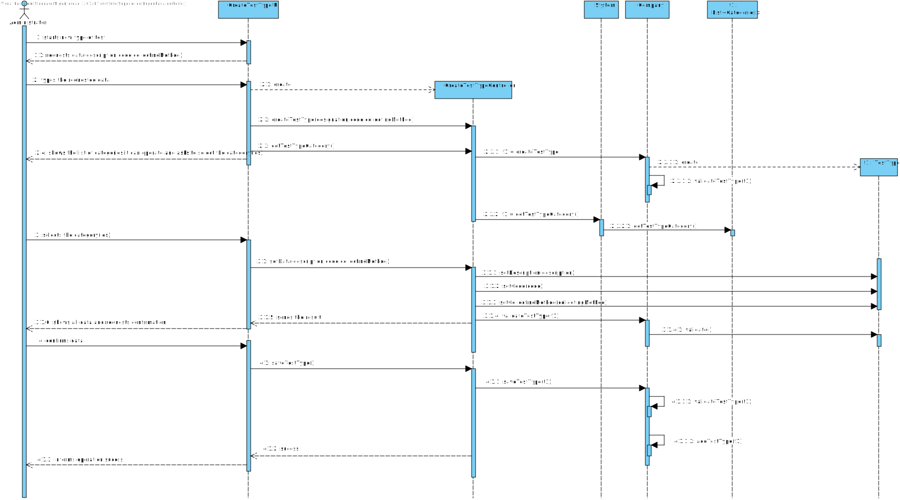
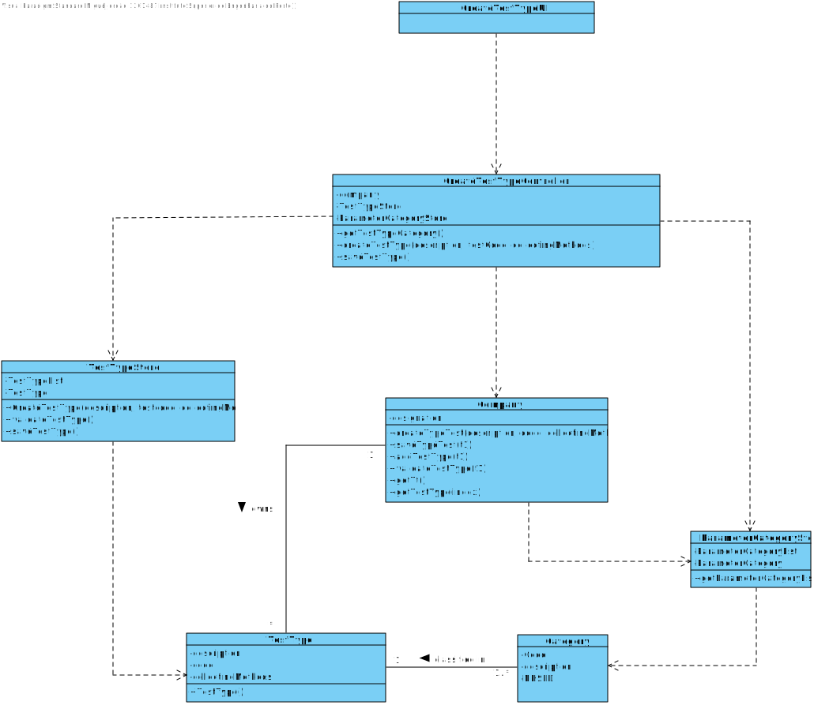

# US 9 - Specify test and its collecting methods

## 1. Requirements Engineering

### 1.1. User Story Description

*- As an administrator, I want to specify a new type of test and its collecting methods.*

### 1.2. Customer Specifications and Clarifications

**From the Specifications Document:**

> "Typically, the client arrives at one of the clinical analysis laboratories with a lab order prescribed by a doctor. Once there, a receptionist asks the client´s citizen card number, the lab order (which contains the type of test and parameters to be measured), and registers in the application the test to be performed to that client".

> "Many Labs performs two types of tests. Each test is characterized by an internal code, an NHS code, a description that indetifies the sample collection method, the date and time when the samples were collected, the date and time of the chemical analysis, the data and time of the diagnosis made by the specialist doctor, the date and time when the laboratory coordiantor validated the test, and the test type(whether it is blood test or Covid test)"

**From the client clarifications:**

> **Question**: Does a type of test holds any attribute besides its name and collecting methods?
>
> **Answer**: The attributes for a new test type are: description, collecting method and each test type should have a set of categories. Each category should be chosen from a list of categories. Each category has a name and a unique code. There are no subcategories. There exists only one collection method per test type.

> **Question**: Are the collecting methods stored simpled as a word or a sentence, or does it also must contain its description, and/or another attributes?
>
> **Answer**: To make a Covid test you need a swab to collect a sample. To make a blood test you need sample tubes and a syringe.
When the administrator (US9) specifies a new type of test, the administrator also specifies the method to collect a sample. The administrator introduces a brief description for specifying the collecting method. There exists only one collection method per test type.

> **Question**: Are there any different collecting methods other than the ones currently known? Which ones?
>
> **Answer**: Each collecting method is associated with a test type. Whenever a test type is created a collecting method should be defined.

### 1.3. Acceptance Criteria

* **AC1:** Code has five alphanumeric characters.
* **AC2:** The code is not automatically generated.
* **AC3:** The administrator introduces a brief description for specifying the collecting method.
* **AC4:** Description is a string with no more than 15 characters.
* **AC5:** Collecting method is a string with no more than 20 characters.
* **AC6:** Each category has a name and a unique code. There are no subcategories.
* **AC7:** There exists only one collection method per test type.
* **AC8:** Each collecting method is associated with a test type.
* **AC9:** Whenever a test type is created a collecting method should be defined.

### 1.4. Found out Dependencies

*There is a dependency to "US011 Specify a new parameter category" since at least a category must exist to be performed a test type.*

### 1.5 Input and Output Data

**Input data**

* Typed data:
    * a code,
    * a description,
    * a collecting method.

**Selected data**: Categories

**Output Data**

* List of existing categories
* (In)Success of the operation

### 1.6. System Sequence Diagram (SSD)

##

**Alternativa 1**

##

##

**Alternativa 2**

##

### 1.7 Other Relevant Remarks

*Use this section to capture other relevant information that is related with this US such as (i) special requirements ; (ii) data and/or technology variations; (iii) how often this US is held.* 

## 2. OO Analysis

### 2.1. Relevant Domain Model Excerpt 

### 2.2. Other Remarks

*Use this section to capture some aditional notes/remarks that must be taken into consideration into the design activity. In some case, it might be usefull to add other analysis artifacts (e.g. activity or state diagrams).* 

## 3. Design - User Story Realization 

### 3.1. Rationale

**The rationale grounds on the SSD interactions and the identified input/output data.**

| Interaction ID | Question: Which class is responsible for... | Answer | Justification (with patterns) |
|:-------------- |:--------------------- |:------------|:---------------------------- |
| Step/Msg 1: starts new test type | ... interacting with the actor? | CreateTestTypeUI | Pure Fabrication: there is no reason to assign this responsibility to any existing class in the Domain Model |
|                                  | ... coordinating the US? | CreateTaskController | Controller |
| 		                           | ... instantiating a new test type? | Company | Creator (Rule 1): in the DM Company has a test type |
| 	                               | ... knowing the user using the system? | UserSession | IE: cf. A&A component documentation |
| 		                           | ... knowing to which organization the user belongs to? | System | IE: has registed all? |
| Step/Msg 2: request data (description, code, collectingMethods) | n/a | | |
| Step/Msg 3: types requested data | ... saving the inputted data? | TestType | IE: object created in step 1 has its own data |
| Step/Msg 4: shows the test type category | ... knowing the test type category to show? | System | IE: TestType categories are defined by the system? | 
| Step/Msg 5: confirms the selected category | ... saving the selected category? | TestType | IE: object created in step 1 is classified in one Category |
| Step/Msg 6: shows the data and requests a confirmation | ... validating the data locally (e.g.: mandatory vs non-mandatory data)?	| Company | IE: knows its own data |
|                                                        | ... validating the data globally (e.g.:duplicated)? | Company | IE: adopts/records all the TestType objects |
| Step/Msg 7: confirms the data | ... saving the created test type? |  Company | IE:adopts/records all the Test type objects |              
| Step/Msg 8: informs operation success | ... informing operation success? | UI | IE: responsible for user interaction |

### Systematization ##

According to the taken rationale, the conceptual classes promoted to software classes are: 

 * Company
 * UserSession
 * System
 * TestType

Other software classes (i.e. Pure Fabrication) identified: 

 * CreateTestTypeUI
 * CreateTestTypeController
 * CreateTaskController
 * UI?

## 3.2. Sequence Diagram (SD)

##

**Alternativa 1**

##

##

**Alternativa 2**

##

**Alternativa 3**

##

**Alternativa 4**

##

## 3.3. Class Diagram (CD)

# 4. Tests 
*In this section, it is suggested to systematize how the tests were designed to allow a correct measurement of requirements fulfilling.* 

**_DO NOT COPY ALL DEVELOPED TESTS HERE_**

**Test 1:** Check that it is not possible to create an instance of the Example class with null values. 

	@Test(expected = IllegalArgumentException.class)
		public void ensureNullIsNotAllowed() {
		Exemplo instance = new Exemplo(null, null);
	}

*It is also recommended to organize this content by subsections.* 

# 5. Construction (Implementation)

*In this section, it is suggested to provide, if necessary, some evidence that the construction/implementation is in accordance with the previously carried out design. Furthermore, it is recommeded to mention/describe the existence of other relevant (e.g. configuration) files and highlight relevant commits.*

*It is also recommended to organize this content by subsections.* 

# 6. Integration and Demo 

*In this section, it is suggested to describe the efforts made to integrate this functionality with the other features of the system.*

# 7. Observations

*In this section, it is suggested to present a critical perspective on the developed work, pointing, for example, to other alternatives and or future related work.*

