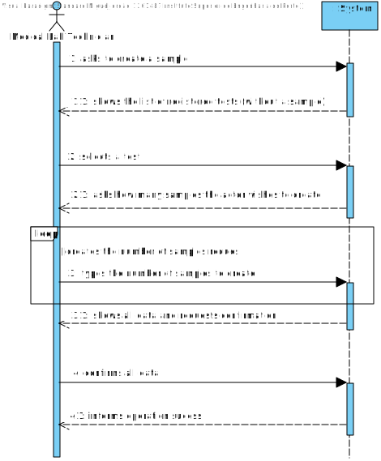
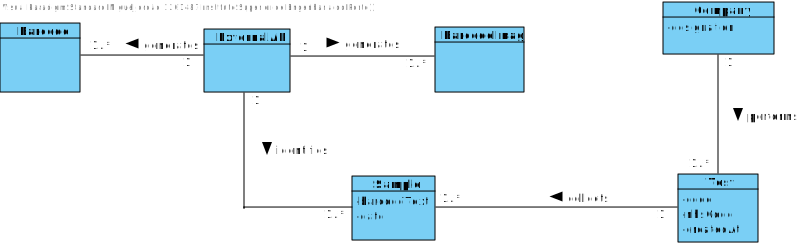

# US 005 - Record the samples 

## 1. Requirements Engineering

### 1.1. User Story Description

As a medical lab technician, I want to record the samples collected in the scope of a given test.

### 1.2. Customer Specifications and Clarifications 

**From the Specifications Document:**

>All the tests (clinical blood tests and Covid-19 tests) performed by the network of laboratories are registered locallyby the medical lab technicianswho collectthe samples. The samplesare sent daily to the chemical laboratory where the chemical analysesare performed,andresultsobtained. When sampling (blood or swab) the medical labtechnician records the samplesin the system, associating the sampleswith the client/test,and identifying each sample with a barcode that is automatically generated using an external API.

**From the client clarifications:**

>**Question**: What kind of attributes should a sample have??
>
>**Answer**: Each sample is associated with a test. A sample has only one attribute, a barcode number (UPC) that is a sequential number and is automatically generated by the system. Each sample has a unique barcode number.
>
> In US5, the medical lab technician checks the system and see all tests for which there are no samples collected. The medical lab technician selects a test and the system asks for the number of samples to collect.

>**Question**: Can a test have more than one sample?
>
>**Answer**: Yes.

>**Question**: We didn't fully understand what will the API do in this US, so here's out interpretation from the US, correct us if we're wrong please: The API will be generated randomly and the API is an attribute from the sample.
>
>**Answer**: The API will be used to generate/print barcodes.

>**Question**: During the current sprint, how should we allow the barcodes to be printed. After generating them via the API, should we save the barcode images to the disk?
>
>**Answer**: Each generated barcode should be saved in a folder as a jpeg file. 

### 1.3. Acceptance Criteria

* **AC1:** The system should support several barcode APIs. The API to use is defined by configuration.
* **AC2:** Each sample is associated with a test.
* **AC3:** A sample has only one attribute, a barcode number (UPC) that is a sequential number and is automatically generated by the system.
* **AC4:** Each sample has a unique barcode number.
* **AC5:** The medical lab technician checks the system and see all tests for which there are no samples collected.
* **AC6:** The medical lab technician selects a test and the system asks for the number of samples to collect.
* **AC7:** A test can have more than 1 sample.
* **AC8:** The API will be used to generate/print barcodes.
* **AC9:** Each generated barcode should be saved in a folder as a jpeg file. 

### 1.4. Found out Dependencies

*There is a dependency to "US004 Register a test to be performed to a registered client" since at least one test must be registered in the system in order to create a sample.*

*There is a dependency to “US007 Register a new employee” since at least a Medical Lab technician should be registered in order to create a sample.*

### 1.5 Input and Output Data

**Input data**

* Typed data:
    * Number of samples that the actor wishes to create.
    
**Selected data**: List of registered tests (without a sample(s)).

**Output Data**

* List of registered test(s),
* (In)Success of the operation.

### 1.6. System Sequence Diagram (SSD)

### 1.7 Other Relevant Remarks

*Use this section to capture other relevant information that is related with this US such as (i) special requirements ; (ii) data and/or technology variations; (iii) how often this US is held.* 

## 2. OO Analysis

### 2.1. Relevant Domain Model Excerpt 

### 2.2. Other Remarks

*Use this section to capture some aditional notes/remarks that must be taken into consideration into the design activity. In some case, it might be usefull to add other analysis artifacts (e.g. activity or state diagrams).* 

## 3. Design - User Story Realization 

### 3.1. Rationale

**The rationale grounds on the SSD interactions and the identified input/output data.**

| Interaction ID | Question: Which class is responsible for... | Answer  | Justification (with patterns)  |
|:-------------  |:--------------------- |:------------|:---------------------------- |
| Step 1  		 |							 |             |                              |
| Step 2  		 |							 |             |                              |
| Step 3  		 |							 |             |                              |
| Step 4  		 |							 |             |                              |
| Step 5  		 |							 |             |                              |
| Step 6  		 |							 |             |                              |              

### Systematization ##

According to the taken rationale, the conceptual classes promoted to software classes are: 

 * Class1
 * Class2
 * Class3

Other software classes (i.e. Pure Fabrication) identified: 
 * xxxxUI  
 * xxxxController

## 3.2. Sequence Diagram (SD)

## 3.3. Class Diagram (CD)

# 4. Tests 
*In this section, it is suggested to systematize how the tests were designed to allow a correct measurement of requirements fulfilling.* 

**_DO NOT COPY ALL DEVELOPED TESTS HERE_**

**Test 1:** Check that it is not possible to create an instance of the Example class with null values. 

	@Test(expected = IllegalArgumentException.class)
		public void ensureNullIsNotAllowed() {
		Exemplo instance = new Exemplo(null, null);
	}

*It is also recommended to organize this content by subsections.* 

# 5. Construction (Implementation)

*In this section, it is suggested to provide, if necessary, some evidence that the construction/implementation is in accordance with the previously carried out design. Furthermore, it is recommeded to mention/describe the existence of other relevant (e.g. configuration) files and highlight relevant commits.*

*It is also recommended to organize this content by subsections.* 

# 6. Integration and Demo 

*In this section, it is suggested to describe the efforts made to integrate this functionality with the other features of the system.*

# 7. Observations

*In this section, it is suggested to present a critical perspective on the developed work, pointing, for example, to other alternatives and or future related work.*

