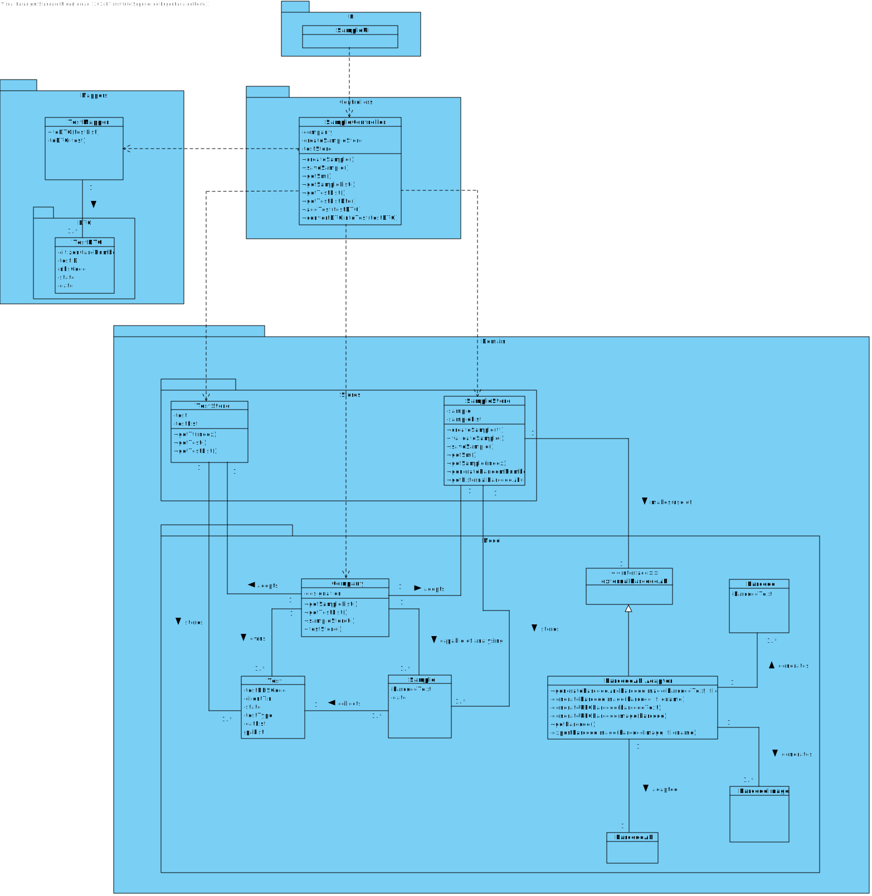

# US 005 - Record the samples 

## 1. Requirements Engineering

### 1.1. User Story Description

As a medical lab technician, I want to record the samples collected in the scope of a given test.

### 1.2. Customer Specifications and Clarifications 

**From the Specifications Document:**

> The set of Many Labs clinical analysis laboratories form a network that covers all England, and it is responsible for collecting samples and interacting with clients. The samples collected by the network of laboratories are then sent to the chemical laboratory located in the company's headquarters and the chemical analysis are performed there.

> All the tests (clinical blood tests and Covid-19 tests) performed by the network of laboratories are registered locally by the medical lab technicians who collect the samples. The samples are sent daily to the chemical laboratory where the chemical analyses are performed, and results obtained. When sampling (blood or swab) the medical lab technician records the samples in the system, associating the samples with the client/test, and identifying each sample with a barcode that is automatically generated using an external API.

**From the client clarifications:**

> **Question**: What kind of attributes should a sample have?
>
> **Answer**: Each sample is associated with a test. A sample has only one attribute, a barcode number (UPC) that is a sequential number and is automatically generated by the system. Each sample has a unique barcode number.
>
> In US5, the medical lab technician checks the system and see all tests for which there are no samples collected. The medical lab technician selects a test and the system asks for the number of samples to collect.

> **Question**: Can a test have more than one sample?
>
> **Answer**: Yes.

> **Question**: We didn't fully understand what will the API do in this US, so here's out interpretation from the US, correct us if we're wrong please: The API will be generated randomly and the API is an attribute from the sample.
>
> **Answer**: The API will be used to generate/print barcodes.

> **Question**: During the current sprint, how should we allow the barcodes to be printed. After generating them via the API, should we save the barcode images to the disk?
>
> **Answer**: Each generated barcode should be saved in a folder as a jpeg file.

> **Question**: What is supposed to show to the Medical Lab Technician when he selects the pretended test?
> 
> **Answer**: Firstly, the Medical Lab Technician checks the system to see the tests/clients that need to be done. Before selecting a test, the Medical Lab Technician checks/see the name of the client and all the test data (test attributes, test type, collection method, parameters, etc.). Then, the Medical Lab Technician selects one test/client and the system asks for the number of samples to collect. Next, the system generates the barcodes to put in the samples.

> **Question**: It was answered in one of the previous questions that the sample only has one attribute, the barcode, however the description of the project also mentions a date of collection of the samples, is this date supposed to be an attribute of the test and not of the sample itself?
> 
> **Answer**: Yes. The system should record the date (DD/MM/YYYY) and time (HH:MM) when the sample is collect made. The date and time are automatically generated by the system when the barcode is issued.

> **Question**: If there were multiple samples for a single test, would there be only one collection date for all of them?
> 
> **Answer**: Only one collection date and time for a test.

### 1.3. Acceptance Criteria

* **AC1:** The system should support several barcode APIs. The API to use is defined by configuration.
* **AC2:** Each sample is associated with a test.
* **AC3:** A sample has only one attribute, a barcode number (UPC) that is a sequential number and is automatically generated by the system.
* **AC4:** Each sample has a unique barcode number.
* **AC5:** The medical lab technician checks the system and see all tests for which there are no samples collected.
* **AC6:** The medical lab technician selects a test and the system asks for the number of samples to collect.
* **AC7:** A test can have more than 1 sample.
* **AC8:** The API will be used to generate/print barcodes.
* **AC9:** Each generated barcode should be saved in a folder as a jpeg file.
* **AC10:** The system should record the date (DD/MM/YYYY) and time (HH:MM) when the sample is collect made. The date and time are automatically generated by the system when the barcode is issued.

### 1.4. Found out Dependencies

**From Sprint B:**

There is a dependency to:
*There is a dependency to “US007 Register a new employee” since at least a Medical Lab technician should be registered in order to create a sample.*

**From Sprint C:**

There is a dependency to:
*There is a dependency to "US004 Register a test to be performed to a registered client" since at least one test must be registered in the system in order to create a sample.*

### 1.5 Input and Output Data

**Input data**

* Typed data:
  * Number of samples that the actor wishes to create.
    
* Selected data: List of registered tests (without the sample(s)).

**Output Data**

* List of registered test(s),
* (In)Success of the operation.

### 1.6. System Sequence Diagram (SSD)

### 1.7 Other Relevant Remarks

*n/a* 

## 2. OO Analysis

### 2.1. Relevant Domain Model Excerpt 

### 2.2. Other Remarks

*n/a* 

## 3. Design - User Story Realization 

### 3.1. Rationale

**The rationale grounds on the SSD interactions and the identified input/output data.**

| Interaction ID | Question: Which class is responsible for... | Answer  | Justification (with patterns)  |
|:-------------  |:--------------------- |:------------|:---------------------------- |
| **Step/MSG 1**: asks to create a sample |	... interacting with the actor? | SampleUI | **PureFabrication**: There is no reason to assign this responsibility to any existing class in the Domain model |
| 		                                  | ... coordinating the US? | SampleController | **Controller** |
| 		                                  | ... knowing TestStore? | Company | **IE**: Company knows the TestStore to which it is delegating some tasks. |
| 		                                  | ... checking all tests available in the system?	| TestStore | **IE**: The testStore knows all tests available in the system. |
| 	                                      | ... verifying if the test already has sample(s) collected? | Test | **IE**: The test knows its own state. |
| 	                                      |	... getting the data to expose to the user?	| TestMapper | **DTO**: In order to detach the domain layer from the UI layer, we use a data transfer object (DTO) to only extract data from the domain class (and not extract methods from the domain class) |
| **Step/MSG 2**: shows the list of registered tests (without a sample) | n/a | | |
| **Step/MSG 3**: selects a test |	... creating the SampleStore? | Company | **PureFabrication**: By applying **HC+LC**, this delegates that the responsibility for such will be the Company. |
| **Step/MSG 4**: asks how many samples the actor wishes to create | n/a | | |
| **Step/MSG 5**: types the number of samples to create | ... creating the desired samples? | SampleStore | **Creator(R1)** and **HC+LC**: By the application of the Creator(R1), it would be the company, but, by applying HC + LC  to the company, this delegates that responsibility to the "SampleStore" |
| 		                                                | ... creating the barcodeText?	| SampleStore | **IE**: Responsible for generating the barcodeText |
| 		                                                | ... knowing which API should the system use? | SampleStore | **Protected variation**: The system knows which API should be use in order to create the Barcode |
| 		                                                | ... creating the barcode?	| BarcodeAdapter | **IE**: Responsible for creating the barcode and its components |
| 		                                                | ... creating the barcodeImage? | BarcodeAdapter | **IE**: Responsible for creating the barcode image and its components |
| 		                                                | ... exporting the barcodeImage in the jpeg format? | BarcodeAdapter | **IE**: Responsible for exporting the images (in jpg format) into a folder |
| **Step/MSG 6**: shows all data and requests confirmation | ... validating the data locally (e.g.: mandatory vs non-mandatory data)? | Sample | **IE**: An object knows its data |
| 	                                                       | ... validating the data globally (e.g.: duplicated)? | SampleStore | **IE**: Knows all samples |
| **Step/MSG 7**: confirms all data | ...saving the created sample(s)? | SampleStore | **IE**: The SampleStore knows all samples in the system and stores the created samples |   
| **Step/MSG 8**: informs operation success | ... informing operation success? | SampleUI | **IE**: Responsible for user interaction |              

### Systematization ##

According to the taken rationale, the conceptual classes promoted to software classes are: 

 * Sample
 * Company
 * Barcode
 * BarcodeImage

Other software classes (i.e. Pure Fabrication) identified: 
 * SampleUI  
 * SampleController
 * SampleStore
 * TestStore
 * BarcodeAdapter
 * TestMapper
 * TestDTO

## 3.2. Sequence Diagram (SD)

**Remark :** It is worth noticing that all objects' interactions are consistent with the responsibilities assigned during the rationale.

## 3.3. Class Diagram (CD)

# 4. Tests 

***SampleTest***

**Test 1:** Create a sample. 

	@Test
    public void createSample() {

        ParameterCategory parameterCategory1 = new ParameterCategory("12346", "cat", "1212");

        List<ParameterCategory> categories2 = new ArrayList<>();
        categories2.add(parameterCategory1);

        TestType bloodTest = new TestType("BL000", "Blood Test", "Needle", categories2);
        app.domain.model.Test test = new app.domain.model.Test("1234567890123456", "100000000000", "999999999999", bloodTest);

        Sample sm1 = new Sample(test, "11111111111");

    }

**Test 2:** Get sample barcode.

        @Test
        public void getBarcode1() {

          ParameterCategory parameterCategory1 = new ParameterCategory("12346", "cat", "1212");

         List<ParameterCategory> categories2 = new ArrayList<>();
         categories2.add(parameterCategory1);

         TestType bloodTest = new TestType("BL000", "Blood Test", "Needle", categories2);
          app.domain.model.Test test = new app.domain.model.Test("1234567890123456", "100000000000", "999999999999", bloodTest);

          Sample sm1 = new Sample(test, "11111111111");

         String expected = "11111111111";
         String actual = sm1.getBarcode();

          Assert.assertEquals(expected, actual);

     }

**Test 3:** Get Test (associated to a sample).

    @Test
    public void getTest() {

        ParameterCategory parameterCategory1 = new ParameterCategory("12346", "cat", "1212");

        List<ParameterCategory> categories2 = new ArrayList<>();
        categories2.add(parameterCategory1);

        TestType bloodTest = new TestType("BL000", "Blood Test", "Needle", categories2);
        app.domain.model.Test test = new app.domain.model.Test("1234567890123456", "100000000000", "999999999999", bloodTest);

        Sample sm1 = new Sample(test, "11111111111");

        app.domain.model.Test expected = test;
        app.domain.model.Test actual = sm1.getTr();

        Assert.assertEquals(expected, actual);

    }

**Test 4:** Set barcode.

        @Test
        public void setBarcode() {

        ParameterCategory parameterCategory1 = new ParameterCategory("12346", "cat", "1212");

        List<ParameterCategory> categories2 = new ArrayList<>();
        categories2.add(parameterCategory1);

        TestType bloodTest = new TestType("BL000", "Blood Test", "Needle", categories2);
        app.domain.model.Test test = new app.domain.model.Test("1234567890123456", "100000000000", "999999999999", bloodTest);

        Sample sm1 = new Sample(test, "11111111111");

        String expected = "19111111111";

        sm1.setBarcode(expected);

        Assert.assertNotNull(sm1.getBarcode());

    }

**Test 5:** Set barcode.

        @Test
        public void setTest() {

        ParameterCategory parameterCategory1 = new ParameterCategory("12346", "cat", "1212");

        List<ParameterCategory> categories2 = new ArrayList<>();
        categories2.add(parameterCategory1);

        TestType bloodTest = new TestType("BL000", "Blood Test", "Needle", categories2);
        app.domain.model.Test test = new app.domain.model.Test("1234567890123456", "100000000000", "999999999999", bloodTest);

        Sample sm1 = new Sample(test, "11111111111");

        app.domain.model.Test expected = new app.domain.model.Test("1234567890123412", "120000000000", "991999999999", bloodTest);

        sm1.setTr(expected);

        Assert.assertNotNull(sm1.getTr());

    }

***SampleStore and BarcodeAdapter***

**Test 1:** Create a sample using SampleStore.

        @Test
        public void createSample() {

        ParameterCategory parameterCategory1 = new ParameterCategory("12346", "cat", "1212");

        List<ParameterCategory> categories2 = new ArrayList<>();
        categories2.add(parameterCategory1);

        TestType bloodTest = new TestType("BL000", "Blood Test", "Needle", categories2);
        app.domain.model.Test test = new app.domain.model.Test("1234567890123456", "100000000000", "999999999999", bloodTest);

        SampleStore sampleStore = new SampleStore();

        try {
            Assert.assertNotNull(sampleStore.createSample(test));
        } catch (Exception e) {

        }

    }

**Test 2:** Validate a sample.

        @Test
        public void validateSample() {

        ParameterCategory parameterCategory1 = new ParameterCategory("12346", "cat", "1212");

        List<ParameterCategory> categories2 = new ArrayList<>();
        categories2.add(parameterCategory1);

        TestType bloodTest = new TestType("BL000", "Blood Test", "Needle", categories2);
        app.domain.model.Test test = new app.domain.model.Test("1234567890123456", "100000000000", "999999999999", bloodTest);

        SampleStore sampleStore = new SampleStore();

        try {
            sampleStore.createSample(test);
            Assert.assertTrue(sampleStore.validateSample());

        } catch (Exception e) {

        }

    }

**Test 3:** Save a sample.

        @Test
        public void saveSample() {

        ParameterCategory parameterCategory1 = new ParameterCategory("12346", "cat", "1212");

        List<ParameterCategory> categories2 = new ArrayList<>();
        categories2.add(parameterCategory1);

        TestType bloodTest = new TestType("BL000", "Blood Test", "Needle", categories2);
        app.domain.model.Test test = new app.domain.model.Test("1234567890123456", "100000000000", "999999999999", bloodTest);

        SampleStore sampleStore = new SampleStore();

        try {
            sampleStore.createSample(test);
            Assert.assertTrue(sampleStore.saveSample());

        } catch (Exception e) {

        }

    }

**Test 4:** Get sample (from SampleStore (from list index))

        @Test
        public void getSample() {

        ParameterCategory parameterCategory1 = new ParameterCategory("12346", "cat", "1212");

        List<ParameterCategory> categories2 = new ArrayList<>();
        categories2.add(parameterCategory1);

        TestType bloodTest = new TestType("BL000", "Blood Test", "Needle", categories2);
        app.domain.model.Test test = new app.domain.model.Test("1234567890123456", "100000000000", "999999999999", bloodTest);

        SampleStore sampleStore = new SampleStore();

        try {
            sampleStore.createSample(test);
            Assert.assertNotNull(sampleStore.getSample(0));

        } catch (Exception e) {

        }

    }

**Test 5:** Get sample (from SampleStore (the last objected saved in the sampleList))

        @Test
        public void getSM() {

        ParameterCategory parameterCategory1 = new ParameterCategory("12346", "cat", "1212");

        List<ParameterCategory> categories2 = new ArrayList<>();
        categories2.add(parameterCategory1);

        TestType bloodTest = new TestType("BL000", "Blood Test", "Needle", categories2);
        app.domain.model.Test test = new app.domain.model.Test("1234567890123456", "100000000000", "999999999999", bloodTest);

        SampleStore sampleStore = new SampleStore();

        try {
            sampleStore.createSample(test);
            Assert.assertNotNull(sampleStore.getSm());

        } catch (Exception e) {

        }

    }

**Test 6** Get sample list

        @Test
        public void getSampleList() {

        ParameterCategory parameterCategory1 = new ParameterCategory("12346", "cat", "1212");

        List<ParameterCategory> categories2 = new ArrayList<>();
        categories2.add(parameterCategory1);

        TestType bloodTest = new TestType("BL000", "Blood Test", "Needle", categories2);
        app.domain.model.Test test = new app.domain.model.Test("1234567890123456", "100000000000", "999999999999", bloodTest);

        SampleStore sampleStore = new SampleStore();

        try {
            sampleStore.createSample(test);
            List<Sample> sampleList;

            sampleList = sampleStore.getSampleList();

            Assert.assertNotNull(sampleList);

        } catch (Exception e) {

        }

    }

***SampleDTO and SampleMapper***

**Test 1:** toDto

        @Test
        public void toDTO(){

        ParameterCategory parameterCategory1 = new ParameterCategory("12346", "cat", "1212");

        List<ParameterCategory> categories2 = new ArrayList<>();
        categories2.add(parameterCategory1);

        TestType bloodTest = new TestType("BL000", "Blood Test", "Needle", categories2);
        app.domain.model.Test test = new app.domain.model.Test("1234567890123456", "100000000000", "999999999999", bloodTest);

        Sample sm1 = new Sample(test, "11111111111");
        List<Sample> sampleList = new ArrayList<>();

        sampleList.add(sm1);

        SampleMapper sampleMapper = new SampleMapper();

        sampleMapper.toDTO(sampleList);

    }

**Test 2:** Create SampleDTO

        @Test
        public void createSampleDto(){

        List<ParameterCategory> pcList = new ArrayList<>();

        ParameterCategory pc = new ParameterCategory("aaaaa", "aaa", "aaa");
        pcList.add(pc);

        TestType tt = new TestType("1abcE","yes","aaa",pcList);

        app.domain.model.Test test = new app.domain.model.Test("1234567890123456", "100000000000", "999999999999", tt);

        SampleDTO sampleDTO = new SampleDTO(test,"12345678901");

        Assert.assertNotNull(sampleDTO);

    }

**Test 3:** Get barcode (from SampleDTO)

        @Test
        public void getBarcode(){

        List<ParameterCategory> pcList = new ArrayList<>();

        ParameterCategory pc = new ParameterCategory("aaaaa", "aaa", "aaa");
        pcList.add(pc);

        TestType tt = new TestType("1abcE","yes","aaa",pcList);

        app.domain.model.Test test = new app.domain.model.Test("1234567890123456", "100000000000", "999999999999", tt);

        SampleDTO sampleDTO = new SampleDTO(test,"12345678901");

        Assert.assertNotNull(sampleDTO.getBarcode());

    }

**Test 4** Get test (from SampleDTO)

        @Test
        public void getTR(){

        List<ParameterCategory> pcList = new ArrayList<>();

        ParameterCategory pc = new ParameterCategory("aaaaa", "aaa", "aaa");
        pcList.add(pc);

        TestType tt = new TestType("1abcE","yes","aaa",pcList);

        app.domain.model.Test test = new app.domain.model.Test("1234567890123456", "100000000000", "999999999999", tt);

        SampleDTO sampleDTO = new SampleDTO(test,"12345678901");

        Assert.assertNotNull(sampleDTO.getTr());

    }

**Test5** SampleDTO toString

      @Test
      public void TesttoString(){

        List<ParameterCategory> pcList = new ArrayList<>();

        ParameterCategory pc = new ParameterCategory("aaaaa", "aaa", "aaa");
        pcList.add(pc);

        TestType tt = new TestType("1abcE","yes","aaa",pcList);

        app.domain.model.Test test = new app.domain.model.Test("1234567890123456", "100000000000", "999999999999", tt);

        SampleDTO sampleDTO = new SampleDTO(test,"12345678901");

        String expected = "SampleDTO{tr=Test{citizenCardNumber='1234567890123456', testID='100000000000', nhsCode='999999999999', tt= Test Code: 1abcE, Description:yes, CollectingMethod:aaa, state=CREATED, tpList=[]}, barcode='12345678901'}";

        String actual = sampleDTO.toString();

        Assert.assertEquals(expected,actual);

    }

# 5. Construction (Implementation)

### Class SampleUI

    package app.ui.console;

    import app.controller.SampleController;
    import app.mappers.dto.TestDTO;
    import app.ui.console.utils.Utils;

    public class SampleUI implements Runnable {

    private final SampleController ctrl;

    public SampleUI() {
        this.ctrl = new SampleController();
    }

    @Override
    public void run() {

        boolean count;
        boolean flag;
        boolean m = false;
        boolean nbol = false;

        TestDTO trDto;

        if (this.ctrl.getTestListDto() == null || this.ctrl.getTestListDto().isEmpty()) {
            System.out.println("The list is empty! Please, try adding at least one test in order to create the sample(s)!");

        } else {
            do {
                boolean exception = false;
                do {

                     trDto = (TestDTO) Utils.showAndSelectOne(this.ctrl.getTestListDto(), "Select the test: \n");

                    if (trDto != null)
                        m = trDto.compareState(trDto.getState());

                    if (!m) {
                        if(trDto==null){
                            System.out.println("Please choose a valid test!\n");
                        } else
                        System.out.println("Please choose a valid test (sample is already collected!)\n");
                    }

                } while (!m);

                do {
                    try {

                        int n = Utils.readIntegerFromConsole("Type the number of samples that you wish to create: ");

                        ctrl.addTest(trDto);

                        this.ctrl.createSample(n);

                        exception = false;

                    } catch (Exception e) {
                        System.out.println(e.getMessage());
                        System.out.println("Incorrect input of data (an error has occurred), please try again.");
                        exception = true;

                    }
                } while (exception);

                count = Utils.confirm("Sample(s) created! Do you wish to see it(them) (s/n)?");

                if (count) {

                    do {
                        Utils.showListWithouThe0(ctrl.getSampleList(), "Do you wish to delete any?(s/n)");
                        flag = Utils.confirm("");
                        count = flag;
                        nbol = flag;

                        if (flag) {
                            int a = Utils.readIntegerFromConsole("Type the number of the sample that you wish to delete: ");
                            ctrl.getSampleList().remove(a - 1);
                            count = !flag;

                        }

                    }while(nbol);
                }

            } while (count);

            ctrl.getSm().getTr().setState("SAMPLE_COLLECTED");

         }
       }
    }

###Class SampleController

      package app.controller;

      import app.mappers.TestMapper;
      import app.mappers.dto.TestDTO;
      import app.domain.model.*;
      import app.domain.stores.SampleStore;

      import java.util.ArrayList;
      import java.util.List;

      public class SampleController {

      private Company company;
      private SampleStore smStore;
      private TestMapper testMapper;

      static List<Sample> sampleListTemporary;

      private Test tr;

    /**
     * Creates an empty Test Type controller
     */

    public SampleController() {
        this(App.getInstance().getCompany());
    }

    /**
     * Instance of a Test Type
     *
     * @param company the company that administrates the system
     */

    public SampleController(Company company) {
        this.company = company;
    }

    public void addTest(TestDTO trDto){
        convertDTOintoTest(trDto);
    }

    /**
     * Creates a test type (Calling the TestType constructor implemented in the TestTypeStore)
     */

    public void createSample(int n) throws ClassNotFoundException, InstantiationException, IllegalAccessException {

        smStore = company.getSampleStore();

        for (int i = 0; i < n; i++) {
            this.smStore.createSample(tr);
            this.smStore.saveSample();
        }
    }

    /**
     * Transforms into string.
     *
     * @return the Test Type's info in string format
     */

    public Sample getSm() {
        return smStore.getSm();
    }

    /**
     * Saves an instance Test type.
     *
     * @return the saving of an instance of a Test Type
     */

    public List<Test> getCreatedTests (){

        List<Test> testList = new ArrayList<>();

        for(Test test : company.getTestList()){
            if(test.getState().equals("SAMPLE_COLLECTED")||test.getState().equals("SAMPLE_ANALYSED")||test.getState().equals("DIAGNOSTIC_MADE")||test.getState().equals("VALIDATED"))
                testList.add(test);
        }

        return testList;

    }

    public boolean saveSample() {
        return this.smStore.saveSample();
    }

    public boolean saveSamples() {
        for (Sample sm1 : sampleListTemporary) {
            smStore.getSampleList().add(sm1);
        }
        return true;
    }

    /**
     * Returns the list of test type already created
     *
     * @return the list of test type already created
     */

    public List<Sample> getSampleList() {
        return smStore.getSampleList();
    }

    public List<Test> getTestList() {
        return this.company.getTestList();
    }

    public List<TestDTO> getTestListDto() {

        this.testMapper = new TestMapper();

        return testMapper.toDTO(getTestList());

    }

    public void convertDTOintoTest(TestDTO testDTO) {

        for (Test tr1 : this.getTestList()) {
            if (testDTO.getTestID().equals(tr1.getTestID())) {
                this.tr = tr1;
            }
        }

     }

    }

### Sample

    package app.domain.model;

    public class Sample {

    private Test tr;
    private String barcode;

    public Sample(Test tr,String barcode) {

        this.tr=tr;
        this.barcode=barcode;

    }

    public String getBarcode() {
        return barcode;
    }

    public Test getTr() {
        return tr;
    }

    public void setBarcode(String barcode) {

        this.barcode = barcode;
    }

    public void setTr(Test tr) {
        this.tr = tr;
    }

    @Override
    public String toString() {
        return "Sample {" +
                " Test ID=" + tr.getTestID() +
                ", Barcode=" + barcode +
                '}';
      }
    }

###Class BarcodeAdapter

    package app.domain.model;

    import app.domain.shared.Constants;
    import net.sourceforge.barbecue.Barcode;
    import net.sourceforge.barbecue.BarcodeException;
    import net.sourceforge.barbecue.BarcodeFactory;
    import net.sourceforge.barbecue.BarcodeImageHandler;
    import net.sourceforge.barbecue.output.OutputException;

    import javax.imageio.ImageIO;
    import java.awt.image.BufferedImage;
    import java.io.File;
    import java.io.IOException;

    public class BarcodeAdapter1 implements BarcodeAdapter {

    private Barcode barcode;
    private BufferedImage barcodeImage;

    public BarcodeAdapter1() {
      //Object created in order to create a barcode
    }

    public String generateBarcodeandBarcodeImage(String barcodeText,String filename){

        try {

            this.barcode = generateUPCBarcode(barcodeText);

        } catch (Exception e) {
            System.out.println("Barcode couldn't be created! Verify barcodeText!");
        }

        generateBarcodeImage(this.barcode,filename);

        return barcode.getData();

    }

    private void generateBarcodeImage(Barcode barcode,String filename){

        try{
            this.barcodeImage = generateUPCBarcodeImage(barcode);
        } catch (Exception e){
            System.out.println("Barcode image couldn't be created! Verify the barcode!");
        }
        try{
            barcodeImage(barcodeImage,filename);
        } catch (IOException e){
            e.getMessage();
            System.out.println("Image couldn't be created! Please check the integrity of the sample!");
        }

    }

    private Barcode generateUPCBarcode(String barcodeText) throws BarcodeException {

        return BarcodeFactory.createUPCA(barcodeText);
    }

    private BufferedImage generateUPCBarcodeImage(Barcode barcode) throws OutputException {
        return BarcodeImageHandler.getImage(barcode);
    }

    public String getBarcode() {
        return barcode.getData();
    }

    private void barcodeImage(BufferedImage barcodeImage,String filename) throws IOException {

        File outputfile = new File(Constants.PATH+filename+".jpg");

        ImageIO.write(barcodeImage, "jpg", outputfile);

     }

    }

###Interface BarcodeAdapter

    package app.domain.model;

    public interface BarcodeAdapter {

    String generateBarcodeandBarcodeImage(String barcodeText,String filename);

    String getBarcode();

    }

# 6. Integration and Demo 

###Integration in the Company Class

    SampleStore sampleStore = new SampleStore();

    public List<Sample> getSampleList() {
        return sampleStore.getSampleList();
    }

    public SampleStore getSampleStore() {
        return sampleStore;
    }

###Constants

    public static final String BARCODE_IMAGE="BarcodeImage";
    public static final String PATH ="Barcodes\\";

# 7. Observations

*As requested by the SW Client the barcodeImages are saved in a package inside the project. They are exported from the Barcode Adapter in the .jgp format with the name BarcodeImage_(testID)_(BarcodeText)*

