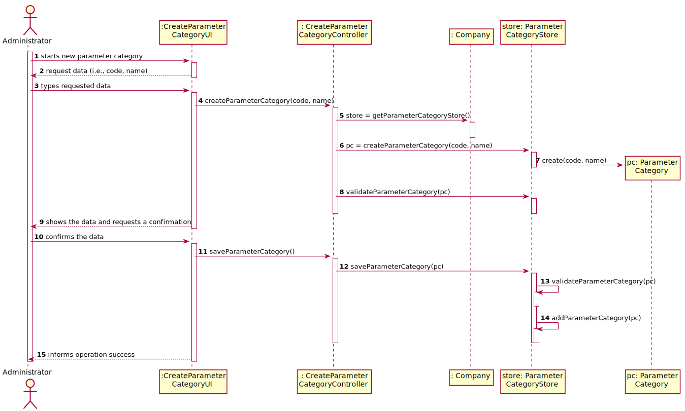
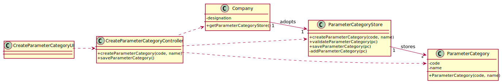

# US 11 - Specify new parameter category

## 1. Requirements Engineering

### 1.1. User Story Description

*As an administrator, I want to specify a new parameter category*

### 1.2. Customer Specifications and Clarifications 

**From the Specifications Document:**

>"Blood Tests are frequently characterized by measuring several parameters which for presentation/reporting purposes are organized by categories.For example, parameters such as the number of Red Blood Cells(RBC), White Blood Cells(RBC) and Platelets(PLT) are usually presented under the blood count (Hemogram) category."

>"Regardless, such tests rely on measuring one or more parameters that can be grouped/organized by categories."

**From the client clarifications:**

>**Question**: What are the information related to a Parameter Category?
>
>**Answer**: Each category has a name and a unique code. There are no subcategories.

>**Question**: Regarding the creation of a new category, what should be the format of the code in terms of length, should it be alphanumeric or numbers only? Also, can we assume that both attributes are mandatory?
>
>**Answer:** The format of the attributes of one category are:
> * Name: is a string with no more than 10 characters;
> * Code: are five alphanumeric characters. The code is unique and is not automatically generated.
> 
> Both attributes are mandatory.

### 1.3. Acceptance Criteria

* **AC1:** NHSLD is a string with no more than 10 characters
* **AC2:** Code is unique and has five alphanumeric characters
* **AC3:** Description cannot be empty and has , at maximum , 40 chars

### 1.4. Found out Dependencies

*No dependencies were found*

### 1.5 Input and Output Data

**Input data**

* Typed data:
    * Name
    * Code
    * Description
    
**Selected data**: 

*There is no selected data*

**Output Data**

* (In)Success of the operation

### 1.6. System Sequence Diagram (SSD)

### 1.7 Other Relevant Remarks

*n/a* 

## 2. OO Analysis

### 2.1. Relevant Domain Model Excerpt

### 2.2. Other Remarks

*n/a* 

## 3. Design - User Story Realization 

### 3.1. Rationale

**The rationale grounds on the SSD interactions and the identified input/output data.**

| Interaction ID | Question: Which class is responsible for... | Answer  | Justification (with patterns)  |
|:-------------  |:--------------------- |:------------|:---------------------------- |
**Step/Msg 1**: starts new test type | ... interacting with the actor? | CreateTestTypeUI | **Pure Fabrication**: there is no reason to assign this responsibility to any existing class in the Domain Model |
| 		 |	...coordinating the US?		 |  ParameterCategoryController           | **Controller**                             |
| **Step/Msg 2**: request data (i.e.,code,description,nhsld) 		 | n/a							 |             |                              |
| **Step/Msg 3**: types requested data  		 |		...creates the SampleStore?					 |  Company           |     **PureFabrication** : By applying **HC+LC**, this delegates that the responsibility for such will be the Company.                       |
| |...creates the desired parameter category?					 |  ParameterCategoryStore            |     **Creator(R1)** and **HC+LC** : By the application of the Creator(R1), it would be the company, but, by applying HC + LC  to the company, this delegates that responsibility to the "SampleStore"                       |
| **Step/Msg 4**: shows the data and requests a confirmation  		 |	...validating the data locally (e.g..:mandatory vs. nom-mandatory data)?						 |   ParameterCategory          |    **IE**: knows its own data                          |
|  	 |	...validanting the data globally (e.g..:duplicated)?		 |  ParameterCategory          |      **IE**: The object knows its own data            |
| **Step/Msg 5**:confirms the data		 | ...saving the created parameter category							 |  ParameterCategoryStore          |  **IE**: Adopts/records all the ParameterCategory objects                            |
| **Step/Msg 6**:informing operation sucess	 | 	...informing operation sucess			 |  ParameterCategoryUI	         |    **IE**: Responible for user interaction                           |                 

### Systematization ##

According to the taken rationale, the conceptual classes promoted to software classes are: 

 * Company
 * ParameterCategory

Other software classes (i.e. Pure Fabrication) identified: 

 * ParameterCategoryUI
 * ParameterCategoryController
 * ParameterCategoryStore

## 3.2. Sequence Diagram (SD)

**Alternativa 1**

##

**Alternativa 2**

##

**Other alternatives might exist.**

## 3.3. Class Diagram (CD)

# 4. Tests 

##AC 1: NHSLD is a string with no more than 10 characters

###Test 1
    @Test(expected = IllegalArgumentException.class)
    public void checkNHSLDTooManyChars1() {

        ParameterCategory pc = new ParameterCategory("1abcE","ye22s","aa1234213412341234123412341a");

    }

###Test 2
    @Test(expected = IllegalArgumentException.class)
    public void checkNHSLDTooManyChars2() {

        ParameterCategory pc = new ParameterCategory("1abcE","ye22s","aa2452345234523452345234523452345234523452345234523452345a");

    }

###Test 3
    @Test(expected = IllegalArgumentException.class)
    public void checkNHSLDBlank() {

        ParameterCategory pc = new ParameterCategory("1abcE","ye22s","");

    }

###Test 4
    @Test
    public void checkNHSLD() {

        ParameterCategory pc = new ParameterCategory("1abcE","ye22s","333");

        Assert.assertNotNull(pc);

    }

##AC2: Code is unique and has five alphanumeric characters

###Test 5

    @Test
    public void setCode1(){

        ParameterCategory pc = new ParameterCategory("1abcE","ye22s","aaa");

        String expected ="1abcd";
        pc.setCode(expected);

        String Actual = pc.getCode();

        Assert.assertEquals(expected,Actual);
    }

###Test 6

    @Test(expected = IllegalArgumentException.class)
    public void checkCodeTooManyChars() {

        ParameterCategory pc = new ParameterCategory("1ab23423423423cE","ye22s","aaa");

    }

###Test 7

    @Test(expected = IllegalArgumentException.class)
    public void checkCodeTooFewChars2() {

        ParameterCategory pc = new ParameterCategory("1","ye22s","aaa");

    }

##AC 3: Description cannot be empty and has , at maximum , 40 chars

###Test 8

    @Test(expected = IllegalArgumentException.class)
    public void checkDescriptionTooManyChars1() {

        ParameterCategory pc = new ParameterCategory("1abcE","yeye22sye22sye22sye22sye22sye22sye22sye22sye22sye22sye22sye22sye22sye22sye22sye22sye22sye22sye22s22s","aaa");

    }

###Test 9

    @Test(expected = IllegalArgumentException.class)
    public void checkDescriptionTooManyChars2() {

        ParameterCategory pc = new ParameterCategory("1abcE","ye2sye22sye22sye22sye22sye22sye22sye22sye22sye22sye22sye22sye22sye221452351235123512352s","aaa");

    }

###Test 10

    @Test(expected = IllegalArgumentException.class)
    public void checkDescriptionBlank() {

        ParameterCategory pc = new ParameterCategory("1abcE","","aaa");

    }

# 5. Construction (Implementation)

##ParameterCategory

    public class ParameterCategory {

    private String code;
    private String nhsld;
    private String description;

    /**
     * Constructs an instance of ParameterCategory.
     *
     * @param code the ParameterCategory's code
     * @param description the ParameterCategory's description
     * @param nhsld the ParameterCategory's nhsld
     */

    public ParameterCategory(String code, String description, String nhsld) {

        checkCode(code);
        checkNhsld(nhsld);
        checkDescription(description);

        this.code = code;
        this.nhsld = nhsld;
        this.description = description;

    }

    //Checks --------------------------------------------------------------------

    /**
     * Checks code rules (According to the acceptance criteira).
     *
     * @param code the ParameterCategory's code
     */

    public void checkCode(String code) {

        if (StringUtils.isBlank(code))
            throw new IllegalArgumentException("Code cannot be blank.");

        if (code.length()<4 || code.length() > 8)
            throw new IllegalArgumentException("Code not valid! Code must have 4 to 8 chars.");

    }

    /**
     * Checks Nhsld rules (According to the acceptance criteira).
     *
     * @param nhsld the ParameterCategory's nhsld
     */

    public void checkNhsld(String nhsld) {

        if (StringUtils.isBlank(nhsld))
            throw new IllegalArgumentException("NHSLD cannot be blank.");

        if (nhsld.length() > 8)
            throw new IllegalArgumentException("NHSLD not valid! Cannot have more than 8 chars.");

    }

    /**
     * Checks the description rules (According to the acceptance criteira).
     *
     * @param description the ParameterCategory's description
     */

    public void checkDescription(String description) {

        if (StringUtils.isBlank(description))
            throw new IllegalArgumentException("Description cannot be blank.");

        if (description.length() > 40)
            throw new IllegalArgumentException("Description not valid! Cannot have more than 40 chars.");

    }

    //Get--------------------------------------------------------------------------------

    /**
     * Returns the code of the ParameterCategory
     *
     * @return the code of the ParameterCategory
     */

    public String getCode() {
        return code;
    }

    /**
     * Returns the description of the ParameterCategory
     *
     * @return the description of the ParameterCategory
     */

    public String getDescription() {
        return description;
    }

    /**
     * Returns the nhsld of the ParameterCategory
     *
     * @return the nhsld of the ParameterCategory
     */

    public String getNhsld() {
        return nhsld;
    }

    //Set----------------------------------------------------------------------------

    /**
     * Modifies the name of the ParameterCategory
     *
     * @param nhsld modifies the name of the ParameterCategory
     */

    public void setName(String nhsld) {
        checkNhsld(nhsld);
        this.nhsld = nhsld;
    }

    /**
     * Modifies the name of the ParameterCategory
     *
     * @param description modifies the name of the ParameterCategory
     */

    public void setDescription(String description) {
        checkDescription(description);
        this.description = description;
    }

    /**
     * Modifies the name of the the ParameterCategory
     *
     * @param code modifies the name of the ParameterCategory
     */

    public void setCode(String code) {
        checkCode(code);
        this.code = code;
    }

    /**
     * Returns the textual description of the the ParameterCategory in the format: Code, Description, NHSLD.
     *
     * @return
     */

    @Override
    public String toString() {
        return
                " Code: " + code  +
                        ", Description:" + description +
                        ", NHSLD:" + nhsld;

     }
    }

##ParameterCategoryStore

    public class ParameterCategoryStore {

    static List<ParameterCategory> list = new ArrayList<>();
    ParameterCategory pc;

    /**
     * Creates a Parameter Category (Calling the parameter category constructor)
     *
     * @param description the Parameter Category's description
     * @param code the Parameter Category's code
     * @param nhsld the Parameter Category's nhsld
     * @return the parameter category created
     */

    public ParameterCategory CreateParameterCategory(String description,String code,String nhsld){
        return this.pc = new ParameterCategory(code,description,nhsld);
    }

    /**
     * Validates a parameter category
     *
     * @param pc the object parameter category
     * @return the validation of the parameter category being created
     */

    public boolean validateParameterCategory(ParameterCategory pc){
        if(pc==null||listContain(pc)){
            return false;
        }
        return true;
    }

    /**
     * Checks if the new objected created is already in the list
     *
     * @param pc the object parameter category
     * @return true if the list contains the parameter category and false if it doesn't
     */

    public boolean listContain(ParameterCategory pc){
        if(this.list.contains(pc)){
            return true;
        } else {
            return false;
        }
    }

    /**
     * Saves an instance of parameter category.
     *
     * @return the saving of an instance of parameter category
     */

    public boolean saveParameterCategory(){
        if(validateParameterCategory(this.pc)){
            listAdd();
            return true;
        } else {
            return false;
        }
    }

    /**
     * Adds an instance of parameter category to the list.
     *
     * @return the addition of parameter category to the list
     */

    public boolean listAdd(){
        list.add(pc);
        return true;
    }

    /**
     * Replaces the element of the specified position in the list with the specified element.
     *
     * @param i the index of the element to replace
     * @return the element previously at the specified postion
     */

    public ParameterCategory getParameterCategory(int i){
        return list.get(i);
    }

    /**
     * Gets parameter category from the list.
     *
     * @return the parameter category requested
     */

    public ParameterCategory getPc() {
        return pc;
    }

    /**
     * Returns the list of parameter categories already created
     *
     * @return the list of parameter categories already created
     */

    public List<ParameterCategory> getParameterCategoryList() {
        return this.list;
     }

    }

##ParameterCategoryController

    public class ParameterCategoryController {

    private Company company;
    private ParameterCategoryStore store;

    /**
     * Creates an empty ParameterCategory controller.
     */

    public ParameterCategoryController(){
        this(App.getInstance().getCompany());
    }

    /**
     * Instance of a ParameterCategory.
     *
     * @param company - the company that administrates the system
     */

    public ParameterCategoryController(Company company){
        this.company=company;
    }

    /**
     * Creates a ParameterCategory
     *
     * @param description the parameter category's description
     * @param testCode the parameter category's test code
     * @param nhsld the parameter category's nhsld
     */

    public void CreateParameterCategory(String description,String testCode,String nhsld){
        store = company.getParameterCategoryStore();
        store.CreateParameterCategory(description,testCode,nhsld);
    }

    /**
     * Transforms into string.
     *
     * @return the parameter category's info in string format
     */

    public String getPC(){ return store.getPc().toString(); }

    /**
     * Saves an instance of parameter category.
     *
     * @return the saving of an instance of a parameter cartegory
     */

    public boolean saveParameterCategory(){ return this.store.saveParameterCategory(); }

    /**
     * Returns the list of parameter category already created
     *
     * @return the list of parameter category already created
     */

    public List<ParameterCategory> getParameterList() {
        return store.getParameterCategoryList();
     }

    }

##ParameterCategoryUI

    public class ParameterCategoryUI implements Runnable {

    private ParameterCategoryController ctrl;

    public ParameterCategoryUI() {
        this.ctrl = new ParameterCategoryController();
    }

    @Override
    public void run() {
        boolean cont = true;
        boolean exception = false;
        do {
            try {
                String nhsld = Utils.readLineFromConsole("Please enter the nhsld of the parameter category");
                String description = Utils.readLineFromConsole("Please enter the description of the parameter category");
                String code = Utils.readLineFromConsole("Please enter the code of the parameter category");
                ctrl.CreateParameterCategory(description, code, nhsld);
                exception = false;
            } catch (Exception e) {
                e.printStackTrace();
                System.out.println("Incorrect input of data (an error has ocurred), please try again.");
                exception = true;
            }
        } while (exception);

        cont = Utils.confirm("Parameter Category created! Do you wish to save it?" + ctrl.getPC());
        if (cont) {
            if (ctrl.saveParameterCategory()) ;
            System.out.println("Parameter Category was saved with sucess!");
         }
       }
    }

# 6. Integration and Demo 

##Integration in the company class

    public ParameterCategory createParameterCategory(String code, String description, String nhsld) {
    return new ParameterCategory(code, description, nhsld);
    }

    ParameterCategoryStore parameterCategoryStore = new ParameterCategoryStore();

    private static ParameterCategoryStore parameterCategoryList;

    public static ParameterCategoryStore ParameterCategory() {
        return parameterCategoryList = new ParameterCategoryStore();
    }

    public List<TestType> getTestType() {
        return testTypeStore.getTestTypeList();
    }

    public List<Parameter> getParameter() {
        return parameterStore.getParameterList();
    }

    public boolean validateParameterCategory(ParameterCategory pc) {
        parameterCategoryStore.validateParameterCategory(pc);
        return true;
    }

    public boolean saveParameterCategory() {
        parameterCategoryStore.saveParameterCategory();
        return true;
    }

    public boolean listContainsParameterCategory(ParameterCategory pc) {
        parameterCategoryStore.listContain(pc);
        return true;
    }

    public boolean listAddParameterCategory(ParameterCategory pc) {
        parameterCategoryStore.listAdd();
        return true;
    }

    public ParameterCategory getParameterCategory(int i) {
        return parameterCategoryStore.getParameterCategory(i);
    }

    public ParameterCategory getPC() {
        return parameterCategoryStore.pc;
    }

    public ParameterCategoryStore getParameterCategoryStore() {
        return parameterCategoryStore;
    }

# 7. Observations

*In this section, it is suggested to present a critical perspective on the developed work, pointing, for example, to other alternatives and or future related work.*

