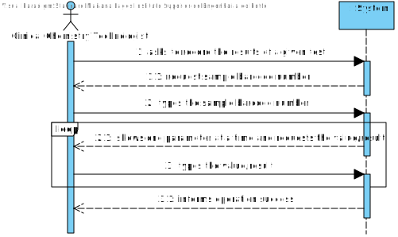
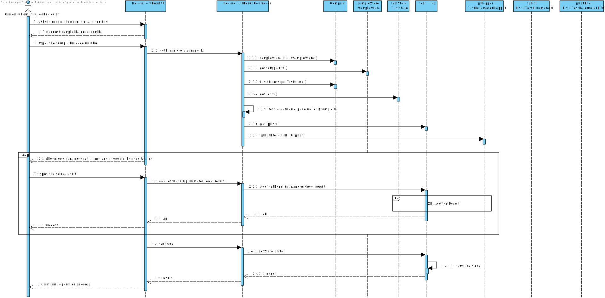
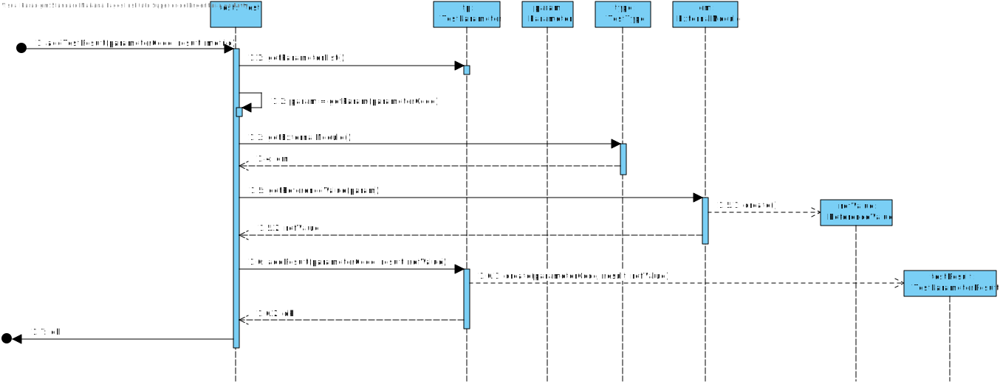
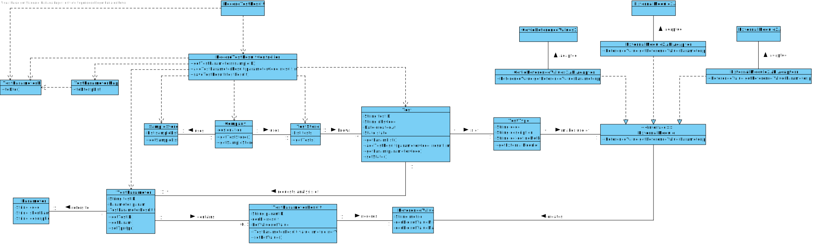

# US 12 - RecordTheResultsOfAGivenTest

## 1. Requirements Engineering

*In this section, it is suggested to capture the requirement description and specifications as provided by the client as well as any further clarification on it. It is also suggested capturing the requirements' acceptance criteria and existing dependencies to other requirements. At last, identify the involved input and output data and depicted an Actor-System interaction in order to fulfill the requirement.*

### 1.1. User Story Description

*As a clinical chemistry technologist, I intend to record the results of a given test.*

### 1.2. Customer Specifications and Clarifications 

**From the specifications document:**

> “At the company's headquarters, the clinical chemistry technologist receives the samples (delivered by a courier) and performs the chemical analysis, recording the results in the software application.”

> “… the application uses an external module that is responsible for doing an automatic validation using test reference values.”

> “At the same time, the results are also available in the central application where the medical lab technicians who collect the samples, the clinical chemistry technologist, the specialist doctor, and the laboratory coordinator can check them.”

**From the client clarifications:**

> **Question:** When the Clinical Chemistry Technologist wants to record the results of a test, how does he have access to that test? By an internal code, NHS code…?
> 
> **Answer:** Each sample has a unique barcode. The Clinical Chemistry Technologist should use the sample barcode number to find the test for which the sample was collected.

> **Question:** Should the system present a result for each test parameter or a single result for the test to be recorded?
> 
> **Answer:** The Clinical Chemistry Technologist should register a value/result for each parameter of the test.

> **Question:** Are the reference values, for each parameter, going to be delivered to the groups? If so, when and how?
> 
> **Answer:** You should use the APIs available in moodle to obtain the reference values.

### 1.3. Acceptance Criteria

* **AC1:** The application should use an external module that is responsible for providing the test reference values. The application can use an external module for each type of test. For instance, when the results are for blood tests parameters, the external module BloodReferenceValues1API can be used. When the results are for Covid-19 tests parameters, the external module CovidReferenceValues1API can be used. In any case, the API request should include, at most:
  * (i) a key to access the module (e.g.: “KEY1234”);
  * (ii) a parameter identifier;
  * (iii) the reference date;
  * (iv) reference measurement unit (e.g.: "mg").
* **AC2:** Each test result is characterized by a parameter code, a result and metric.
* **AC3:** Each test parameter is characterized by a test result.
* **AC4:** Each sample has a unique barcode.
* **AC5:** The Clinical Chemistry Technologist should use the sample barcode number to find the test for which the sample was collected.
* **AC6:** The Clinical Chemistry Technologist should register a value/result for each parameter of the test.

### 1.4. Found out Dependencies

**From Sprint B:**

There is a dependency to:
* **"US07 Register a new employee"** since at least a Clinical Chemistry Technologist must be registered in the system.
* **“US09 Specify a new type of test and its collecting methods”** since at least a type of test must exist to record its results.
* **“US10 Specify a new parameter and categorize it”** since at least a parameter must exist to record its results.

**From Sprint C:**

* **"US04 Register a test to be performed to a registered client"** since at least one test must be registered in the system.
* **"US05 Record the samples collected in the scope of a given test"** since each test must have an associated sample recorded in the system.

### 1.5 Input and Output Data

**Input Data:**

* Typed data:
  * Sample barcode number
  * Value/result (for each parameter)

* Selected data:
  * Test parameter

**Output Data:**

* List of test parameters
* (In)Success of the operation

### 1.6. System Sequence Diagram (SSD)

*Insert here a SSD depicting the envisioned Actor-System interactions and throughout which data is inputted and outputted to fulfill the requirement. All interactions must be numbered.*

### 1.7 Other Relevant Remarks

*Use this section to capture other relevant information that is related with this US such as (i) special requirements ; (ii) data and/or technology variations; (iii) how often this US is held.* 

## 2. OO Analysis

### 2.1. Relevant Domain Model Excerpt 
*In this section, it is suggested to present an excerpt of the domain model that is seen as relevant to fulfill this requirement.* 

### 2.2. Other Remarks

*Use this section to capture some additional notes/remarks that must be taken into consideration into the design activity. In some case, it might be usefull to add other analysis artifacts (e.g. activity or state diagrams).* 

## 3. Design - User Story Realization 

### 3.1. Rationale

**The rationale grounds on the SSD interactions and the identified input/output data.**

| Interaction ID | Question: Which class is responsible for... | Answer  | Justification (with patterns)  |
|:-------------  |:--------------------- |:------------|:---------------------------- |
| Step/Msg 1: asks to record the results of a given test | ... interacting with the actor? | TestResultUI | Pure Fabrication: there is no reason to assign this responsibility to any existing class in the Domain Model |
|                                                        | ... coordinating the US? | TestResultController | Controller |
| Step/Msg 2: request sample barcode number | n/a | | |
| Step/Msg 3: types the sample barcode number | ... knowing TestStore? | Company | IE: TestStore is initialized in Company |
|                                             | ... knowing all the existent test? | TestStore | IE: knows its own tests |
| Step/Msg 4: shows one parameter at a time and requests each value/result | n/a | | |
| Step/Msg 5: types the value/result | ... knowing and getting the reference values? | ExternalModule | Protected Variation: It is necessary to know which adapter to use in order to get the reference values for the correct API |
|                                    | ... getting the ExternalModule? | TestType | IE: knows what API to get depending on the type of test |
|                                    | ... creating the TestParameterResult object? | TestParameter | Creator: TestParameterResult is an attribute of TestParameter |
|                                    | ... validating and saving the typed data? | ReferenceValue | IE: knows its own data |
|                                    | ... changing the test state? | Test | IE: After the tests being recorded, Test must change its state |
| Step/Msg 6: informs operation success | ... informing operation success? | RecordTestResultUI | IE: responsible for user interaction |

### Systematization ##

According to the taken rationale, the conceptual classes promoted to software classes are: 

 * Company
 * TestParameter
 * TestParameterResult

Other software classes (i.e. Pure Fabrication) identified: 
 * RecordTestResultUI  
 * RecordTestResultController
 * ExternalModule
 * RefValue
 * RefValueAdapter (1 for each API)
 * TestParameterDTO
 * TestParameterMapper

## 3.2. Sequence Diagram (SD)

  

* SD_AddTestResult(parameterCode, result, metric)

## 3.3. Class Diagram (CD)

*In this section, it is suggested to present an UML static view representing the main domain related software classes that are involved in fulfilling the requirement as well as and their relations, attributes and methods.*

# 4. Tests

**Test 1:** Check that it is not possible to create an instance of the Example class with null values. 

	@Test(expected = IllegalArgumentException.class)
		public void ensureNullIsNotAllowed() {
		Exemplo instance = new Exemplo(null, null);
	}

*It is also recommended organizing this content by subsections.* 

# 5. Construction (Implementation)

### Class RecordTestResultUI

    public class RecordTestResultUI implements Runnable {

        RecordTestResultController ctrl;

        public RecordTestResultUI() {
            ctrl = new RecordTestResultController();
        }

        @Override
        public void run() {

            boolean result = true;
            boolean repeat = false;
            double value;

            String sampleID = Utils.readLineFromConsole("Please enter the sample barcode number of the test:");

            List<TestParameter> parameters = ctrl.getParameters(sampleID);

            if (this.ctrl.getSampleListDto() == null || this.ctrl.getSampleListDto().isEmpty()) {
                System.out.println("The list is of samples is empty!");
            } else {
                do {
                    for (TestParameter param : parameters) {
                        System.out.println();
                        System.out.print("Parameters: " + param.getParam().getName());

                        value = Utils.readDoubleFromConsole("Please insert the result/value:");

                        try {
                            result = ctrl.addTestParameterResult(param.getParam().getCode(), value);
                            result = true;
                        } catch (Exception e) {
                            System.out.println(e.getMessage());
                            result = false;
                        }

                        if (result) {
                            System.out.println("Test parameter result saved with success!");
                        } else {
                            System.out.println("Incorrect input of data (an error has occurred).");
                            repeat = Utils.confirm("Try again? (s/n)");
                        }
                    }
                } while (repeat);
            }

            if (result) {
                ctrl.setState();
                System.out.println("Success! All test parameters results have been recorded.");
            } else {
                System.out.println("Something went wrong... please, try again.");
            }
        }
    }

### Class RecordTestResultController

    public class RecordTestResultController {

        private Company company;
        private SampleStore sampleStore;
        private TestStore testStore;
        private Test test;

        private SampleMapper sampleMapper;

        public RecordTestResultController(){
            this(App.getInstance().getCompany());
            this.sampleStore = company.getSampleStore();
            this.testStore = company.getTestStore();
        }

        public RecordTestResultController(Company company) {
            this.company=company;
        }

        private boolean getCorrespondingTest(String sampleID) {
            String testID;

            List<Sample> samples = sampleStore.getSampleList();

            testID = "";

            for (Sample sa : samples) {
                if (sa.getBarcode().equals(sampleID)) {
                    testID = sa.getTr().getTestID();
                }
            }

            List<Test> tests = testStore.getTestList();

            for (Test test1 : tests) {
                if (test1.getTestID().equals(testID)) {
                    this.test = test1;
                    return test1.compareTestState("SAMPLE_COLLECTED");
                }
            }
            return false;
        }

        public List<TestParameter> getParameters(String sampleID) {
            getCorrespondingTest(sampleID);

            if(test == null) {
                return null;
            }
            return test.getTpList();
        }

        public boolean addTestParameterResult(String parameterCode, double result) {

            try {
                test.addTestParameterResult(parameterCode, result);
            } catch (Exception e) {
                return false;
            }
            return true;
        }

        public void setState() {
            test.setState("SAMPLE_ANALYSED");
        }

        public List<Sample> getSampleList(){return company.getSampleList(); }

        public List<SampleDTO> getSampleListDto(){

            this.sampleMapper = new SampleMapper();

            return sampleMapper.toDTO(getSampleList());
        }
    }

### Class TestParameter

    public class TestParameter {

        private String testID;
        private Parameter param;
        private TestParameterResult tpr;

        public TestParameter(String testID, Parameter param) {
            this.testID = testID;
            this.param = param;
            this.tpr = null;
        }

        public String getTestID() {
            return testID;
        }

        public Parameter getParam() {
            return param;
        }

        public TestParameterResult getTpr() {
            return tpr;
        }

        public void setTpr(TestParameterResult tpr) {
            this.tpr = tpr;
        }
    }

### Class TestParameterResult

    public class TestParameterResult {

        private String paramID;
        private double result;
        private RefValue refValue;

        public TestParameterResult(String paramID, double result) {
            this.paramID = paramID;
            this.result = result;
        }

        public String getParamID() {
            return paramID;
        }

        public double getResult() {
            return result;
        }

        public RefValue getRefValue() {
            return refValue;
        }

        public void setRefValue(RefValue refValue) {
            this.refValue = refValue;
        }
    }

### Class RefValue

    public class RefValue {

        private String metric;
        private double refValueMin;
        private double refValueMax;

        public RefValue(String metric, double refValueMin, double refValueMax) {
            this.metric = metric;
            this.refValueMin = refValueMin;
            this.refValueMax = refValueMax;
        }

        public String getMetric() {
            return metric;
        }

        public double getRefValueMin() {
            return refValueMin;
        }

        public double getRefValueMax() {
            return refValueMax;
        }
    }

### Interface RefValueAdapter

    public interface RefValueAdapter {

        RefValue getRefValue(String param);

        double getRefValueMin(String param);

        double getRefValueMax(String param);

        String getMetric(String param);
    }

### Class RefValueAdapter1

    public class RefValueAdapter1 implements RefValueAdapter {
    CovidReferenceValues1API api;

        public RefValueAdapter1() {
            this.api = new CovidReferenceValues1API();
        }

        public RefValue getRefValue(String param) {
            return new RefValue(getMetric(param), getRefValueMin(param), getRefValueMax(param));
        }

        public double getRefValueMin(String paramID) {
            return api.getMinReferenceValue(paramID, Constants.ACCESS_KEY);
        }

        public double getRefValueMax(String paramID) {
            return api.getMaxReferenceValue(paramID, Constants.ACCESS_KEY);
        }

        public String getMetric(String paramID) {
            return api.usedMetric(paramID, Constants.ACCESS_KEY);
        }
    }

### Class RefValueAdapter2

    public class RefValueAdapter2 implements RefValueAdapter {
    ExternalModule2API api;

        public RefValueAdapter2() {
            this.api = new ExternalModule2API();
        }

        public RefValue getRefValue(String param) {
            return new RefValue(getMetric(param), getRefValueMin(param), getRefValueMax(param));
        }

        public double getRefValueMin(String paramID) {
            EMRefValue refValue = api.getReferenceFor(paramID);
            return refValue.getMinValue();
        }

        public double getRefValueMax(String paramID) {
            EMRefValue refValue = api.getReferenceFor(paramID);
            return refValue.getMaxValue();
        }

        public String getMetric(String paramID) {
            return api.getMetricsFor(paramID);
        }
    }

### Class RefValueAdapter3

    public class RefValueAdapter3 implements RefValueAdapter{
    ExternalModule3API api;

        public RefValueAdapter3() {
            this.api = new ExternalModule3API();
        }

        public RefValue getRefValue(String param) {
            return new RefValue(getMetric(param), getRefValueMin(param), getRefValueMax(param));
        }

        public double getRefValueMin(String paramID) {
            return api.getMinReferenceValue(paramID, Constants.ACCESS_KEY);
        }

        public double getRefValueMax(String paramID) {
            return api.getMaxReferenceValue(paramID, Constants.ACCESS_KEY);
        }

        public String getMetric(String paramID) {
            return api.usedMetric(paramID, Constants.ACCESS_KEY);
        }
    }

# 6. Integration and Demo

### Integration in the Company class

    TestStore testStore = new TestStore();

    public TestStore getTestStore() {
        return testStore;
    }

### Integration in the Test class

    public void createTestParameter(String testID, List<Parameter> parameters) {
        TestParameter tp;
        for (Parameter param : parameters) {
            tp = new TestParameter(testID, param);
            this.tpList.add(tp);
        }
    }

    public List<TestParameter> getTpList() {
        return tpList;
    }

    public boolean addTestParameterResult(String parameterCode, double result) throws ClassNotFoundException, InstantiationException, IllegalAccessException {

        TestParameter tp1 = null;

        for (TestParameter tp : tpList) {
            if (tp.getParam().getCode().equals(parameterCode)) {
                tp1 = tp;
            }
        }

        if (tp1 == null) {
            return false;
        }

        String em = tt.getExternalModule();
        Class<?> daclass = Class.forName(em);
        RefValueAdapter adp = (RefValueAdapter) daclass.newInstance();

        String paramCode = tp1.getParam().getCode();

        TestParameterResult tpr = new TestParameterResult(parameterCode, result);
        tpr.setRefValue(adp.getRefValue(paramCode));

        tp1.setTpr(tpr);
        return true;
    }

    public boolean compareTestState(String state) {

        if (state.equals("SAMPLE_ANALYSED") || state.equals("DIAGNOSTIC_MADE") || state.equals("VALIDATED")) {
            return false;
        }
        return true;
    }

### Integration in the TestType class

    public String getExternalModule() {
        return externalModule;
    }

    public String setExternalModule(String testCode) {

        if(testCode.equals("BL000")) {
            return Constants.EM_REFERENCE_API;
        }

        if(testCode.equals("COV19")) {
            return Constants.COVID_REFERENCE_API;
        }
        return null;
    }

### Constants class

    public static final int ACCESS_KEY = 12345;
    public static final String COVID_REFERENCE_API = "app.domain.model.RefValueAdapter1";
    public static final String EM_REFERENCE_API = "app.domain.model.RefValueAdapter2";
    public static final String BC_REFERENCE_API = "app.domain.model.BarcodeAdapter1";

# 7. Observations